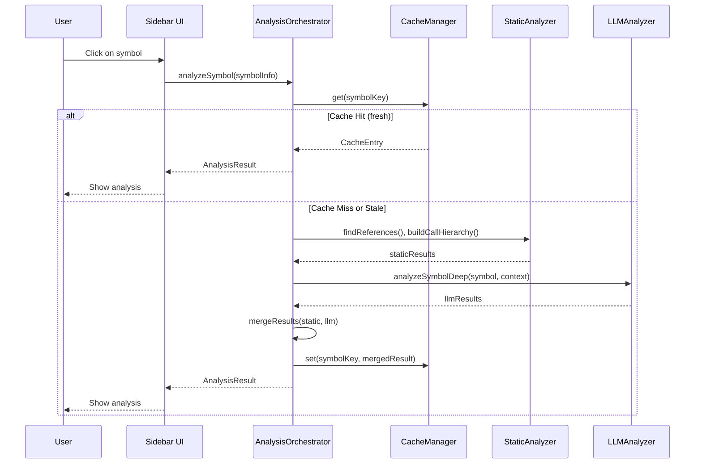
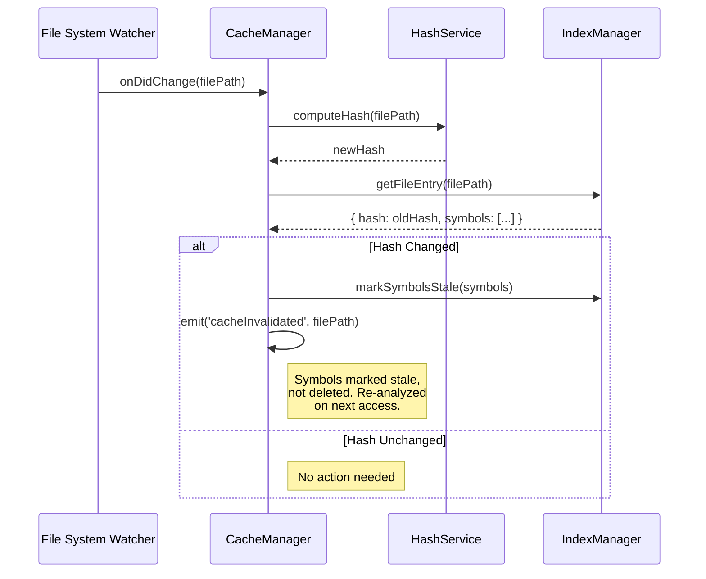

# Code Explorer — Technical Specification

> **Version:** 1.0
> **Date:** 2026-03-28
> **Status:** Draft

---

## Table of Contents

1. [Extension Architecture](#1-extension-architecture)
2. [Sidebar UI Technical Design](#2-sidebar-ui-technical-design)
3. [Code Analysis Engine](#3-code-analysis-engine)
4. [LLM Analysis Pipeline](#4-llm-analysis-pipeline)
5. [Caching System Design](#5-caching-system-design)
6. [Interaction Model](#6-interaction-model)
7. [MCP Server Design](#7-mcp-server-design-future)
8. [Data Models](#8-data-models)
9. [API Contracts](#9-api-contracts)
10. [Error Handling](#10-error-handling)
11. [Configuration Schema](#11-configuration-schema)

---

## 1. Extension Architecture

### 1.1 Activation Events

```jsonc
// package.json (partial)
{
  "activationEvents": [
    "onView:codeExplorer.sidebar",
    "onCommand:codeExplorer.exploreSymbol",
    "onLanguage:typescript",
    "onLanguage:javascript",
    "onLanguage:typescriptreact",
    "onLanguage:javascriptreact"
  ]
}
```

### 1.2 Extension Entry Point

```typescript
// src/extension.ts
import * as vscode from 'vscode';
import { CodeExplorerViewProvider } from './ui/CodeExplorerViewProvider';
import { AnalysisOrchestrator } from './analysis/AnalysisOrchestrator';
import { CacheManager } from './cache/CacheManager';
import { LLMProviderFactory } from './llm/LLMProviderFactory';
import { SymbolResolver } from './providers/SymbolResolver';
import { CodeExplorerHoverProvider } from './providers/CodeExplorerHoverProvider';

export function activate(context: vscode.ExtensionContext) {
  // Initialize services
  const cacheManager = new CacheManager(context);
  const llmProvider = LLMProviderFactory.create(context);
  const analysisOrchestrator = new AnalysisOrchestrator(cacheManager, llmProvider);
  const symbolResolver = new SymbolResolver();

  // Register sidebar
  const sidebarProvider = new CodeExplorerViewProvider(
    context.extensionUri,
    analysisOrchestrator
  );
  context.subscriptions.push(
    vscode.window.registerWebviewViewProvider('codeExplorer.sidebar', sidebarProvider)
  );

  // Register hover provider
  const hoverProvider = new CodeExplorerHoverProvider(cacheManager, symbolResolver);
  context.subscriptions.push(
    vscode.languages.registerHoverProvider(
      ['typescript', 'javascript', 'typescriptreact', 'javascriptreact'],
      hoverProvider
    )
  );

  // Register commands
  context.subscriptions.push(
    vscode.commands.registerCommand('codeExplorer.exploreSymbol', (symbol) =>
      sidebarProvider.openTab(symbol)
    ),
    vscode.commands.registerCommand('codeExplorer.refreshAnalysis', () =>
      analysisOrchestrator.refreshCurrent()
    ),
    vscode.commands.registerCommand('codeExplorer.clearCache', () =>
      cacheManager.clearAll()
    ),
    vscode.commands.registerCommand('codeExplorer.analyzeWorkspace', () =>
      analysisOrchestrator.analyzeWorkspace()
    )
  );

  // Register file watchers for cache invalidation
  const watcher = vscode.workspace.createFileSystemWatcher('**/*.{ts,tsx,js,jsx}');
  watcher.onDidChange((uri) => cacheManager.invalidate(uri.fsPath));
  watcher.onDidDelete((uri) => cacheManager.remove(uri.fsPath));
  context.subscriptions.push(watcher);

  // Start background analysis scheduler
  analysisOrchestrator.startPeriodicAnalysis();
}

export function deactivate() {
  // Cleanup handled by disposables
}
```

### 1.3 package.json Contributions

```jsonc
{
  "contributes": {
    "viewsContainers": {
      "activitybar": [{
        "id": "codeExplorer",
        "title": "Code Explorer",
        "icon": "media/icon.svg"
      }]
    },
    "views": {
      "codeExplorer": [{
        "type": "webview",
        "id": "codeExplorer.sidebar",
        "name": "Code Explorer"
      }]
    },
    "commands": [
      { "command": "codeExplorer.exploreSymbol", "title": "Explore Symbol", "category": "Code Explorer" },
      { "command": "codeExplorer.refreshAnalysis", "title": "Refresh Analysis", "category": "Code Explorer" },
      { "command": "codeExplorer.clearCache", "title": "Clear Cache", "category": "Code Explorer" },
      { "command": "codeExplorer.analyzeWorkspace", "title": "Analyze Workspace", "category": "Code Explorer" }
    ],
    "menus": {
      "editor/context": [{
        "command": "codeExplorer.exploreSymbol",
        "group": "navigation",
        "when": "editorTextFocus"
      }]
    },
    "configuration": {
      "title": "Code Explorer",
      "properties": {
        "codeExplorer.llmProvider": {
          "type": "string",
          "default": "mai-claude",
          "enum": ["mai-claude", "copilot-cli", "none"],
          "description": "LLM provider for deep code analysis"
        },
        "codeExplorer.autoAnalyzeOnSave": {
          "type": "boolean",
          "default": false,
          "description": "Automatically trigger analysis when files are saved"
        },
        "codeExplorer.cacheTTLHours": {
          "type": "number",
          "default": 168,
          "description": "Cache time-to-live in hours (default: 7 days)"
        },
        "codeExplorer.maxConcurrentAnalyses": {
          "type": "number",
          "default": 3,
          "description": "Maximum concurrent LLM analysis requests"
        },
        "codeExplorer.excludePatterns": {
          "type": "array",
          "default": ["**/node_modules/**", "**/dist/**", "**/.git/**"],
          "description": "Glob patterns to exclude from analysis"
        },
        "codeExplorer.analysisDepth": {
          "type": "string",
          "default": "standard",
          "enum": ["shallow", "standard", "deep"],
          "description": "Depth of AI analysis (deeper = more tokens)"
        },
        "codeExplorer.periodicAnalysisIntervalMinutes": {
          "type": "number",
          "default": 0,
          "description": "Minutes between periodic background analysis (0 = disabled)"
        }
      }
    }
  }
}
```

---

## 2. Sidebar UI Technical Design

### 2.1 WebviewViewProvider

```typescript
// src/ui/CodeExplorerViewProvider.ts
export class CodeExplorerViewProvider implements vscode.WebviewViewProvider {
  private _view?: vscode.WebviewView;
  private _tabs: Map<string, TabState> = new Map();
  private _activeTabId: string | null = null;

  constructor(
    private readonly _extensionUri: vscode.Uri,
    private readonly _analysisOrchestrator: AnalysisOrchestrator
  ) {}

  resolveWebviewView(
    webviewView: vscode.WebviewView,
    context: vscode.WebviewViewResolveContext,
    _token: vscode.CancellationToken
  ) {
    this._view = webviewView;

    webviewView.webview.options = {
      enableScripts: true,
      localResourceRoots: [this._extensionUri]
    };

    webviewView.webview.html = this._getHtmlForWebview(webviewView.webview);

    // Handle messages from webview
    webviewView.webview.onDidReceiveMessage(this._handleMessage.bind(this));
  }

  async openTab(symbol: SymbolInfo): Promise<void> {
    const tabId = this._resolveTabId(symbol);

    if (this._tabs.has(tabId)) {
      this._focusTab(tabId);
      return;
    }

    // Create new tab
    const tab: TabState = {
      id: tabId,
      symbol,
      status: 'loading',
      analysis: null
    };
    this._tabs.set(tabId, tab);
    this._activeTabId = tabId;

    // Notify webview
    this._postMessage({ type: 'openTab', tab });

    // Fetch analysis
    try {
      const analysis = await this._analysisOrchestrator.analyzeSymbol(symbol);
      tab.status = 'ready';
      tab.analysis = analysis;
      this._postMessage({ type: 'showAnalysis', tabId, data: analysis });
    } catch (error) {
      tab.status = 'error';
      this._postMessage({ type: 'showError', tabId, error: String(error) });
    }
  }

  private _resolveTabId(symbol: SymbolInfo): string {
    return `${symbol.filePath}::${symbol.kind}.${symbol.name}`;
  }

  private _focusTab(tabId: string): void {
    this._activeTabId = tabId;
    this._postMessage({ type: 'focusTab', tabId });
  }

  private _postMessage(message: ExtensionToWebviewMessage): void {
    this._view?.webview.postMessage(message);
  }

  private async _handleMessage(message: WebviewToExtensionMessage): Promise<void> {
    switch (message.type) {
      case 'closeTab':
        this._tabs.delete(message.tabId);
        if (this._activeTabId === message.tabId) {
          const remaining = [...this._tabs.keys()];
          this._activeTabId = remaining.length > 0 ? remaining[remaining.length - 1] : null;
        }
        break;

      case 'navigateToSource':
        const doc = await vscode.workspace.openTextDocument(message.filePath);
        const editor = await vscode.window.showTextDocument(doc, vscode.ViewColumn.One);
        const pos = new vscode.Position(message.line - 1, message.character || 0);
        editor.selection = new vscode.Selection(pos, pos);
        editor.revealRange(new vscode.Range(pos, pos), vscode.TextEditorRevealType.InCenter);
        break;

      case 'refreshAnalysis':
        const tab = this._tabs.get(message.tabId);
        if (tab) {
          tab.status = 'loading';
          this._postMessage({ type: 'showLoading', tabId: message.tabId });
          const result = await this._analysisOrchestrator.analyzeSymbol(tab.symbol, { force: true });
          tab.analysis = result;
          tab.status = 'ready';
          this._postMessage({ type: 'showAnalysis', tabId: message.tabId, data: result });
        }
        break;

      case 'openSettings':
        vscode.commands.executeCommand('workbench.action.openSettings', 'codeExplorer');
        break;
    }
  }

  private _getHtmlForWebview(webview: vscode.Webview): string {
    const scriptUri = webview.asWebviewUri(
      vscode.Uri.joinPath(this._extensionUri, 'webview', 'dist', 'main.js')
    );
    const styleUri = webview.asWebviewUri(
      vscode.Uri.joinPath(this._extensionUri, 'webview', 'dist', 'main.css')
    );
    const nonce = getNonce();

    return `<!DOCTYPE html>
    <html lang="en">
    <head>
      <meta charset="UTF-8">
      <meta http-equiv="Content-Security-Policy"
        content="default-src 'none'; style-src ${webview.cspSource} 'nonce-${nonce}'; script-src 'nonce-${nonce}';">
      <meta name="viewport" content="width=device-width, initial-scale=1.0">
      <link href="${styleUri}" rel="stylesheet">
      <title>Code Explorer</title>
    </head>
    <body>
      <div id="app"></div>
      <script nonce="${nonce}" src="${scriptUri}"></script>
    </body>
    </html>`;
  }
}
```

### 2.2 Webview Architecture

The webview uses **vanilla TypeScript** with a lightweight component model (no framework dependency) to keep bundle size minimal.

```
webview/
├── src/
│   ├── main.ts              # Entry point, message handler
│   ├── components/
│   │   ├── TabBar.ts         # Tab bar with scroll, close
│   │   ├── SymbolHeader.ts   # Symbol name, kind icon, file path
│   │   ├── OverviewSection.ts
│   │   ├── CallStackSection.ts
│   │   ├── UsageSection.ts
│   │   ├── DataFlowSection.ts
│   │   ├── RelationshipSection.ts
│   │   ├── LoadingState.ts
│   │   ├── EmptyState.ts
│   │   └── ErrorState.ts
│   ├── utils/
│   │   ├── dom.ts            # DOM helpers
│   │   └── icons.ts          # Codicon references
│   └── styles/
│       └── main.css          # VS Code theme variable usage
├── esbuild.config.mjs
└── tsconfig.json
```

### 2.3 Message Protocol

```typescript
// === Extension → Webview ===
type ExtensionToWebviewMessage =
  | { type: 'openTab'; tab: TabState }
  | { type: 'focusTab'; tabId: string }
  | { type: 'showAnalysis'; tabId: string; data: AnalysisResult }
  | { type: 'showLoading'; tabId: string }
  | { type: 'showError'; tabId: string; error: string }
  | { type: 'analysisProgress'; tabId: string; percent: number; stage: string }
  | { type: 'stalenessWarning'; tabId: string; changedFiles: string[] }

// === Webview → Extension ===
type WebviewToExtensionMessage =
  | { type: 'closeTab'; tabId: string }
  | { type: 'closeOtherTabs'; tabId: string }
  | { type: 'closeAllTabs' }
  | { type: 'navigateToSource'; filePath: string; line: number; character?: number }
  | { type: 'refreshAnalysis'; tabId: string }
  | { type: 'openSettings' }
  | { type: 'ready' }  // webview loaded
```

---

## 3. Code Analysis Engine

### 3.1 Symbol Resolution

```typescript
// src/analysis/SymbolResolver.ts
export class SymbolResolver {
  /**
   * Resolve the symbol under the cursor using VS Code's built-in APIs.
   */
  async resolveAtPosition(
    document: vscode.TextDocument,
    position: vscode.Position
  ): Promise<SymbolInfo | null> {
    // 1. Get word range at position
    const wordRange = document.getWordRangeAtPosition(position);
    if (!wordRange) return null;

    const word = document.getText(wordRange);

    // 2. Use definition provider to find the symbol's declaration
    const definitions = await vscode.commands.executeCommand<vscode.LocationLink[]>(
      'vscode.executeDefinitionProvider', document.uri, position
    );

    // 3. Use document symbol provider for kind detection
    const symbols = await vscode.commands.executeCommand<vscode.DocumentSymbol[]>(
      'vscode.executeDocumentSymbolProvider', document.uri
    );

    const matchedSymbol = this._findSymbolAtPosition(symbols, position);

    return {
      name: word,
      kind: matchedSymbol ? this._mapSymbolKind(matchedSymbol.kind) : 'unknown',
      filePath: document.uri.fsPath,
      position: { line: position.line, character: position.character },
      range: wordRange,
      containerName: matchedSymbol?.containerName
    };
  }

  private _findSymbolAtPosition(
    symbols: vscode.DocumentSymbol[] | undefined,
    position: vscode.Position
  ): vscode.DocumentSymbol | null {
    if (!symbols) return null;
    for (const sym of symbols) {
      if (sym.range.contains(position)) {
        // Check children first (more specific)
        const child = this._findSymbolAtPosition(sym.children, position);
        return child || sym;
      }
    }
    return null;
  }

  private _mapSymbolKind(kind: vscode.SymbolKind): SymbolKindType {
    const map: Record<number, SymbolKindType> = {
      [vscode.SymbolKind.Class]: 'class',
      [vscode.SymbolKind.Function]: 'function',
      [vscode.SymbolKind.Method]: 'method',
      [vscode.SymbolKind.Variable]: 'variable',
      [vscode.SymbolKind.Interface]: 'interface',
      [vscode.SymbolKind.Enum]: 'enum',
      [vscode.SymbolKind.Property]: 'property',
      [vscode.SymbolKind.TypeParameter]: 'type',
    };
    return map[kind] || 'unknown';
  }
}
```

### 3.2 Static Analysis

```typescript
// src/analysis/StaticAnalyzer.ts
export class StaticAnalyzer {
  /**
   * Find all references to a symbol across the workspace.
   */
  async findReferences(symbol: SymbolInfo): Promise<UsageEntry[]> {
    const uri = vscode.Uri.file(symbol.filePath);
    const position = new vscode.Position(symbol.position.line, symbol.position.character);

    const locations = await vscode.commands.executeCommand<vscode.Location[]>(
      'vscode.executeReferenceProvider', uri, position
    );

    return (locations || []).map(loc => ({
      filePath: loc.uri.fsPath,
      line: loc.range.start.line + 1,
      character: loc.range.start.character,
      contextLine: '', // filled by reading the file
      isDefinition: loc.uri.fsPath === symbol.filePath &&
                    loc.range.start.line === symbol.position.line
    }));
  }

  /**
   * Build call hierarchy for a function/method.
   */
  async buildCallHierarchy(symbol: SymbolInfo): Promise<CallStackEntry[]> {
    const uri = vscode.Uri.file(symbol.filePath);
    const position = new vscode.Position(symbol.position.line, symbol.position.character);

    // Get call hierarchy item
    const items = await vscode.commands.executeCommand<vscode.CallHierarchyItem[]>(
      'vscode.prepareCallHierarchy', uri, position
    );

    if (!items || items.length === 0) return [];

    // Get incoming calls (who calls this?)
    const incomingCalls = await vscode.commands.executeCommand<vscode.CallHierarchyIncomingCall[]>(
      'vscode.provideIncomingCalls', items[0]
    );

    return (incomingCalls || []).map(call => ({
      caller: {
        name: call.from.name,
        filePath: call.from.uri.fsPath,
        line: call.from.range.start.line + 1,
        kind: this._mapCallHierarchyKind(call.from.kind)
      },
      callSites: call.fromRanges.map(r => ({
        line: r.start.line + 1,
        character: r.start.character
      }))
    }));
  }

  /**
   * Get type hierarchy for a class/interface.
   */
  async getTypeHierarchy(symbol: SymbolInfo): Promise<RelationshipEntry[]> {
    const uri = vscode.Uri.file(symbol.filePath);
    const position = new vscode.Position(symbol.position.line, symbol.position.character);

    const items = await vscode.commands.executeCommand<vscode.TypeHierarchyItem[]>(
      'vscode.prepareTypeHierarchy', uri, position
    );

    if (!items || items.length === 0) return [];

    const supertypes = await vscode.commands.executeCommand<vscode.TypeHierarchyItem[]>(
      'vscode.provideSupertypes', items[0]
    );

    const subtypes = await vscode.commands.executeCommand<vscode.TypeHierarchyItem[]>(
      'vscode.provideSubtypes', items[0]
    );

    const relationships: RelationshipEntry[] = [];
    (supertypes || []).forEach(t => relationships.push({
      type: 'extends',
      targetName: t.name,
      targetFilePath: t.uri.fsPath,
      targetLine: t.range.start.line + 1
    }));
    (subtypes || []).forEach(t => relationships.push({
      type: 'extended-by',
      targetName: t.name,
      targetFilePath: t.uri.fsPath,
      targetLine: t.range.start.line + 1
    }));

    return relationships;
  }
}
```

### 3.3 Analysis Orchestrator



---

## 4. LLM Analysis Pipeline

### 4.1 Provider Interface

```typescript
// src/llm/LLMProvider.ts
export interface LLMProvider {
  readonly name: string;

  /** Check if the provider CLI tool is available */
  isAvailable(): Promise<boolean>;

  /** Run an analysis prompt and return the raw response */
  analyze(request: LLMAnalysisRequest): Promise<string>;

  /** Provider capabilities */
  getCapabilities(): ProviderCapabilities;
}

export interface LLMAnalysisRequest {
  prompt: string;
  systemPrompt?: string;
  maxTokens?: number;
  temperature?: number;
}

export interface ProviderCapabilities {
  maxContextTokens: number;
  supportsStreaming: boolean;
  costPerMTokenInput: number;
  costPerMTokenOutput: number;
}
```

### 4.2 Mai-Claude Provider

```typescript
// src/llm/MaiClaudeProvider.ts
import { execFile } from 'child_process';
import { promisify } from 'util';

const execFileAsync = promisify(execFile);

export class MaiClaudeProvider implements LLMProvider {
  readonly name = 'mai-claude';

  async isAvailable(): Promise<boolean> {
    try {
      await execFileAsync('which', ['claude']);
      return true;
    } catch {
      return false;
    }
  }

  async analyze(request: LLMAnalysisRequest): Promise<string> {
    const args = ['--print', '--max-tokens', String(request.maxTokens || 4096)];
    if (request.systemPrompt) {
      args.push('--system', request.systemPrompt);
    }
    args.push(request.prompt);

    const { stdout } = await execFileAsync('claude', args, {
      timeout: 120_000, // 2 minute timeout
      maxBuffer: 1024 * 1024 * 5 // 5MB
    });

    return stdout;
  }

  getCapabilities(): ProviderCapabilities {
    return {
      maxContextTokens: 200_000,
      supportsStreaming: false,
      costPerMTokenInput: 3.0,
      costPerMTokenOutput: 15.0
    };
  }
}
```

### 4.3 Prompt Templates

```typescript
// src/llm/PromptBuilder.ts
export class PromptBuilder {
  static classOverview(className: string, sourceCode: string, relatedFiles: FileContent[]): string {
    const relatedContext = relatedFiles
      .map(f => `--- ${f.path} ---\n${f.content}`)
      .join('\n\n');

    return `Analyze the following TypeScript/JavaScript class and provide a structured analysis.

## Source Code
\`\`\`typescript
${sourceCode}
\`\`\`

## Related Files
${relatedContext}

## Instructions
Provide your analysis in the following exact format:

### Overview
A 2-3 sentence description of what this class does, its purpose, and its role in the codebase.

### Key Methods
For each public method, one line: \`methodName(params)\` — description

### Dependencies
List classes/modules this class depends on, one per line.

### Usage Pattern
Describe how this class is typically instantiated and used.

### Potential Issues
Any code smells, potential bugs, or improvement suggestions (max 3).`;
  }

  static functionCallStack(funcName: string, sourceCode: string, callSites: string[]): string {
    return `Analyze the call patterns for the function "${funcName}".

## Function Source
\`\`\`typescript
${sourceCode}
\`\`\`

## Known Call Sites
${callSites.map((s, i) => `${i + 1}. ${s}`).join('\n')}

## Instructions
Provide:
### Purpose
One-sentence description of what this function does.

### Call Chain Analysis
For each call site, describe the execution path that leads to this function (max depth: 5 levels).

### Side Effects
List any side effects (I/O, state mutations, exceptions thrown).

### Data Flow
Describe what data flows in (parameters) and out (return value, mutations).`;
  }

  static variableLifecycle(varName: string, sourceCode: string, references: string[]): string {
    return `Analyze the lifecycle of the variable "${varName}".

## Source Context
\`\`\`typescript
${sourceCode}
\`\`\`

## References Found
${references.map((r, i) => `${i + 1}. ${r}`).join('\n')}

## Instructions
Provide:
### Declaration
Where and how the variable is declared (const/let/var, type).

### Initialization
How the variable gets its initial value.

### Mutations
List each point where the variable is modified (if mutable), with context.

### Consumption
Where the variable's value is read/used, categorized by purpose.

### Scope & Lifetime
Describe the variable's scope and when it becomes eligible for GC.`;
  }
}
```

### 4.4 Analysis Queue

```typescript
// src/llm/AnalysisQueue.ts
export class AnalysisQueue {
  private _queue: PriorityQueue<QueuedAnalysis> = new PriorityQueue();
  private _activeCount = 0;
  private _maxConcurrent: number;
  private _rateLimitMs: number;
  private _lastRequestTime = 0;

  constructor(maxConcurrent = 3, rateLimitMs = 2000) {
    this._maxConcurrent = maxConcurrent;
    this._rateLimitMs = rateLimitMs;
  }

  async enqueue(analysis: QueuedAnalysis): Promise<AnalysisResult> {
    return new Promise((resolve, reject) => {
      analysis._resolve = resolve;
      analysis._reject = reject;
      this._queue.enqueue(analysis, analysis.priority);
      this._processNext();
    });
  }

  private async _processNext(): Promise<void> {
    if (this._activeCount >= this._maxConcurrent) return;
    const next = this._queue.dequeue();
    if (!next) return;

    // Rate limiting
    const now = Date.now();
    const elapsed = now - this._lastRequestTime;
    if (elapsed < this._rateLimitMs) {
      await this._sleep(this._rateLimitMs - elapsed);
    }

    this._activeCount++;
    this._lastRequestTime = Date.now();

    try {
      const result = await next.executor();
      next._resolve!(result);
    } catch (error) {
      if (next.retryCount < next.maxRetries) {
        next.retryCount++;
        next.priority--; // lower priority on retry
        this._queue.enqueue(next, next.priority);
      } else {
        next._reject!(error);
      }
    } finally {
      this._activeCount--;
      this._processNext();
    }
  }

  private _sleep(ms: number): Promise<void> {
    return new Promise(resolve => setTimeout(resolve, ms));
  }
}

interface QueuedAnalysis {
  symbolKey: string;
  priority: number; // higher = more urgent. User-triggered = 10, background = 1
  executor: () => Promise<AnalysisResult>;
  retryCount: number;
  maxRetries: number;
  _resolve?: (result: AnalysisResult) => void;
  _reject?: (error: unknown) => void;
}
```

### 4.5 Response Parser

```typescript
// src/llm/ResponseParser.ts
export class ResponseParser {
  /**
   * Parse LLM markdown response into structured AnalysisResult fields.
   */
  static parse(raw: string, symbol: SymbolInfo): Partial<AnalysisResult> {
    const sections = this._extractSections(raw);

    return {
      overview: sections['overview'] || sections['purpose'] || '',
      keyMethods: this._parseList(sections['key methods']),
      dependencies: this._parseList(sections['dependencies']),
      usagePattern: sections['usage pattern'] || sections['usage'] || '',
      callChainAnalysis: sections['call chain analysis'] || '',
      sideEffects: this._parseList(sections['side effects']),
      dataFlowDescription: sections['data flow'] || '',
      potentialIssues: this._parseList(sections['potential issues']),
      variableLifecycle: {
        declaration: sections['declaration'] || '',
        initialization: sections['initialization'] || '',
        mutations: this._parseList(sections['mutations']),
        consumption: this._parseList(sections['consumption']),
        scopeAndLifetime: sections['scope & lifetime'] || sections['scope'] || ''
      }
    };
  }

  private static _extractSections(markdown: string): Record<string, string> {
    const sections: Record<string, string> = {};
    const regex = /^###?\s+(.+)$/gm;
    let lastKey: string | null = null;
    let lastIndex = 0;

    let match;
    while ((match = regex.exec(markdown)) !== null) {
      if (lastKey !== null) {
        sections[lastKey] = markdown.substring(lastIndex, match.index).trim();
      }
      lastKey = match[1].toLowerCase().trim();
      lastIndex = match.index + match[0].length;
    }
    if (lastKey !== null) {
      sections[lastKey] = markdown.substring(lastIndex).trim();
    }

    return sections;
  }

  private static _parseList(text: string | undefined): string[] {
    if (!text) return [];
    return text
      .split('\n')
      .map(line => line.replace(/^[-*•]\s*/, '').trim())
      .filter(line => line.length > 0);
  }
}
```

---

## 5. Caching System Design

### 5.1 Directory Structure

```
<workspace-root>/
└── .vscode/
    └── code-explorer/
        ├── _index.json                          # Master symbol index
        ├── _config.json                         # Cache config
        ├── src/
        │   ├── controllers/
        │   │   └── UserController.ts/           # Directory per source file
        │   │       ├── _manifest.json           # Symbols in this file
        │   │       ├── class.UserController.md  # Per-symbol analysis
        │   │       ├── fn.getUser.md
        │   │       ├── fn.createUser.md
        │   │       └── var.userCache.md
        │   └── models/
        │       └── User.ts/
        │           ├── _manifest.json
        │           ├── class.User.md
        │           └── interface.IUser.md
        └── _stats.json                          # Usage statistics
```

### 5.2 Naming Convention

| Symbol Kind | File Name Pattern | Example |
|-------------|-------------------|---------|
| Class | `class.<Name>.md` | `class.UserController.md` |
| Function | `fn.<Name>.md` | `fn.getUser.md` |
| Method | `method.<Class>.<Name>.md` | `method.UserController.getUser.md` |
| Variable | `var.<Name>.md` | `var.userCache.md` |
| Interface | `interface.<Name>.md` | `interface.IUser.md` |
| Type | `type.<Name>.md` | `type.UserRole.md` |
| Enum | `enum.<Name>.md` | `enum.Status.md` |

### 5.3 Analysis Markdown File Format

```markdown
---
symbol: UserController
kind: class
file: src/controllers/UserController.ts
line: 15
analyzed_at: "2026-03-28T10:30:00Z"
analysis_version: "1.0.0"
llm_provider: mai-claude
source_hash: "sha256:a1b2c3d4e5f6..."
dependent_files:
  "src/models/User.ts": "sha256:f6e5d4c3b2a1..."
  "src/services/UserService.ts": "sha256:1a2b3c4d5e6f..."
stale: false
---

# class UserController

## Overview

Handles user-related HTTP endpoints for the REST API. Extends BaseController
and provides CRUD operations for user resources. Delegates business logic
to UserService.

## Call Stacks

### 1. HTTP Request → getUser
```
app.ts:42 → express.Router.get()
  → routes/user.ts:15 → UserController.getUser()
    → UserService.findById()
```

### 2. HTTP Request → createUser
```
app.ts:42 → express.Router.post()
  → routes/user.ts:23 → UserController.createUser()
    → UserService.create()
```

## Usage (12 references)

| File | Line | Context |
|------|------|---------|
| `routes/user.ts` | 8 | `new UserController(userService)` |
| `routes/user.ts` | 15 | `controller.getUser` |
| `test/user.test.ts` | 12 | `new UserController(mockService)` |

## Data Flow

- **Created:** `routes/user.ts:8` — instantiated with `UserService` dependency
- **Stored:** `routes/user.ts:8` — assigned to `const controller`
- **Consumed:** `routes/user.ts:15-30` — methods used as route handlers

## Relationships

- **Extends:** `BaseController` (`src/controllers/BaseController.ts`)
- **Uses:** `UserService`, `Logger`, `ValidationUtil`
- **Used by:** `UserRouter`, `AdminRouter`
```

### 5.4 Master Index Schema

```jsonc
// _index.json
{
  "version": "1.0.0",
  "lastUpdated": "2026-03-28T10:30:00Z",
  "symbolCount": 142,
  "entries": {
    "src/controllers/UserController.ts::class.UserController": {
      "name": "UserController",
      "kind": "class",
      "file": "src/controllers/UserController.ts",
      "cachePath": "src/controllers/UserController.ts/class.UserController.md",
      "analyzedAt": "2026-03-28T10:30:00Z",
      "sourceHash": "sha256:a1b2c3d4e5f6...",
      "stale": false
    }
    // ... more entries
  },
  "fileIndex": {
    "src/controllers/UserController.ts": {
      "hash": "sha256:a1b2c3d4e5f6...",
      "symbols": [
        "class.UserController",
        "fn.getUser",
        "fn.createUser",
        "var.userCache"
      ],
      "lastAnalyzed": "2026-03-28T10:30:00Z"
    }
  }
}
```

### 5.5 Cache Invalidation Flow



---

## 6. Interaction Model

### 6.1 Hover Provider

```typescript
// src/providers/CodeExplorerHoverProvider.ts
export class CodeExplorerHoverProvider implements vscode.HoverProvider {
  constructor(
    private readonly _cacheManager: CacheManager,
    private readonly _symbolResolver: SymbolResolver
  ) {}

  async provideHover(
    document: vscode.TextDocument,
    position: vscode.Position,
    token: vscode.CancellationToken
  ): Promise<vscode.Hover | null> {
    const symbol = await this._symbolResolver.resolveAtPosition(document, position);
    if (!symbol || symbol.kind === 'unknown') return null;

    const cached = this._cacheManager.get(symbol);
    const statusIcon = cached
      ? (cached.metadata.stale ? '$(warning)' : '$(check)')
      : '$(circle-outline)';
    const statusText = cached
      ? (cached.metadata.stale ? 'Stale' : `Analyzed ${this._timeAgo(cached.metadata.analyzedAt)}`)
      : 'Not yet analyzed';

    const markdown = new vscode.MarkdownString();
    markdown.isTrusted = true;
    markdown.supportHtml = true;

    markdown.appendMarkdown(`**${this._kindIcon(symbol.kind)} ${symbol.name}** — ${symbol.kind}\n\n`);

    if (cached && !cached.metadata.stale) {
      markdown.appendMarkdown(`${cached.overview.substring(0, 150)}...\n\n`);
      markdown.appendMarkdown(`📊 ${cached.usages?.length || 0} usages | `);
      markdown.appendMarkdown(`📞 ${cached.callStacks?.length || 0} call stacks\n\n`);
    }

    markdown.appendMarkdown(`${statusIcon} ${statusText}\n\n`);

    const args = encodeURIComponent(JSON.stringify(symbol));
    markdown.appendMarkdown(
      `[$(link-external) Open in Code Explorer](command:codeExplorer.exploreSymbol?${args})`
    );

    return new vscode.Hover(markdown);
  }

  private _kindIcon(kind: string): string {
    const icons: Record<string, string> = {
      class: '$(symbol-class)',
      function: '$(symbol-function)',
      method: '$(symbol-method)',
      variable: '$(symbol-variable)',
      interface: '$(symbol-interface)',
      type: '$(symbol-type-parameter)',
      enum: '$(symbol-enum)',
    };
    return icons[kind] || '$(symbol-misc)';
  }

  private _timeAgo(dateStr: string): string {
    const diff = Date.now() - new Date(dateStr).getTime();
    const hours = Math.floor(diff / 3600000);
    if (hours < 1) return 'just now';
    if (hours < 24) return `${hours}h ago`;
    return `${Math.floor(hours / 24)}d ago`;
  }
}
```

### 6.2 Editor Click Handler

```typescript
// Registered in activate()
vscode.window.onDidChangeTextEditorSelection(async (event) => {
  if (event.kind !== vscode.TextEditorSelectionChangeKind.Mouse) return;
  if (event.selections.length !== 1) return;

  const config = vscode.workspace.getConfiguration('codeExplorer');
  if (!config.get<boolean>('openOnClick', false)) return;

  const position = event.selections[0].active;
  const symbol = await symbolResolver.resolveAtPosition(event.textEditor.document, position);

  if (symbol && symbol.kind !== 'unknown') {
    sidebarProvider.openTab(symbol);
  }
});
```

---

## 7. MCP Server Design (Future)

### 7.1 Server Configuration

```jsonc
// .vscode/mcp.json or claude_desktop_config.json
{
  "mcpServers": {
    "code-explorer": {
      "command": "node",
      "args": ["${workspaceFolder}/node_modules/code-explorer/dist/mcp-server.js"],
      "env": {
        "WORKSPACE_ROOT": "${workspaceFolder}"
      }
    }
  }
}
```

### 7.2 Tool Definitions

| Tool | Description | Input | Output |
|------|-------------|-------|--------|
| `explore_symbol` | Full analysis for a symbol | `{name, filePath?, kind?}` | `AnalysisResult` |
| `get_call_stacks` | Call hierarchy | `{functionName, filePath?, maxDepth?}` | `CallStackEntry[]` |
| `get_usages` | All references | `{symbolName, filePath?}` | `UsageEntry[]` |
| `get_data_flow` | Variable lifecycle | `{variableName, filePath}` | `DataFlowEntry[]` |
| `search_symbols` | Search by name | `{query, kind?, limit?}` | `SymbolInfo[]` |
| `get_file_analysis` | All symbols in a file | `{filePath}` | `FileAnalysis` |
| `trigger_analysis` | Request fresh analysis | `{symbolName, filePath, force?}` | `{status}` |
| `get_analysis_status` | Cache health check | `{filePath?}` | `CacheStatus` |

---

## 8. Data Models

```typescript
// src/models/types.ts

// === Core Types ===
export type SymbolKindType =
  | 'class' | 'function' | 'method' | 'variable'
  | 'interface' | 'type' | 'enum' | 'property' | 'unknown';

export interface SymbolInfo {
  name: string;
  kind: SymbolKindType;
  filePath: string;
  position: { line: number; character: number };
  range?: { start: Position; end: Position };
  containerName?: string;
}

export interface Position {
  line: number;
  character: number;
}

// === Analysis Results ===
export interface AnalysisResult {
  symbol: SymbolInfo;
  overview: string;
  callStacks: CallStackEntry[];
  usages: UsageEntry[];
  dataFlow: DataFlowEntry[];
  relationships: RelationshipEntry[];
  keyMethods?: string[];
  dependencies?: string[];
  potentialIssues?: string[];
  metadata: AnalysisMetadata;
}

export interface CallStackEntry {
  caller: {
    name: string;
    filePath: string;
    line: number;
    kind: SymbolKindType;
  };
  callSites: { line: number; character: number }[];
  depth?: number;
  chain?: string; // Human-readable call chain
}

export interface UsageEntry {
  filePath: string;
  line: number;
  character: number;
  contextLine: string;
  isDefinition: boolean;
}

export interface DataFlowEntry {
  type: 'created' | 'assigned' | 'read' | 'modified' | 'consumed' | 'returned';
  filePath: string;
  line: number;
  description: string;
}

export interface RelationshipEntry {
  type: 'extends' | 'implements' | 'uses' | 'used-by' | 'extended-by' | 'implemented-by';
  targetName: string;
  targetFilePath: string;
  targetLine: number;
}

// === Metadata ===
export interface AnalysisMetadata {
  analyzedAt: string;       // ISO 8601
  sourceHash: string;       // SHA-256 of source file
  dependentFileHashes: Record<string, string>; // path → hash
  llmProvider?: string;
  analysisVersion: string;
  stale: boolean;
}

// === Cache Types ===
export interface MasterIndex {
  version: string;
  lastUpdated: string;
  symbolCount: number;
  entries: Record<string, IndexEntry>;
  fileIndex: Record<string, FileIndexEntry>;
}

export interface IndexEntry {
  name: string;
  kind: SymbolKindType;
  file: string;
  cachePath: string;
  analyzedAt: string;
  sourceHash: string;
  stale: boolean;
}

export interface FileIndexEntry {
  hash: string;
  symbols: string[];
  lastAnalyzed: string;
}

export interface FileManifest {
  file: string;
  hash: string;
  symbols: {
    name: string;
    kind: SymbolKindType;
    line: number;
    cacheFile: string;
    analyzedAt: string;
    stale: boolean;
  }[];
}

// === UI State ===
export interface TabState {
  id: string;
  symbol: SymbolInfo;
  status: 'loading' | 'ready' | 'error' | 'stale';
  analysis: AnalysisResult | null;
  error?: string;
}

export interface ExplorerState {
  tabs: TabState[];
  activeTabId: string | null;
}
```

---

## 9. API Contracts

### 9.1 CacheManager Interface

```typescript
export interface ICacheManager {
  /** Get cached analysis for a symbol. Returns null on cache miss. */
  get(symbol: SymbolInfo): AnalysisResult | null;

  /** Get cached analysis by key string. */
  getByKey(key: string): AnalysisResult | null;

  /** Store analysis result in cache. */
  set(symbol: SymbolInfo, result: AnalysisResult): Promise<void>;

  /** Mark all symbols in a file as stale. */
  invalidate(filePath: string): Promise<void>;

  /** Remove all cached data for a file. */
  remove(filePath: string): Promise<void>;

  /** Check if a cached entry is stale. */
  isStale(symbol: SymbolInfo): boolean;

  /** Clear entire cache. */
  clearAll(): Promise<void>;

  /** Get cache statistics. */
  getStats(): CacheStats;
}

export interface CacheStats {
  totalSymbols: number;
  freshCount: number;
  staleCount: number;
  totalSizeBytes: number;
  oldestAnalysis: string;
  newestAnalysis: string;
}
```

### 9.2 AnalysisOrchestrator Interface

```typescript
export interface IAnalysisOrchestrator {
  /** Analyze a symbol (uses cache if available, triggers LLM if not). */
  analyzeSymbol(symbol: SymbolInfo, options?: { force?: boolean }): Promise<AnalysisResult>;

  /** Start periodic background analysis. */
  startPeriodicAnalysis(): void;

  /** Stop periodic background analysis. */
  stopPeriodicAnalysis(): void;

  /** Trigger full workspace analysis. */
  analyzeWorkspace(): Promise<void>;

  /** Refresh current active analysis. */
  refreshCurrent(): Promise<void>;

  /** Event fired when analysis completes. */
  onAnalysisComplete: vscode.Event<AnalysisResult>;
}
```

---

## 10. Error Handling

### 10.1 Error Types

```typescript
export class CodeExplorerError extends Error {
  constructor(
    message: string,
    public readonly code: ErrorCode,
    public readonly recoverable: boolean = true
  ) {
    super(message);
    this.name = 'CodeExplorerError';
  }
}

export enum ErrorCode {
  // LLM errors
  LLM_UNAVAILABLE = 'LLM_UNAVAILABLE',
  LLM_TIMEOUT = 'LLM_TIMEOUT',
  LLM_RATE_LIMITED = 'LLM_RATE_LIMITED',
  LLM_PARSE_ERROR = 'LLM_PARSE_ERROR',

  // Cache errors
  CACHE_READ_ERROR = 'CACHE_READ_ERROR',
  CACHE_WRITE_ERROR = 'CACHE_WRITE_ERROR',
  CACHE_CORRUPT = 'CACHE_CORRUPT',

  // Analysis errors
  SYMBOL_NOT_FOUND = 'SYMBOL_NOT_FOUND',
  ANALYSIS_TIMEOUT = 'ANALYSIS_TIMEOUT',
  FILE_NOT_FOUND = 'FILE_NOT_FOUND',

  // General
  WORKSPACE_NOT_OPEN = 'WORKSPACE_NOT_OPEN',
  UNKNOWN = 'UNKNOWN'
}
```

### 10.2 Graceful Degradation

| Scenario | Behavior |
|----------|----------|
| LLM unavailable | Show static analysis only (references, call hierarchy from VS Code APIs). Display banner: "AI analysis unavailable — showing static analysis only" |
| LLM rate limited | Queue request, show estimated wait time |
| Cache corrupt | Auto-rebuild index, re-analyze affected symbols |
| Large file (>10k lines) | Analyze only the specific symbol + immediate context (200 lines) |
| Stale cache | Show stale data with warning banner + refresh button |
| No TypeScript project | Fall back to text-based analysis (regex references) |

---

## 11. Configuration Schema

| Setting | Type | Default | Description |
|---------|------|---------|-------------|
| `codeExplorer.llmProvider` | `string` | `"mai-claude"` | LLM provider: `mai-claude`, `copilot-cli`, `none` |
| `codeExplorer.autoAnalyzeOnSave` | `boolean` | `false` | Auto-analyze on file save |
| `codeExplorer.cacheTTLHours` | `number` | `168` | Cache time-to-live (hours) |
| `codeExplorer.maxConcurrentAnalyses` | `number` | `3` | Max concurrent LLM requests |
| `codeExplorer.excludePatterns` | `string[]` | `["**/node_modules/**"]` | Excluded glob patterns |
| `codeExplorer.analysisDepth` | `string` | `"standard"` | `shallow` / `standard` / `deep` |
| `codeExplorer.periodicAnalysisIntervalMinutes` | `number` | `0` | Background analysis interval (0 = off) |
| `codeExplorer.openOnClick` | `boolean` | `false` | Open sidebar on symbol click |
| `codeExplorer.maxCallStackDepth` | `number` | `5` | Max call stack depth |
| `codeExplorer.showHoverCards` | `boolean` | `true` | Show hover cards on symbols |

---

*End of Technical Specification*
