# Code Explorer — High-Level Design & Architecture

> **Version:** 1.0
> **Date:** 2026-03-28
> **Status:** Draft

---

## Table of Contents

1. [Architecture Overview](#1-architecture-overview)
2. [Component Architecture](#2-component-architecture)
3. [Data Flow Diagrams](#3-data-flow-diagrams)
4. [Directory Structure](#4-directory-structure)
5. [Technology Choices](#5-technology-choices)
6. [Scalability Considerations](#6-scalability-considerations)
7. [Security Considerations](#7-security-considerations)
8. [Integration Points](#8-integration-points)
9. [Deployment Architecture](#9-deployment-architecture)

---

## 1. Architecture Overview

### 1.1 System Context Diagram

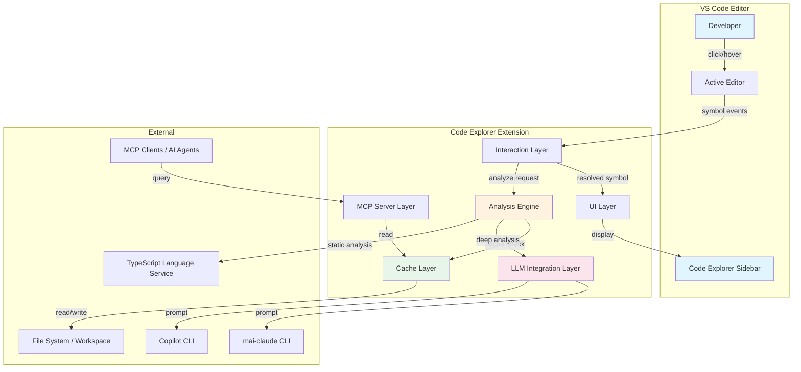

### 1.2 Layered Architecture

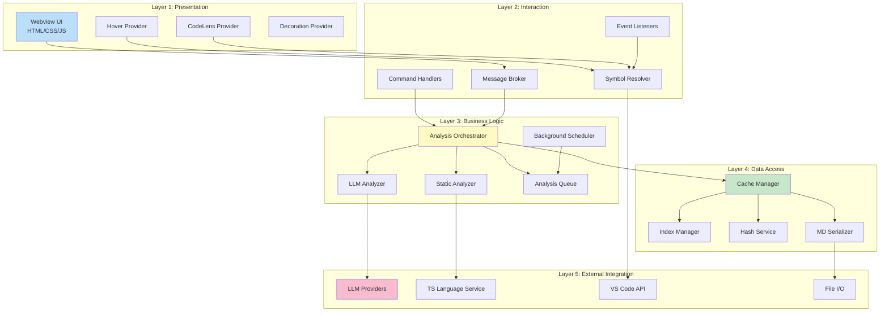

---

## 2. Component Architecture

### 2.1 UI Layer

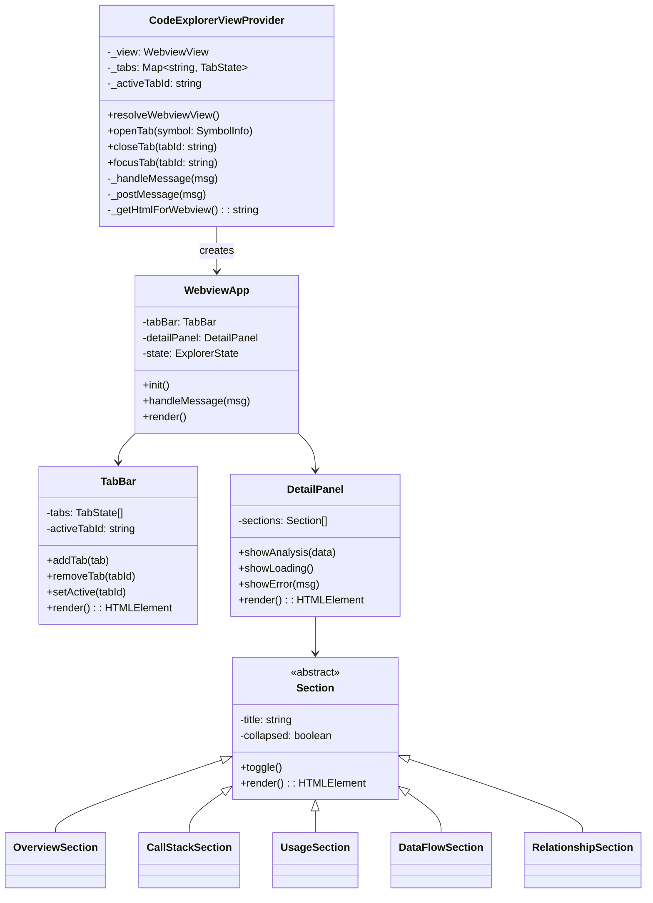

**Responsibilities:**

| Component | Responsibility |
|-----------|---------------|
| `CodeExplorerViewProvider` | VS Code WebviewView lifecycle, message routing between extension host and webview |
| `WebviewApp` | Webview-side application root, state management, rendering |
| `TabBar` | Tab creation, switching, closing, overflow scrolling |
| `DetailPanel` | Renders analysis content with collapsible sections |
| `Section` subclasses | Specialized rendering for each analysis section (call stacks as trees, usage as file lists, data flow as timelines) |

### 2.2 Interaction Layer

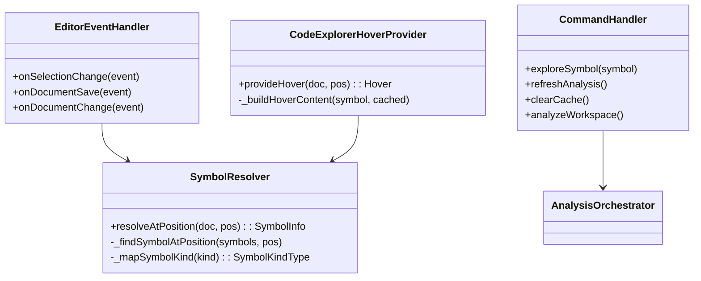

### 2.3 Analysis Engine

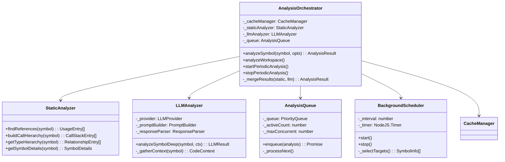

**Analysis Flow Decision Tree:**

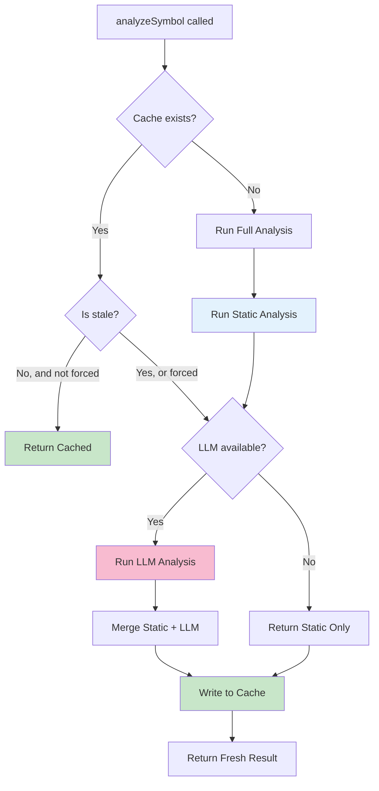

### 2.4 Cache Layer

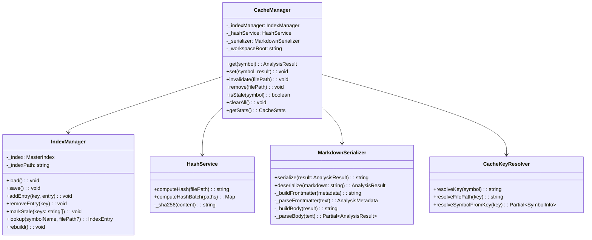

### 2.5 LLM Integration Layer

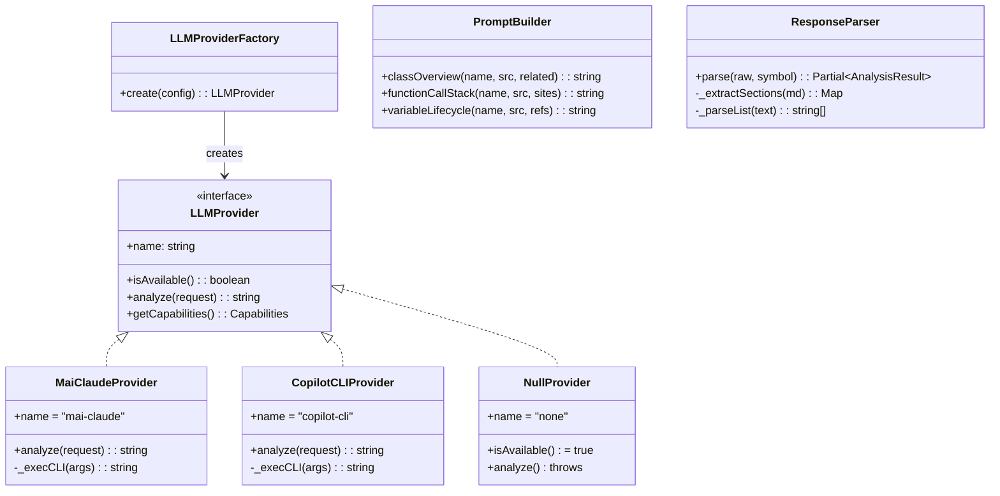

### 2.6 MCP Layer (Future)

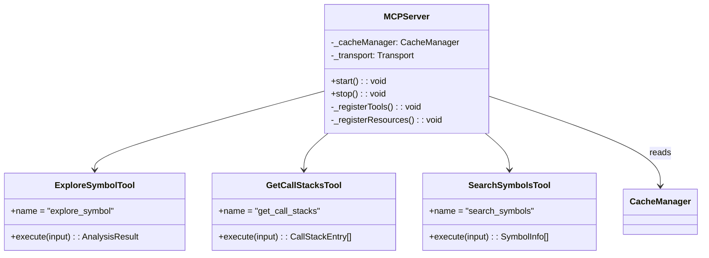

---

## 3. Data Flow Diagrams

### 3.1 User Click → Analysis → Render

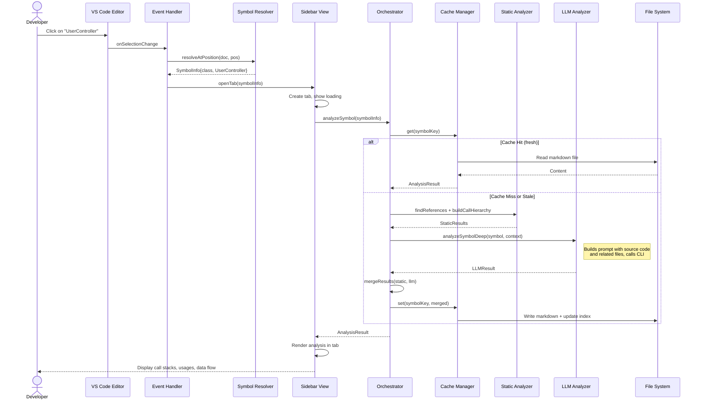

### 3.2 Background Periodic Analysis

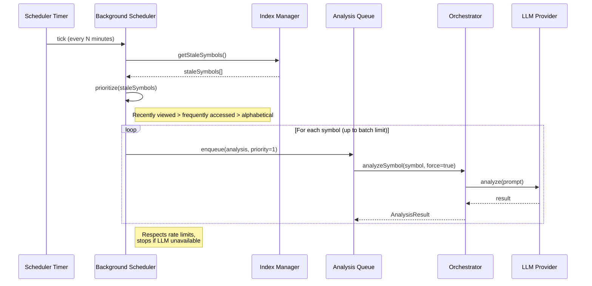

### 3.3 Cache Invalidation on File Save

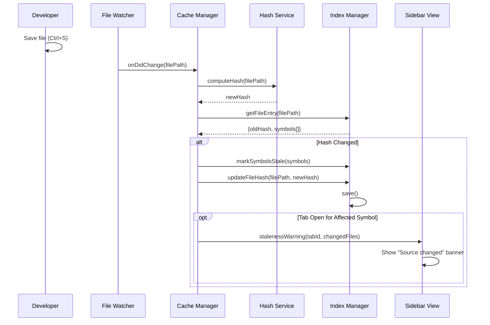

### 3.4 MCP Query Flow (Future)

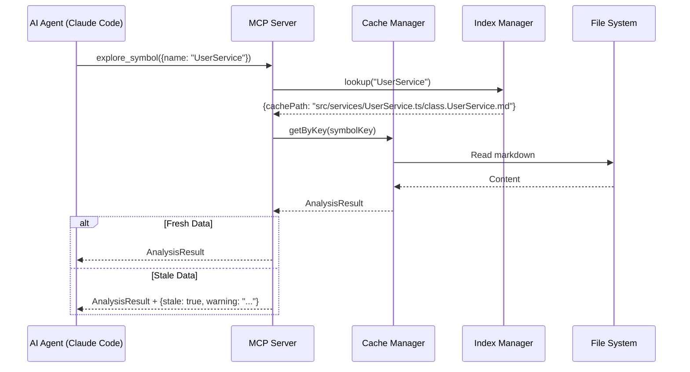

---

## 4. Directory Structure

```
code-explorer/
├── .vscode/
│   ├── launch.json             # Debug configurations
│   ├── tasks.json              # Build, test, package tasks
│   └── settings.json           # Workspace settings
│
├── src/                        # Extension source (TypeScript)
│   ├── extension.ts            # Entry point: activate / deactivate
│   │
│   ├── ui/                     # UI Layer
│   │   └── CodeExplorerViewProvider.ts
│   │
│   ├── providers/              # VS Code language feature providers
│   │   ├── CodeExplorerHoverProvider.ts
│   │   ├── CodeExplorerCodeLensProvider.ts
│   │   ├── CodeExplorerDecorationProvider.ts
│   │   └── SymbolResolver.ts
│   │
│   ├── analysis/               # Analysis engine
│   │   ├── AnalysisOrchestrator.ts
│   │   ├── StaticAnalyzer.ts
│   │   ├── LLMAnalyzer.ts
│   │   ├── AnalysisQueue.ts
│   │   └── BackgroundScheduler.ts
│   │
│   ├── cache/                  # Cache management
│   │   ├── CacheManager.ts
│   │   ├── IndexManager.ts
│   │   ├── HashService.ts
│   │   ├── MarkdownSerializer.ts
│   │   └── CacheKeyResolver.ts
│   │
│   ├── llm/                    # LLM integration
│   │   ├── LLMProvider.ts      # Interface
│   │   ├── LLMProviderFactory.ts
│   │   ├── MaiClaudeProvider.ts
│   │   ├── CopilotCLIProvider.ts
│   │   ├── PromptBuilder.ts
│   │   └── ResponseParser.ts
│   │
│   ├── mcp/                    # MCP server (future)
│   │   ├── MCPServer.ts
│   │   ├── tools/
│   │   │   ├── ExploreSymbolTool.ts
│   │   │   ├── GetCallStacksTool.ts
│   │   │   ├── GetUsagesTool.ts
│   │   │   └── SearchSymbolsTool.ts
│   │   └── resources/
│   │       ├── IndexResource.ts
│   │       └── SymbolResource.ts
│   │
│   ├── models/                 # Data models / interfaces
│   │   ├── types.ts            # All TypeScript interfaces
│   │   ├── errors.ts           # Error classes
│   │   └── constants.ts        # Constants
│   │
│   └── utils/                  # Utilities
│       ├── fileUtils.ts
│       ├── hashUtils.ts
│       └── debounce.ts
│
├── webview/                    # Webview UI source
│   ├── src/
│   │   ├── main.ts             # Webview entry point
│   │   ├── components/
│   │   │   ├── TabBar.ts
│   │   │   ├── SymbolHeader.ts
│   │   │   ├── OverviewSection.ts
│   │   │   ├── CallStackSection.ts
│   │   │   ├── UsageSection.ts
│   │   │   ├── DataFlowSection.ts
│   │   │   ├── RelationshipSection.ts
│   │   │   ├── LoadingState.ts
│   │   │   ├── EmptyState.ts
│   │   │   └── ErrorState.ts
│   │   ├── utils/
│   │   │   ├── dom.ts
│   │   │   └── icons.ts
│   │   └── styles/
│   │       └── main.css
│   ├── tsconfig.json
│   └── esbuild.config.mjs
│
├── media/                      # Static assets
│   ├── icon.svg                # Activity bar icon
│   └── icons/                  # Symbol kind icons
│
├── test/                       # Tests
│   ├── unit/
│   │   ├── cache/
│   │   ├── analysis/
│   │   └── llm/
│   ├── integration/
│   │   └── extension.test.ts
│   └── fixtures/               # Test data
│
├── docs/                       # Documentation
│
├── package.json                # Extension manifest
├── tsconfig.json               # TypeScript config
├── esbuild.config.mjs          # Extension bundler config
├── .eslintrc.json
├── .prettierrc
├── .vscodeignore               # VSIX packaging excludes
├── CHANGELOG.md
└── README.md
```

---

## 5. Technology Choices

| Category | Choice | Rationale |
|----------|--------|-----------|
| **Language** | TypeScript | Type safety, VS Code ecosystem native |
| **Extension API** | VS Code Extension API v1.85+ | WebviewView, CallHierarchy, TypeHierarchy APIs |
| **Webview UI** | Vanilla TS + CSS | Minimal bundle size (~20KB vs ~150KB for React), fast load |
| **Bundler** | esbuild | 10-100x faster than webpack, good tree-shaking |
| **Cache format** | Markdown + YAML frontmatter | Human-readable, AI-agent friendly, git-diffable |
| **Index format** | JSON | Fast parsing, O(1) lookups via object keys |
| **Hashing** | SHA-256 (Node.js crypto) | Built-in, no dependencies, collision-resistant |
| **LLM CLI** | mai-claude / copilot CLI | Available in dev environments, no API key management |
| **MCP SDK** | @modelcontextprotocol/sdk | Official MCP TypeScript SDK |
| **Testing** | Mocha + VS Code Test Runner | Standard for VS Code extensions |
| **CI/CD** | GitHub Actions / ADO Pipeline | Extension packaging + marketplace publish |

### Decision: Why Vanilla TS for Webview (Not React)?

| Factor | Vanilla TS | React |
|--------|-----------|-------|
| Bundle size | ~20KB | ~150KB+ |
| Load time | <50ms | ~200ms |
| Dependencies | 0 | react, react-dom |
| VS Code theme integration | Direct CSS variable usage | Requires styled-components or CSS modules |
| Maintenance | More boilerplate | Less boilerplate |
| **Decision** | **✅ Chosen** | Not chosen |

The sidebar must feel instant. The additional bundle size and load time of React is not justified for the relatively simple DOM structure (tab bar + collapsible sections).

### Decision: Why Markdown Cache (Not JSON)?

| Factor | Markdown + YAML FM | JSON |
|--------|-------------------|------|
| Human readability | Excellent | Good |
| AI agent consumption | Excellent (natural language) | Good (structured) |
| Git diff readability | Excellent | Poor for large objects |
| Parsing speed | Moderate | Fast |
| Schema flexibility | High | Rigid |
| **Decision** | **✅ Chosen** | Used for index only |

Markdown files serve double duty: structured data (via frontmatter) and human/AI-readable content (via body). The index.json provides fast lookups while markdown provides rich content.

---

## 6. Scalability Considerations

### 6.1 Workspace Size Tiers

| Tier | Files | Symbols | Strategy |
|------|-------|---------|----------|
| Small | <100 | <500 | Full analysis on activation, keep all in memory |
| Medium | 100-1K | 500-5K | On-demand analysis, index in memory, content lazy-loaded |
| Large | 1K-10K | 5K-50K | On-demand only, index lazy-loaded, pagination in UI |
| Monorepo | 10K+ | 50K+ | Scope to active workspace folder, ignore node_modules aggressively |

### 6.2 Performance Targets

| Operation | Target | Strategy |
|-----------|--------|----------|
| Hover popup | <100ms | Read from memory cache → index lookup → file read |
| Tab open (cached) | <200ms | Index lookup + markdown parse + render |
| Tab open (uncached) | <30s | Static analysis (<2s) + LLM analysis (<25s) + render |
| Background analysis (per symbol) | <30s | Queue with rate limiting |
| Index load | <500ms | JSON parse, lazy for large workspaces |
| File save → staleness check | <50ms | Hash comparison only |

### 6.3 Memory Management

- **Index**: Kept in memory (~1KB per 100 symbols = ~500KB for 50K symbols)
- **Analysis results**: NOT kept in memory; loaded from disk on demand
- **Open tabs**: Only active tabs' data in memory (max ~10 tabs ≈ 1MB)
- **LLM responses**: Streamed to disk, not buffered in memory

### 6.4 Incremental Analysis

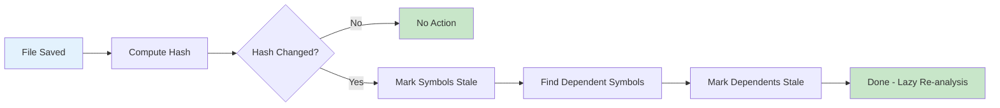

Only re-analyze when:
1. A stale symbol's tab is opened
2. Background scheduler picks up stale symbols
3. User explicitly clicks "Refresh"

---

## 7. Security Considerations

### 7.1 Threat Model

| Threat | Mitigation |
|--------|-----------|
| Sensitive code sent to LLM | User opt-in, configurable exclude patterns, local-only providers |
| Secrets in cache files | Cache stores analysis, not raw code; .gitignore the cache directory |
| Webview XSS | Strict CSP (Content Security Policy), no inline scripts |
| Malicious workspace | CSP prevents loading external resources, sandboxed webview |
| LLM prompt injection | System prompt isolation, output sanitization |

### 7.2 Content Security Policy

```
default-src 'none';
style-src ${webview.cspSource} 'nonce-${nonce}';
script-src 'nonce-${nonce}';
img-src ${webview.cspSource};
font-src ${webview.cspSource};
```

### 7.3 .gitignore

The cache directory should be gitignored:

```gitignore
# Code Explorer cache (machine-specific analysis)
.vscode/code-explorer/
```

**Rationale:** Analysis results contain machine-specific file paths, hashes tied to local file state, and potentially sensitive code summaries. They should not be shared across developers.

---

## 8. Integration Points

### 8.1 VS Code Extension API

| API | Usage |
|-----|-------|
| `window.registerWebviewViewProvider` | Sidebar panel |
| `languages.registerHoverProvider` | Hover cards |
| `languages.registerCodeLensProvider` | Inline indicators (optional) |
| `commands.registerCommand` | User commands |
| `workspace.createFileSystemWatcher` | Cache invalidation |
| `commands.executeCommand('vscode.executeReferenceProvider')` | Find references |
| `commands.executeCommand('vscode.prepareCallHierarchy')` | Call hierarchy |
| `commands.executeCommand('vscode.prepareTypeHierarchy')` | Type hierarchy |
| `commands.executeCommand('vscode.executeDocumentSymbolProvider')` | Symbol enumeration |

### 8.2 TypeScript Language Service

Used **indirectly** through VS Code's built-in TypeScript extension, which provides:
- Document symbols (classes, functions, variables)
- References (find all usages)
- Call hierarchy (incoming/outgoing calls)
- Type hierarchy (supertypes/subtypes)
- Go-to-definition

### 8.3 LLM CLI Tools

| Tool | Command | Use Case |
|------|---------|----------|
| mai-claude | `claude --print "<prompt>"` | Deep code analysis |
| Copilot CLI | `github-copilot-cli explain "<prompt>"` | Alternative provider |

### 8.4 MCP Protocol (Future)

- **Transport:** stdio (for CLI clients) or in-process (for VS Code extensions)
- **SDK:** `@modelcontextprotocol/sdk`
- **Capability:** Tools + Resources (no prompts)

---

## 9. Deployment Architecture

### 9.1 Extension Packaging

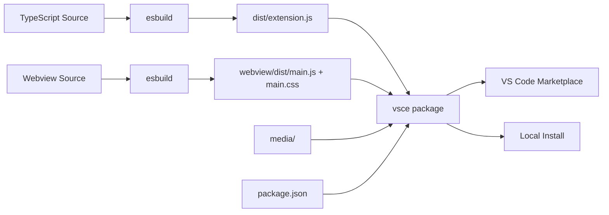

### 9.2 Build Configuration

```jsonc
// .vscode/tasks.json
{
  "version": "2.0.0",
  "tasks": [
    {
      "label": "Build Extension",
      "type": "npm",
      "script": "build",
      "group": { "kind": "build", "isDefault": true }
    },
    {
      "label": "Watch Extension",
      "type": "npm",
      "script": "watch",
      "isBackground": true
    },
    {
      "label": "Build Webview",
      "type": "npm",
      "script": "build:webview"
    },
    {
      "label": "Build All",
      "dependsOn": ["Build Extension", "Build Webview"]
    },
    {
      "label": "Run Tests",
      "type": "npm",
      "script": "test"
    },
    {
      "label": "Package VSIX",
      "type": "npm",
      "script": "package"
    }
  ]
}
```

### 9.3 Debug Configuration

```jsonc
// .vscode/launch.json
{
  "version": "0.2.0",
  "configurations": [
    {
      "name": "Run Extension",
      "type": "extensionHost",
      "request": "launch",
      "runtimeExecutable": "${execPath}",
      "args": ["--extensionDevelopmentPath=${workspaceFolder}"],
      "outFiles": ["${workspaceFolder}/dist/**/*.js"],
      "preLaunchTask": "Build All"
    },
    {
      "name": "Extension Tests",
      "type": "extensionHost",
      "request": "launch",
      "runtimeExecutable": "${execPath}",
      "args": [
        "--extensionDevelopmentPath=${workspaceFolder}",
        "--extensionTestsPath=${workspaceFolder}/out/test"
      ],
      "outFiles": ["${workspaceFolder}/out/test/**/*.js"],
      "preLaunchTask": "Build All"
    }
  ]
}
```

---

*End of High-Level Design & Architecture Document*
