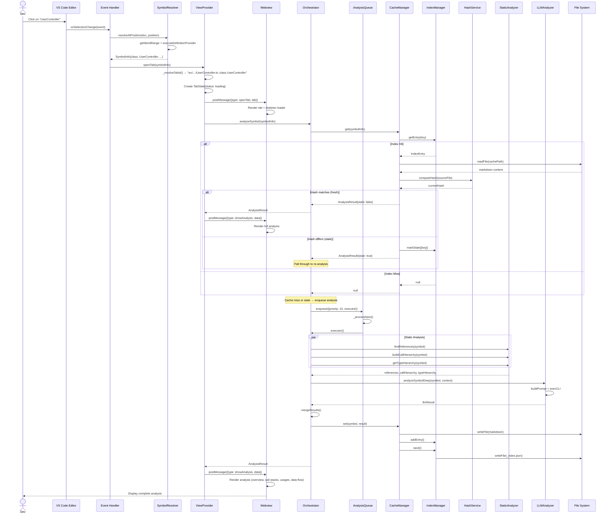
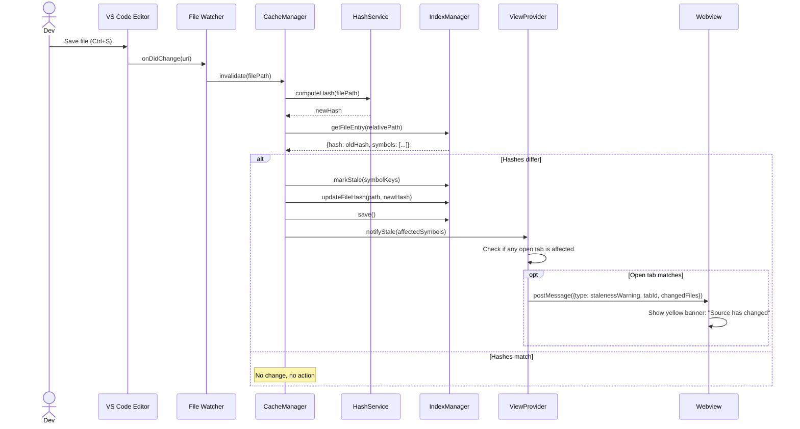

# Code Explorer — Low-Level Detailed Design

> **Version:** 1.0
> **Date:** 2026-03-28
> **Status:** Draft

---

## Table of Contents

1. [Module-Level Design](#1-module-level-design)
2. [Detailed Data Models](#2-detailed-data-models)
3. [Cache File Format Specification](#3-cache-file-format-specification)
4. [Sequence Diagrams](#4-sequence-diagrams)
5. [Error Handling Design](#5-error-handling-design)
6. [Testing Strategy](#6-testing-strategy)

---

## 1. Module-Level Design

### 1.1 Extension Core (`src/extension.ts`)

```typescript
import * as vscode from 'vscode';
import { CacheManager } from './cache/CacheManager';
import { IndexManager } from './cache/IndexManager';
import { HashService } from './cache/HashService';
import { MarkdownSerializer } from './cache/MarkdownSerializer';
import { CacheKeyResolver } from './cache/CacheKeyResolver';
import { StaticAnalyzer } from './analysis/StaticAnalyzer';
import { LLMAnalyzer } from './analysis/LLMAnalyzer';
import { AnalysisOrchestrator } from './analysis/AnalysisOrchestrator';
import { AnalysisQueue } from './analysis/AnalysisQueue';
import { BackgroundScheduler } from './analysis/BackgroundScheduler';
import { LLMProviderFactory } from './llm/LLMProviderFactory';
import { SymbolResolver } from './providers/SymbolResolver';
import { CodeExplorerHoverProvider } from './providers/CodeExplorerHoverProvider';
import { CodeExplorerViewProvider } from './ui/CodeExplorerViewProvider';

let scheduler: BackgroundScheduler | undefined;

export function activate(context: vscode.ExtensionContext): void {
  const workspaceRoot = vscode.workspace.workspaceFolders?.[0]?.uri.fsPath;
  if (!workspaceRoot) {
    vscode.window.showWarningMessage('Code Explorer requires an open workspace.');
    return;
  }

  // --- Dependency Construction ---
  const config = vscode.workspace.getConfiguration('codeExplorer');

  // Cache layer
  const hashService = new HashService();
  const cacheKeyResolver = new CacheKeyResolver();
  const serializer = new MarkdownSerializer();
  const indexManager = new IndexManager(workspaceRoot);
  const cacheManager = new CacheManager(
    workspaceRoot, indexManager, hashService, serializer, cacheKeyResolver
  );

  // LLM layer
  const llmProvider = LLMProviderFactory.create(config.get('llmProvider', 'mai-claude'));

  // Analysis layer
  const symbolResolver = new SymbolResolver();
  const staticAnalyzer = new StaticAnalyzer();
  const llmAnalyzer = new LLMAnalyzer(llmProvider);
  const analysisQueue = new AnalysisQueue(
    config.get('maxConcurrentAnalyses', 3),
    2000 // rate limit ms
  );
  const orchestrator = new AnalysisOrchestrator(
    cacheManager, staticAnalyzer, llmAnalyzer, analysisQueue
  );

  // UI layer
  const viewProvider = new CodeExplorerViewProvider(context.extensionUri, orchestrator);

  // --- Registrations ---

  // Sidebar
  context.subscriptions.push(
    vscode.window.registerWebviewViewProvider('codeExplorer.sidebar', viewProvider)
  );

  // Hover provider
  if (config.get('showHoverCards', true)) {
    context.subscriptions.push(
      vscode.languages.registerHoverProvider(
        ['typescript', 'javascript', 'typescriptreact', 'javascriptreact', 'python', 'java', 'csharp'],
        new CodeExplorerHoverProvider(cacheManager, symbolResolver)
      )
    );
  }

  // Commands
  context.subscriptions.push(
    vscode.commands.registerCommand('codeExplorer.exploreSymbol', async (symbolOrUndefined) => {
      let symbol = symbolOrUndefined;
      if (!symbol) {
        const editor = vscode.window.activeTextEditor;
        if (!editor) return;
        symbol = await symbolResolver.resolveAtPosition(editor.document, editor.selection.active);
      }
      if (symbol) {
        viewProvider.openTab(symbol);
      }
    }),
    vscode.commands.registerCommand('codeExplorer.refreshAnalysis', () => orchestrator.refreshCurrent()),
    vscode.commands.registerCommand('codeExplorer.clearCache', async () => {
      const confirm = await vscode.window.showWarningMessage(
        'Clear all Code Explorer cached analysis?', { modal: true }, 'Clear'
      );
      if (confirm === 'Clear') {
        await cacheManager.clearAll();
        vscode.window.showInformationMessage('Code Explorer cache cleared.');
      }
    }),
    vscode.commands.registerCommand('codeExplorer.analyzeWorkspace', () => orchestrator.analyzeWorkspace())
  );

  // File watcher for cache invalidation
  const watcher = vscode.workspace.createFileSystemWatcher('**/*.{ts,tsx,js,jsx,py,java,cs}');
  watcher.onDidChange(uri => cacheManager.invalidate(uri.fsPath));
  watcher.onDidDelete(uri => cacheManager.remove(uri.fsPath));
  watcher.onDidCreate(uri => { /* New file — nothing to invalidate */ });
  context.subscriptions.push(watcher);

  // Background scheduler
  const intervalMinutes = config.get('periodicAnalysisIntervalMinutes', 0);
  if (intervalMinutes > 0) {
    scheduler = new BackgroundScheduler(orchestrator, indexManager, intervalMinutes);
    scheduler.start();
    context.subscriptions.push({ dispose: () => scheduler?.stop() });
  }

  // Config change listener
  context.subscriptions.push(
    vscode.workspace.onDidChangeConfiguration(e => {
      if (e.affectsConfiguration('codeExplorer')) {
        // Restart scheduler if interval changed
        const newInterval = vscode.workspace.getConfiguration('codeExplorer')
          .get('periodicAnalysisIntervalMinutes', 0);
        scheduler?.stop();
        if (newInterval > 0) {
          scheduler = new BackgroundScheduler(orchestrator, indexManager, newInterval);
          scheduler.start();
        }
      }
    })
  );

  // Load index on activation
  indexManager.load().catch(err => {
    console.warn('[Code Explorer] Failed to load index, will rebuild:', err);
  });
}

export function deactivate(): void {
  scheduler?.stop();
}
```

### 1.2 CacheManager — Detailed Implementation

```typescript
// src/cache/CacheManager.ts
import * as fs from 'fs/promises';
import * as path from 'path';
import { AnalysisResult, AnalysisMetadata, SymbolInfo, CacheStats } from '../models/types';
import { IndexManager } from './IndexManager';
import { HashService } from './HashService';
import { MarkdownSerializer } from './MarkdownSerializer';
import { CacheKeyResolver } from './CacheKeyResolver';

export class CacheManager {
  private readonly _cacheRoot: string;

  constructor(
    private readonly _workspaceRoot: string,
    private readonly _indexManager: IndexManager,
    private readonly _hashService: HashService,
    private readonly _serializer: MarkdownSerializer,
    private readonly _keyResolver: CacheKeyResolver
  ) {
    this._cacheRoot = path.join(_workspaceRoot, '.vscode', 'code-explorer');
  }

  /**
   * Get cached analysis for a symbol.
   * Returns null on cache miss. Returns stale data with metadata.stale=true if stale.
   */
  async get(symbol: SymbolInfo): Promise<AnalysisResult | null> {
    const key = this._keyResolver.resolveKey(symbol);
    const entry = this._indexManager.getEntry(key);
    if (!entry) return null;

    const filePath = path.join(this._cacheRoot, entry.cachePath);

    try {
      const content = await fs.readFile(filePath, 'utf-8');
      const result = this._serializer.deserialize(content);

      // Check freshness
      const currentHash = await this._hashService.computeHash(
        path.join(this._workspaceRoot, symbol.filePath)
      );
      if (currentHash !== entry.sourceHash) {
        result.metadata.stale = true;
        this._indexManager.markStale([key]);
      }

      return result;
    } catch (err) {
      // File doesn't exist or is corrupt
      this._indexManager.removeEntry(key);
      return null;
    }
  }

  /**
   * Get cached analysis by key string (for MCP/API access).
   */
  async getByKey(key: string): Promise<AnalysisResult | null> {
    const entry = this._indexManager.getEntry(key);
    if (!entry) return null;

    const filePath = path.join(this._cacheRoot, entry.cachePath);
    try {
      const content = await fs.readFile(filePath, 'utf-8');
      return this._serializer.deserialize(content);
    } catch {
      return null;
    }
  }

  /**
   * Store analysis result.
   */
  async set(symbol: SymbolInfo, result: AnalysisResult): Promise<void> {
    const key = this._keyResolver.resolveKey(symbol);
    const relativeCachePath = this._keyResolver.resolveFilePath(key);
    const absoluteCachePath = path.join(this._cacheRoot, relativeCachePath);

    // Ensure directory exists
    await fs.mkdir(path.dirname(absoluteCachePath), { recursive: true });

    // Serialize and write
    const content = this._serializer.serialize(result);
    await fs.writeFile(absoluteCachePath, content, 'utf-8');

    // Update index
    this._indexManager.addEntry(key, {
      name: symbol.name,
      kind: symbol.kind,
      file: symbol.filePath,
      cachePath: relativeCachePath,
      analyzedAt: result.metadata.analyzedAt,
      sourceHash: result.metadata.sourceHash,
      stale: false
    });

    // Write manifest
    await this._writeManifest(symbol.filePath);

    // Persist index
    await this._indexManager.save();
  }

  /**
   * Mark all symbols in a file as stale (triggered by file watcher).
   */
  async invalidate(filePath: string): Promise<void> {
    const relativePath = path.relative(this._workspaceRoot, filePath);
    const fileEntry = this._indexManager.getFileEntry(relativePath);
    if (!fileEntry) return;

    // Compute new hash
    const newHash = await this._hashService.computeHash(filePath);
    if (newHash === fileEntry.hash) return; // No actual change

    // Mark all symbols as stale
    this._indexManager.markStale(fileEntry.symbols.map(s => `${relativePath}::${s}`));

    // Update file hash
    this._indexManager.updateFileHash(relativePath, newHash);
    await this._indexManager.save();
  }

  /**
   * Remove all cached data for a file (triggered by file deletion).
   */
  async remove(filePath: string): Promise<void> {
    const relativePath = path.relative(this._workspaceRoot, filePath);
    const fileEntry = this._indexManager.getFileEntry(relativePath);
    if (!fileEntry) return;

    // Remove cache directory
    const cacheDir = path.join(this._cacheRoot, relativePath);
    try {
      await fs.rm(cacheDir, { recursive: true, force: true });
    } catch { /* ignore */ }

    // Remove from index
    for (const sym of fileEntry.symbols) {
      this._indexManager.removeEntry(`${relativePath}::${sym}`);
    }
    this._indexManager.removeFileEntry(relativePath);
    await this._indexManager.save();
  }

  /**
   * Check if a specific symbol's cache is stale.
   */
  isStale(symbol: SymbolInfo): boolean {
    const key = this._keyResolver.resolveKey(symbol);
    const entry = this._indexManager.getEntry(key);
    return !entry || entry.stale;
  }

  /**
   * Clear entire cache.
   */
  async clearAll(): Promise<void> {
    try {
      await fs.rm(this._cacheRoot, { recursive: true, force: true });
    } catch { /* ignore */ }
    await fs.mkdir(this._cacheRoot, { recursive: true });
    this._indexManager.reset();
    await this._indexManager.save();
  }

  /**
   * Get cache statistics.
   */
  getStats(): CacheStats {
    const entries = this._indexManager.getAllEntries();
    const values = Object.values(entries);

    return {
      totalSymbols: values.length,
      freshCount: values.filter(e => !e.stale).length,
      staleCount: values.filter(e => e.stale).length,
      totalSizeBytes: 0, // computed lazily
      oldestAnalysis: values.length > 0
        ? values.reduce((min, e) => e.analyzedAt < min ? e.analyzedAt : min, values[0].analyzedAt)
        : '',
      newestAnalysis: values.length > 0
        ? values.reduce((max, e) => e.analyzedAt > max ? e.analyzedAt : max, values[0].analyzedAt)
        : ''
    };
  }

  private async _writeManifest(filePath: string): Promise<void> {
    const relativePath = path.relative(this._workspaceRoot,
      filePath.startsWith('/') ? filePath : path.join(this._workspaceRoot, filePath)
    );
    const fileEntry = this._indexManager.getFileEntry(relativePath);
    if (!fileEntry) return;

    const manifest = {
      file: relativePath,
      hash: fileEntry.hash,
      symbols: fileEntry.symbols.map(symName => {
        const key = `${relativePath}::${symName}`;
        const entry = this._indexManager.getEntry(key);
        return {
          name: symName.split('.').slice(1).join('.'),
          kind: entry?.kind || 'unknown',
          cacheFile: `${symName}.md`,
          analyzedAt: entry?.analyzedAt || '',
          stale: entry?.stale || false
        };
      })
    };

    const manifestPath = path.join(this._cacheRoot, relativePath, '_manifest.json');
    await fs.writeFile(manifestPath, JSON.stringify(manifest, null, 2), 'utf-8');
  }
}
```

### 1.3 IndexManager — Detailed Implementation

```typescript
// src/cache/IndexManager.ts
import * as fs from 'fs/promises';
import * as path from 'path';
import { MasterIndex, IndexEntry, FileIndexEntry } from '../models/types';

export class IndexManager {
  private _index: MasterIndex;
  private readonly _indexPath: string;
  private _dirty = false;
  private _saveDebounceTimer?: NodeJS.Timeout;

  constructor(workspaceRoot: string) {
    this._indexPath = path.join(workspaceRoot, '.vscode', 'code-explorer', '_index.json');
    this._index = this._emptyIndex();
  }

  private _emptyIndex(): MasterIndex {
    return {
      version: '1.0.0',
      lastUpdated: new Date().toISOString(),
      symbolCount: 0,
      entries: {},
      fileIndex: {}
    };
  }

  async load(): Promise<void> {
    try {
      const content = await fs.readFile(this._indexPath, 'utf-8');
      this._index = JSON.parse(content);
    } catch {
      this._index = this._emptyIndex();
    }
  }

  async save(): Promise<void> {
    if (!this._dirty) return;

    // Debounce saves — max once per second
    if (this._saveDebounceTimer) {
      clearTimeout(this._saveDebounceTimer);
    }

    return new Promise((resolve) => {
      this._saveDebounceTimer = setTimeout(async () => {
        this._index.lastUpdated = new Date().toISOString();
        this._index.symbolCount = Object.keys(this._index.entries).length;

        const dir = path.dirname(this._indexPath);
        await fs.mkdir(dir, { recursive: true });
        await fs.writeFile(this._indexPath, JSON.stringify(this._index, null, 2), 'utf-8');
        this._dirty = false;
        resolve();
      }, 500);
    });
  }

  getEntry(key: string): IndexEntry | undefined {
    return this._index.entries[key];
  }

  getFileEntry(filePath: string): FileIndexEntry | undefined {
    return this._index.fileIndex[filePath];
  }

  getAllEntries(): Record<string, IndexEntry> {
    return this._index.entries;
  }

  addEntry(key: string, entry: IndexEntry): void {
    this._index.entries[key] = entry;

    // Update file index
    const filePath = entry.file;
    if (!this._index.fileIndex[filePath]) {
      this._index.fileIndex[filePath] = {
        hash: entry.sourceHash,
        symbols: [],
        lastAnalyzed: entry.analyzedAt
      };
    }

    const symbolName = key.split('::')[1]; // e.g., "class.UserController"
    if (!this._index.fileIndex[filePath].symbols.includes(symbolName)) {
      this._index.fileIndex[filePath].symbols.push(symbolName);
    }
    this._index.fileIndex[filePath].lastAnalyzed = entry.analyzedAt;
    this._index.fileIndex[filePath].hash = entry.sourceHash;

    this._dirty = true;
  }

  removeEntry(key: string): void {
    const entry = this._index.entries[key];
    if (!entry) return;

    // Remove from file index
    const fileEntry = this._index.fileIndex[entry.file];
    if (fileEntry) {
      const symbolName = key.split('::')[1];
      fileEntry.symbols = fileEntry.symbols.filter(s => s !== symbolName);
      if (fileEntry.symbols.length === 0) {
        delete this._index.fileIndex[entry.file];
      }
    }

    delete this._index.entries[key];
    this._dirty = true;
  }

  removeFileEntry(filePath: string): void {
    delete this._index.fileIndex[filePath];
    this._dirty = true;
  }

  markStale(keys: string[]): void {
    for (const key of keys) {
      if (this._index.entries[key]) {
        this._index.entries[key].stale = true;
      }
    }
    this._dirty = true;
  }

  updateFileHash(filePath: string, hash: string): void {
    if (this._index.fileIndex[filePath]) {
      this._index.fileIndex[filePath].hash = hash;
      this._dirty = true;
    }
  }

  /**
   * Get all stale symbol keys, sorted by staleness (oldest first).
   */
  getStaleEntries(): string[] {
    return Object.entries(this._index.entries)
      .filter(([_, e]) => e.stale)
      .sort(([_, a], [__, b]) => a.analyzedAt.localeCompare(b.analyzedAt))
      .map(([key]) => key);
  }

  /**
   * Search entries by name (for MCP search_symbols).
   */
  search(query: string, kind?: string, limit = 20): IndexEntry[] {
    const lowerQuery = query.toLowerCase();
    return Object.values(this._index.entries)
      .filter(e => {
        if (kind && e.kind !== kind) return false;
        return e.name.toLowerCase().includes(lowerQuery);
      })
      .slice(0, limit);
  }

  reset(): void {
    this._index = this._emptyIndex();
    this._dirty = true;
  }
}
```

### 1.4 HashService

```typescript
// src/cache/HashService.ts
import * as fs from 'fs/promises';
import * as crypto from 'crypto';

export class HashService {
  /**
   * Compute SHA-256 hash of a file's contents.
   */
  async computeHash(filePath: string): Promise<string> {
    try {
      const content = await fs.readFile(filePath);
      return 'sha256:' + crypto.createHash('sha256').update(content).digest('hex');
    } catch {
      return 'sha256:unknown';
    }
  }

  /**
   * Compute hashes for multiple files in parallel.
   */
  async computeHashBatch(filePaths: string[]): Promise<Map<string, string>> {
    const results = new Map<string, string>();
    const promises = filePaths.map(async (fp) => {
      const hash = await this.computeHash(fp);
      results.set(fp, hash);
    });
    await Promise.all(promises);
    return results;
  }

  /**
   * Compute hash of a string (for in-memory content).
   */
  hashString(content: string): string {
    return 'sha256:' + crypto.createHash('sha256').update(content, 'utf-8').digest('hex');
  }
}
```

### 1.5 MarkdownSerializer

```typescript
// src/cache/MarkdownSerializer.ts
import { AnalysisResult, AnalysisMetadata, SymbolInfo } from '../models/types';

export class MarkdownSerializer {
  /**
   * Serialize an AnalysisResult to a markdown file with YAML frontmatter.
   */
  serialize(result: AnalysisResult): string {
    const fm = this._buildFrontmatter(result);
    const body = this._buildBody(result);
    return `---\n${fm}---\n\n${body}`;
  }

  /**
   * Deserialize a markdown file back to an AnalysisResult.
   */
  deserialize(content: string): AnalysisResult {
    const { frontmatter, body } = this._splitFrontmatter(content);
    const metadata = this._parseFrontmatter(frontmatter);
    const analysis = this._parseBody(body);

    return {
      symbol: {
        name: metadata.symbolName,
        kind: metadata.symbolKind,
        filePath: metadata.file,
        position: { line: metadata.line || 0, character: 0 }
      },
      overview: analysis.overview || '',
      callStacks: analysis.callStacks || [],
      usages: analysis.usages || [],
      dataFlow: analysis.dataFlow || [],
      relationships: analysis.relationships || [],
      keyMethods: analysis.keyMethods,
      dependencies: analysis.dependencies,
      potentialIssues: analysis.potentialIssues,
      metadata: {
        analyzedAt: metadata.analyzedAt,
        sourceHash: metadata.sourceHash,
        dependentFileHashes: metadata.dependentFileHashes,
        llmProvider: metadata.llmProvider,
        analysisVersion: metadata.analysisVersion,
        stale: metadata.stale
      }
    };
  }

  private _buildFrontmatter(result: AnalysisResult): string {
    const lines: string[] = [];
    lines.push(`symbol: ${result.symbol.name}`);
    lines.push(`kind: ${result.symbol.kind}`);
    lines.push(`file: ${result.symbol.filePath}`);
    lines.push(`line: ${result.symbol.position.line}`);
    lines.push(`analyzed_at: "${result.metadata.analyzedAt}"`);
    lines.push(`analysis_version: "${result.metadata.analysisVersion}"`);
    if (result.metadata.llmProvider) {
      lines.push(`llm_provider: ${result.metadata.llmProvider}`);
    }
    lines.push(`source_hash: "${result.metadata.sourceHash}"`);

    if (Object.keys(result.metadata.dependentFileHashes).length > 0) {
      lines.push(`dependent_files:`);
      for (const [file, hash] of Object.entries(result.metadata.dependentFileHashes)) {
        lines.push(`  "${file}": "${hash}"`);
      }
    }

    lines.push(`stale: ${result.metadata.stale}`);
    return lines.join('\n') + '\n';
  }

  private _buildBody(result: AnalysisResult): string {
    const sections: string[] = [];

    // Header
    sections.push(`# ${result.symbol.kind} ${result.symbol.name}\n`);

    // Overview
    if (result.overview) {
      sections.push(`## Overview\n\n${result.overview}\n`);
    }

    // Call Stacks
    if (result.callStacks.length > 0) {
      sections.push(`## Call Stacks\n`);
      result.callStacks.forEach((cs, i) => {
        sections.push(`### ${i + 1}. ${cs.caller.name}`);
        if (cs.chain) {
          sections.push(`\`\`\`\n${cs.chain}\n\`\`\``);
        }
        sections.push(`- **File:** \`${cs.caller.filePath}:${cs.caller.line}\``);
        sections.push(`- **Kind:** ${cs.caller.kind}\n`);
      });
    }

    // Usage
    if (result.usages.length > 0) {
      sections.push(`## Usage (${result.usages.length} references)\n`);
      sections.push(`| File | Line | Context |`);
      sections.push(`|------|------|---------|`);
      result.usages.forEach(u => {
        sections.push(`| \`${u.filePath}\` | ${u.line} | ${u.contextLine || ''} |`);
      });
      sections.push('');
    }

    // Data Flow
    if (result.dataFlow.length > 0) {
      sections.push(`## Data Flow\n`);
      result.dataFlow.forEach(df => {
        sections.push(`- **${df.type}:** \`${df.filePath}:${df.line}\` — ${df.description}`);
      });
      sections.push('');
    }

    // Relationships
    if (result.relationships.length > 0) {
      sections.push(`## Relationships\n`);
      result.relationships.forEach(r => {
        sections.push(`- **${r.type}:** ${r.targetName} (\`${r.targetFilePath}:${r.targetLine}\`)`);
      });
      sections.push('');
    }

    // Key Methods
    if (result.keyMethods && result.keyMethods.length > 0) {
      sections.push(`## Key Methods\n`);
      result.keyMethods.forEach(m => sections.push(`- ${m}`));
      sections.push('');
    }

    // Dependencies
    if (result.dependencies && result.dependencies.length > 0) {
      sections.push(`## Dependencies\n`);
      result.dependencies.forEach(d => sections.push(`- ${d}`));
      sections.push('');
    }

    // Potential Issues
    if (result.potentialIssues && result.potentialIssues.length > 0) {
      sections.push(`## Potential Issues\n`);
      result.potentialIssues.forEach(p => sections.push(`- ${p}`));
      sections.push('');
    }

    return sections.join('\n');
  }

  private _splitFrontmatter(content: string): { frontmatter: string; body: string } {
    const match = content.match(/^---\n([\s\S]*?)\n---\n\n?([\s\S]*)$/);
    if (!match) return { frontmatter: '', body: content };
    return { frontmatter: match[1], body: match[2] };
  }

  private _parseFrontmatter(fm: string): any {
    const result: any = { dependentFileHashes: {} };
    let inDependentFiles = false;

    for (const line of fm.split('\n')) {
      if (line.startsWith('  ') && inDependentFiles) {
        const match = line.match(/^\s+"([^"]+)":\s+"([^"]+)"/);
        if (match) {
          result.dependentFileHashes[match[1]] = match[2];
        }
        continue;
      }

      inDependentFiles = false;
      const colonIndex = line.indexOf(':');
      if (colonIndex === -1) continue;

      const key = line.substring(0, colonIndex).trim();
      let value = line.substring(colonIndex + 1).trim();
      value = value.replace(/^["']|["']$/g, ''); // strip quotes

      switch (key) {
        case 'symbol': result.symbolName = value; break;
        case 'kind': result.symbolKind = value; break;
        case 'file': result.file = value; break;
        case 'line': result.line = parseInt(value, 10); break;
        case 'analyzed_at': result.analyzedAt = value; break;
        case 'analysis_version': result.analysisVersion = value; break;
        case 'llm_provider': result.llmProvider = value; break;
        case 'source_hash': result.sourceHash = value; break;
        case 'stale': result.stale = value === 'true'; break;
        case 'dependent_files': inDependentFiles = true; break;
      }
    }

    return result;
  }

  private _parseBody(body: string): any {
    // Simplified parsing — extract sections by ## headers
    const result: any = { callStacks: [], usages: [], dataFlow: [], relationships: [] };
    const sections = body.split(/\n## /);

    for (const section of sections) {
      const headerMatch = section.match(/^([^\n]+)/);
      if (!headerMatch) continue;
      const header = headerMatch[1].toLowerCase();

      if (header.includes('overview')) {
        result.overview = section.substring(headerMatch[0].length).trim();
      }
      // Additional parsing for other sections...
    }

    return result;
  }
}
```

### 1.6 CacheKeyResolver

```typescript
// src/cache/CacheKeyResolver.ts
import * as path from 'path';
import { SymbolInfo, SymbolKindType } from '../models/types';

export class CacheKeyResolver {
  /**
   * Generate a unique cache key for a symbol.
   * Format: "relative/path/to/file.ts::kind.Name"
   * Examples:
   *   "src/controllers/UserController.ts::class.UserController"
   *   "src/controllers/UserController.ts::fn.getUser"
   *   "src/controllers/UserController.ts::method.UserController.getUser"
   *   "src/controllers/UserController.ts::var.userCache"
   */
  resolveKey(symbol: SymbolInfo): string {
    const kindPrefix = this._kindToPrefix(symbol.kind);
    const name = symbol.containerName
      ? `${symbol.containerName}.${symbol.name}`
      : symbol.name;
    return `${symbol.filePath}::${kindPrefix}.${name}`;
  }

  /**
   * Convert a cache key to a relative file path in the cache directory.
   * "src/controllers/UserController.ts::class.UserController"
   *   → "src/controllers/UserController.ts/class.UserController.md"
   */
  resolveFilePath(key: string): string {
    const [filePath, symbolPart] = key.split('::');
    return path.join(filePath, `${symbolPart}.md`);
  }

  /**
   * Parse a cache key back into partial symbol info.
   */
  resolveSymbolFromKey(key: string): Partial<SymbolInfo> {
    const [filePath, symbolPart] = key.split('::');
    const dotIndex = symbolPart.indexOf('.');
    const kind = this._prefixToKind(symbolPart.substring(0, dotIndex));
    const name = symbolPart.substring(dotIndex + 1);

    return { name, kind, filePath };
  }

  private _kindToPrefix(kind: SymbolKindType): string {
    const map: Record<string, string> = {
      class: 'class', function: 'fn', method: 'method',
      variable: 'var', interface: 'interface', type: 'type',
      enum: 'enum', property: 'prop', unknown: 'sym'
    };
    return map[kind] || 'sym';
  }

  private _prefixToKind(prefix: string): SymbolKindType {
    const map: Record<string, SymbolKindType> = {
      class: 'class', fn: 'function', method: 'method',
      var: 'variable', interface: 'interface', type: 'type',
      enum: 'enum', prop: 'property', sym: 'unknown'
    };
    return map[prefix] || 'unknown';
  }
}
```

### 1.7 AnalysisOrchestrator

```typescript
// src/analysis/AnalysisOrchestrator.ts
import * as vscode from 'vscode';
import { CacheManager } from '../cache/CacheManager';
import { StaticAnalyzer } from './StaticAnalyzer';
import { LLMAnalyzer } from './LLMAnalyzer';
import { AnalysisQueue } from './AnalysisQueue';
import { AnalysisResult, SymbolInfo } from '../models/types';

export class AnalysisOrchestrator {
  private readonly _onAnalysisComplete = new vscode.EventEmitter<AnalysisResult>();
  readonly onAnalysisComplete = this._onAnalysisComplete.event;

  constructor(
    private readonly _cache: CacheManager,
    private readonly _static: StaticAnalyzer,
    private readonly _llm: LLMAnalyzer,
    private readonly _queue: AnalysisQueue
  ) {}

  /**
   * Main entry point: analyze a symbol.
   * Uses cache if available and fresh, otherwise triggers static + LLM analysis.
   */
  async analyzeSymbol(
    symbol: SymbolInfo,
    options: { force?: boolean } = {}
  ): Promise<AnalysisResult> {
    // 1. Check cache (unless forced)
    if (!options.force) {
      const cached = await this._cache.get(symbol);
      if (cached && !cached.metadata.stale) {
        return cached;
      }
    }

    // 2. Enqueue analysis with user-triggered priority
    return this._queue.enqueue({
      symbolKey: `${symbol.filePath}::${symbol.kind}.${symbol.name}`,
      priority: 10, // high priority for user-triggered
      retryCount: 0,
      maxRetries: 2,
      executor: () => this._performAnalysis(symbol)
    });
  }

  /**
   * Full analysis pipeline: static + LLM → merge → cache.
   */
  private async _performAnalysis(symbol: SymbolInfo): Promise<AnalysisResult> {
    const startTime = Date.now();

    // Static analysis (fast, always available)
    const [references, callHierarchy, typeHierarchy] = await Promise.all([
      this._static.findReferences(symbol),
      this._static.buildCallHierarchy(symbol),
      this._static.getTypeHierarchy(symbol)
    ]);

    // LLM analysis (slow, may be unavailable)
    let llmResult: Partial<AnalysisResult> = {};
    try {
      if (await this._llm.isAvailable()) {
        llmResult = await this._llm.analyzeSymbolDeep(symbol, {
          references,
          callHierarchy,
          typeHierarchy
        });
      }
    } catch (error) {
      console.warn('[Code Explorer] LLM analysis failed, using static only:', error);
    }

    // Merge results
    const result = this._mergeResults(symbol, {
      references,
      callHierarchy,
      typeHierarchy,
      llmResult
    });

    // Write to cache
    await this._cache.set(symbol, result);

    // Emit event
    this._onAnalysisComplete.fire(result);

    const elapsed = Date.now() - startTime;
    console.log(`[Code Explorer] Analyzed ${symbol.kind} ${symbol.name} in ${elapsed}ms`);

    return result;
  }

  private _mergeResults(
    symbol: SymbolInfo,
    data: {
      references: any[];
      callHierarchy: any[];
      typeHierarchy: any[];
      llmResult: Partial<AnalysisResult>;
    }
  ): AnalysisResult {
    return {
      symbol,
      overview: data.llmResult.overview || `${symbol.kind} ${symbol.name}`,
      callStacks: data.callHierarchy,
      usages: data.references,
      dataFlow: data.llmResult.dataFlow || [],
      relationships: data.typeHierarchy,
      keyMethods: data.llmResult.keyMethods,
      dependencies: data.llmResult.dependencies,
      potentialIssues: data.llmResult.potentialIssues,
      metadata: {
        analyzedAt: new Date().toISOString(),
        sourceHash: '', // filled by CacheManager.set()
        dependentFileHashes: {},
        llmProvider: data.llmResult.overview ? this._llm.providerName : undefined,
        analysisVersion: '1.0.0',
        stale: false
      }
    };
  }

  async analyzeWorkspace(): Promise<void> {
    vscode.window.withProgress({
      location: vscode.ProgressLocation.Notification,
      title: 'Code Explorer: Analyzing workspace...',
      cancellable: true
    }, async (progress, token) => {
      // Get all workspace symbols
      const allSymbols = await vscode.commands.executeCommand<vscode.SymbolInformation[]>(
        'vscode.executeWorkspaceSymbolProvider', ''
      );

      if (!allSymbols) return;

      const total = allSymbols.length;
      let completed = 0;

      for (const sym of allSymbols) {
        if (token.isCancellationRequested) break;

        const symbolInfo: SymbolInfo = {
          name: sym.name,
          kind: sym.kind.toString() as any,
          filePath: sym.location.uri.fsPath,
          position: {
            line: sym.location.range.start.line,
            character: sym.location.range.start.character
          }
        };

        try {
          await this.analyzeSymbol(symbolInfo);
        } catch { /* continue on error */ }

        completed++;
        progress.report({
          increment: (1 / total) * 100,
          message: `${completed}/${total} symbols`
        });
      }
    });
  }

  async refreshCurrent(): Promise<void> {
    // This is called by the command; the view provider will handle re-analysis
  }

  startPeriodicAnalysis(): void {
    // Handled by BackgroundScheduler
  }

  stopPeriodicAnalysis(): void {
    // Handled by BackgroundScheduler
  }
}
```

### 1.8 BackgroundScheduler

```typescript
// src/analysis/BackgroundScheduler.ts
import { AnalysisOrchestrator } from './AnalysisOrchestrator';
import { IndexManager } from '../cache/IndexManager';

export class BackgroundScheduler {
  private _timer?: NodeJS.Timeout;
  private _running = false;

  constructor(
    private readonly _orchestrator: AnalysisOrchestrator,
    private readonly _indexManager: IndexManager,
    private readonly _intervalMinutes: number,
    private readonly _batchSize: number = 5
  ) {}

  start(): void {
    if (this._timer) return;
    this._timer = setInterval(
      () => this._tick(),
      this._intervalMinutes * 60 * 1000
    );
    console.log(`[Code Explorer] Background analysis started (every ${this._intervalMinutes}m)`);
  }

  stop(): void {
    if (this._timer) {
      clearInterval(this._timer);
      this._timer = undefined;
    }
    this._running = false;
    console.log('[Code Explorer] Background analysis stopped');
  }

  private async _tick(): Promise<void> {
    if (this._running) return; // prevent overlap
    this._running = true;

    try {
      const staleKeys = this._indexManager.getStaleEntries();
      const batch = staleKeys.slice(0, this._batchSize);

      for (const key of batch) {
        const symbolInfo = this._keyToSymbol(key);
        if (symbolInfo) {
          try {
            await this._orchestrator.analyzeSymbol(symbolInfo, { force: true });
          } catch (err) {
            console.warn(`[Code Explorer] Background analysis failed for ${key}:`, err);
          }
        }
      }

      if (batch.length > 0) {
        console.log(`[Code Explorer] Background: re-analyzed ${batch.length} stale symbols`);
      }
    } finally {
      this._running = false;
    }
  }

  private _keyToSymbol(key: string): any | null {
    const [filePath, symbolPart] = key.split('::');
    if (!filePath || !symbolPart) return null;

    const dotIndex = symbolPart.indexOf('.');
    if (dotIndex === -1) return null;

    return {
      name: symbolPart.substring(dotIndex + 1),
      kind: symbolPart.substring(0, dotIndex),
      filePath,
      position: { line: 0, character: 0 }
    };
  }
}
```

---

## 2. Detailed Data Models

```typescript
// src/models/types.ts — Complete type definitions

// =====================
// Core Symbol Types
// =====================

export type SymbolKindType =
  | 'class'
  | 'function'
  | 'method'
  | 'variable'
  | 'interface'
  | 'type'
  | 'enum'
  | 'property'
  | 'parameter'
  | 'unknown';

export interface Position {
  line: number;
  character: number;
}

export interface Range {
  start: Position;
  end: Position;
}

export interface SymbolInfo {
  /** Symbol name (e.g., "UserController") */
  name: string;
  /** Symbol kind */
  kind: SymbolKindType;
  /** Relative path to the source file */
  filePath: string;
  /** Position of the symbol's identifier */
  position: Position;
  /** Full range of the symbol's declaration */
  range?: Range;
  /** Parent container name (e.g., class name for a method) */
  containerName?: string;
}

// =====================
// Analysis Results
// =====================

export interface AnalysisResult {
  symbol: SymbolInfo;
  overview: string;
  callStacks: CallStackEntry[];
  usages: UsageEntry[];
  dataFlow: DataFlowEntry[];
  relationships: RelationshipEntry[];
  keyMethods?: string[];
  dependencies?: string[];
  usagePattern?: string;
  potentialIssues?: string[];
  variableLifecycle?: VariableLifecycle;
  metadata: AnalysisMetadata;
}

export interface CallStackEntry {
  caller: {
    name: string;
    filePath: string;
    line: number;
    kind: SymbolKindType;
  };
  callSites: Position[];
  depth?: number;
  /** Human-readable call chain: "app.ts:42 → router.get() → handler()" */
  chain?: string;
}

export interface UsageEntry {
  filePath: string;
  line: number;
  character: number;
  /** The line of code where the symbol is used */
  contextLine: string;
  /** Whether this is the symbol's definition site */
  isDefinition: boolean;
}

export interface DataFlowEntry {
  type: 'created' | 'assigned' | 'read' | 'modified' | 'consumed' | 'returned' | 'passed';
  filePath: string;
  line: number;
  description: string;
}

export interface RelationshipEntry {
  type: 'extends' | 'implements' | 'uses' | 'used-by' | 'extended-by' | 'implemented-by' | 'imports' | 'imported-by';
  targetName: string;
  targetFilePath: string;
  targetLine: number;
}

export interface VariableLifecycle {
  declaration: string;
  initialization: string;
  mutations: string[];
  consumption: string[];
  scopeAndLifetime: string;
}

// =====================
// Metadata
// =====================

export interface AnalysisMetadata {
  /** ISO 8601 timestamp of when analysis was performed */
  analyzedAt: string;
  /** SHA-256 hash of the source file at analysis time */
  sourceHash: string;
  /** Hashes of files that the analysis depends on */
  dependentFileHashes: Record<string, string>;
  /** Which LLM provider was used */
  llmProvider?: string;
  /** Cache format version for migration support */
  analysisVersion: string;
  /** Whether the source has changed since analysis */
  stale: boolean;
}

// =====================
// Cache/Index Types
// =====================

export interface MasterIndex {
  version: string;
  lastUpdated: string;
  symbolCount: number;
  entries: Record<string, IndexEntry>;
  fileIndex: Record<string, FileIndexEntry>;
}

export interface IndexEntry {
  name: string;
  kind: SymbolKindType;
  file: string;
  cachePath: string;
  analyzedAt: string;
  sourceHash: string;
  stale: boolean;
}

export interface FileIndexEntry {
  hash: string;
  symbols: string[];
  lastAnalyzed: string;
}

export interface FileManifest {
  file: string;
  hash: string;
  symbols: {
    name: string;
    kind: SymbolKindType;
    line?: number;
    cacheFile: string;
    analyzedAt: string;
    stale: boolean;
  }[];
}

export interface CacheStats {
  totalSymbols: number;
  freshCount: number;
  staleCount: number;
  totalSizeBytes: number;
  oldestAnalysis: string;
  newestAnalysis: string;
}

// =====================
// UI State
// =====================

export interface TabState {
  id: string;
  symbol: SymbolInfo;
  status: 'loading' | 'ready' | 'error' | 'stale';
  analysis: AnalysisResult | null;
  error?: string;
}

export interface ExplorerState {
  tabs: TabState[];
  activeTabId: string | null;
}

// =====================
// LLM Types
// =====================

export interface LLMAnalysisRequest {
  prompt: string;
  systemPrompt?: string;
  maxTokens?: number;
  temperature?: number;
}

export interface ProviderCapabilities {
  maxContextTokens: number;
  supportsStreaming: boolean;
  costPerMTokenInput: number;
  costPerMTokenOutput: number;
}

export interface CodeContext {
  sourceCode: string;
  relatedFiles: { path: string; content: string }[];
  references: UsageEntry[];
  callHierarchy: CallStackEntry[];
}
```

---

## 3. Cache File Format Specification

### 3.1 Complete Example — Class Analysis

```markdown
---
symbol: UserController
kind: class
file: src/controllers/UserController.ts
line: 15
analyzed_at: "2026-03-28T10:30:00Z"
analysis_version: "1.0.0"
llm_provider: mai-claude
source_hash: "sha256:a1b2c3d4e5f67890abcdef1234567890abcdef1234567890abcdef1234567890"
dependent_files:
  "src/models/User.ts": "sha256:f6e5d4c3b2a1098765432109876543210987654321098765432109876543210"
  "src/services/UserService.ts": "sha256:1a2b3c4d5e6f7890abcdef1234567890abcdef1234567890abcdef1234567890"
stale: false
---

# class UserController

## Overview

Handles user-related HTTP endpoints for the REST API. Extends `BaseController`
and provides CRUD operations for user resources through Express route handlers.
Delegates business logic to `UserService` and uses `Logger` for request tracking.

## Call Stacks

### 1. Express Route → getUser
```
app.ts:42 → express.Router.get('/api/users/:id')
  → routes/user.ts:15 → UserController.getUser(req, res)
    → UserService.findById(id)
      → UserRepository.findOne(id)
```

### 2. Express Route → createUser
```
app.ts:42 → express.Router.post('/api/users')
  → middleware/auth.ts:8 → authenticate()
    → routes/user.ts:23 → UserController.createUser(req, res)
      → UserService.create(userData)
```

### 3. Integration Test → constructor
```
test/user.test.ts:12 → describe('UserController')
  → beforeEach() → new UserController(mockService)
```

## Usage (8 references)

| File | Line | Context |
|------|------|---------|
| `routes/user.ts` | 8 | `const controller = new UserController(userService)` |
| `routes/user.ts` | 15 | `router.get('/:id', controller.getUser.bind(controller))` |
| `routes/user.ts` | 23 | `router.post('/', controller.createUser.bind(controller))` |
| `routes/user.ts` | 31 | `router.put('/:id', controller.updateUser.bind(controller))` |
| `routes/user.ts` | 39 | `router.delete('/:id', controller.deleteUser.bind(controller))` |
| `routes/admin.ts` | 12 | `const controller = new UserController(adminService)` |
| `test/user.test.ts` | 12 | `new UserController(mockService)` |
| `test/user.test.ts` | 45 | `expect(controller).toBeInstanceOf(UserController)` |

## Data Flow

- **Created:** `routes/user.ts:8` — Instantiated with `UserService` dependency injection
- **Stored:** `routes/user.ts:8` — Assigned to `const controller`
- **Consumed:** `routes/user.ts:15-39` — Methods bound as Express route handlers

## Relationships

- **extends:** BaseController (`src/controllers/BaseController.ts:5`)
- **uses:** UserService (`src/services/UserService.ts:10`)
- **uses:** Logger (`src/utils/Logger.ts:3`)
- **uses:** ValidationUtil (`src/utils/ValidationUtil.ts:1`)
- **used-by:** UserRouter (`src/routes/user.ts:1`)
- **used-by:** AdminRouter (`src/routes/admin.ts:1`)

## Key Methods

- `getUser(req, res)` — Fetches a user by ID from the URL params
- `createUser(req, res)` — Creates a new user from request body
- `updateUser(req, res)` — Updates an existing user by ID
- `deleteUser(req, res)` — Soft-deletes a user by ID
- `listUsers(req, res)` — Paginated user listing with filters

## Dependencies

- `BaseController` — Base class providing `sendSuccess()` and `sendError()` helpers
- `UserService` — Business logic for user CRUD operations
- `Logger` — Request/response logging
- `ValidationUtil` — Input validation (email, password strength)

## Potential Issues

- Methods are bound using `.bind(controller)` in routes — consider arrow functions or autobind decorator
- No rate limiting on `createUser` endpoint — potential abuse vector
- Error handling delegates to `BaseController.sendError()` but doesn't log stack traces
```

### 3.2 Complete Example — Variable Analysis

```markdown
---
symbol: userCache
kind: variable
file: src/controllers/UserController.ts
line: 18
analyzed_at: "2026-03-28T10:31:00Z"
analysis_version: "1.0.0"
llm_provider: mai-claude
source_hash: "sha256:a1b2c3d4e5f6..."
dependent_files: {}
stale: false
---

# var userCache

## Overview

In-memory LRU cache for user objects, reducing database queries for frequently
accessed users. Initialized as a `Map<string, User>` with a maximum size of 100 entries.

## Usage (4 references)

| File | Line | Context |
|------|------|---------|
| `src/controllers/UserController.ts` | 18 | `private userCache = new Map<string, User>()` |
| `src/controllers/UserController.ts` | 35 | `const cached = this.userCache.get(id)` |
| `src/controllers/UserController.ts` | 42 | `this.userCache.set(id, user)` |
| `src/controllers/UserController.ts` | 78 | `this.userCache.delete(id)` |

## Data Flow

- **Created:** `UserController.ts:18` — Declared as private instance property, initialized with empty Map
- **Read:** `UserController.ts:35` — Checked in `getUser()` before DB query
- **Modified:** `UserController.ts:42` — Populated after successful DB fetch
- **Modified:** `UserController.ts:78` — Cleared on user update/delete

## Relationships

- **used-by:** UserController.getUser (`src/controllers/UserController.ts:30`)
- **used-by:** UserController.updateUser (`src/controllers/UserController.ts:70`)
```

---

## 4. Sequence Diagrams

### 4.1 Tab Open — Full Flow



### 4.2 File Save → Cache Invalidation



### 4.3 Tab Management

```mermaid
statediagram-v2
    [*] --> Empty: Extension activated

    Empty --> SingleTab: User clicks symbol
    SingleTab --> MultipleTabs: User clicks another symbol
    MultipleTabs --> MultipleTabs: User clicks another symbol

    MultipleTabs --> SingleTab: Close tab (1 remaining)
    SingleTab --> Empty: Close last tab

    state SingleTab {
        [*] --> Loading
        Loading --> Ready: Analysis complete
        Loading --> Error: Analysis failed
        Ready --> Stale: Source file changed
        Stale --> Loading: User clicks Refresh
        Error --> Loading: User clicks Retry
    }

    state MultipleTabs {
        [*] --> ActiveTab
        ActiveTab --> SwitchTab: Click different tab
        SwitchTab --> ActiveTab
    }
```

---

## 5. Error Handling Design

### 5.1 Error Class Hierarchy

```typescript
// src/models/errors.ts

export class CodeExplorerError extends Error {
  constructor(
    message: string,
    public readonly code: ErrorCode,
    public readonly recoverable: boolean = true,
    public readonly userMessage?: string
  ) {
    super(message);
    this.name = 'CodeExplorerError';
  }
}

export enum ErrorCode {
  // LLM Errors (1xx)
  LLM_UNAVAILABLE = 'LLM_UNAVAILABLE',
  LLM_TIMEOUT = 'LLM_TIMEOUT',
  LLM_RATE_LIMITED = 'LLM_RATE_LIMITED',
  LLM_PARSE_ERROR = 'LLM_PARSE_ERROR',
  LLM_AUTH_ERROR = 'LLM_AUTH_ERROR',

  // Cache Errors (2xx)
  CACHE_READ_ERROR = 'CACHE_READ_ERROR',
  CACHE_WRITE_ERROR = 'CACHE_WRITE_ERROR',
  CACHE_CORRUPT = 'CACHE_CORRUPT',
  INDEX_CORRUPT = 'INDEX_CORRUPT',

  // Analysis Errors (3xx)
  SYMBOL_NOT_FOUND = 'SYMBOL_NOT_FOUND',
  ANALYSIS_TIMEOUT = 'ANALYSIS_TIMEOUT',
  FILE_NOT_FOUND = 'FILE_NOT_FOUND',
  LANGUAGE_NOT_SUPPORTED = 'LANGUAGE_NOT_SUPPORTED',

  // System Errors (4xx)
  WORKSPACE_NOT_OPEN = 'WORKSPACE_NOT_OPEN',
  DISK_FULL = 'DISK_FULL',
  PERMISSION_DENIED = 'PERMISSION_DENIED',

  UNKNOWN = 'UNKNOWN'
}
```

### 5.2 Recovery Strategies

| Error Code | Recovery Strategy | User Impact |
|------------|------------------|-------------|
| `LLM_UNAVAILABLE` | Return static-only analysis, queue for later | Partial results shown with info banner |
| `LLM_TIMEOUT` | Retry once with doubled timeout, then static-only | Brief delay, then partial results |
| `LLM_RATE_LIMITED` | Exponential backoff, re-queue at lower priority | "Analysis queued, will complete shortly" |
| `LLM_PARSE_ERROR` | Retry with simplified prompt, then return raw | Partial results, raw LLM output in fallback |
| `CACHE_CORRUPT` | Delete corrupt file, rebuild index entry | Transparent — triggers fresh analysis |
| `INDEX_CORRUPT` | Full index rebuild from cache files on disk | One-time 2-5s delay |
| `SYMBOL_NOT_FOUND` | Show "Symbol not recognized" message | User sees message, can try different symbol |
| `FILE_NOT_FOUND` | Remove from cache, clean index | Transparent |

---

## 6. Testing Strategy

### 6.1 Unit Tests

| Module | Test File | Key Test Cases |
|--------|-----------|----------------|
| `CacheManager` | `test/unit/cache/CacheManager.test.ts` | get (hit/miss/stale), set, invalidate, remove, clearAll |
| `IndexManager` | `test/unit/cache/IndexManager.test.ts` | load, save, addEntry, markStale, search, rebuild |
| `HashService` | `test/unit/cache/HashService.test.ts` | computeHash, computeHashBatch, hashString |
| `MarkdownSerializer` | `test/unit/cache/MarkdownSerializer.test.ts` | serialize/deserialize roundtrip, frontmatter parsing |
| `CacheKeyResolver` | `test/unit/cache/CacheKeyResolver.test.ts` | resolveKey, resolveFilePath, edge cases (nested, overloaded) |
| `AnalysisQueue` | `test/unit/analysis/AnalysisQueue.test.ts` | enqueue, priority ordering, rate limiting, retry |
| `PromptBuilder` | `test/unit/llm/PromptBuilder.test.ts` | classOverview, functionCallStack, variableLifecycle |
| `ResponseParser` | `test/unit/llm/ResponseParser.test.ts` | parse various LLM output formats, edge cases |

### 6.2 Mock Strategy

```typescript
// test/mocks/MockLLMProvider.ts
export class MockLLMProvider implements LLMProvider {
  readonly name = 'mock';
  private _responses: Map<string, string> = new Map();
  private _available = true;

  setResponse(promptSubstring: string, response: string): void {
    this._responses.set(promptSubstring, response);
  }

  setAvailable(available: boolean): void {
    this._available = available;
  }

  async isAvailable(): Promise<boolean> {
    return this._available;
  }

  async analyze(request: LLMAnalysisRequest): Promise<string> {
    for (const [key, response] of this._responses) {
      if (request.prompt.includes(key)) return response;
    }
    return '### Overview\nMock analysis result';
  }

  getCapabilities(): ProviderCapabilities {
    return { maxContextTokens: 100000, supportsStreaming: false, costPerMTokenInput: 0, costPerMTokenOutput: 0 };
  }
}
```

### 6.3 Integration Tests

```typescript
// test/integration/extension.test.ts
import * as vscode from 'vscode';
import * as assert from 'assert';

suite('Code Explorer Integration', () => {
  test('Extension activates on TypeScript file', async () => {
    const ext = vscode.extensions.getExtension('code-explorer.code-explorer');
    assert.ok(ext);
    await ext.activate();
    assert.ok(ext.isActive);
  });

  test('Explore Symbol command is registered', async () => {
    const commands = await vscode.commands.getCommands(true);
    assert.ok(commands.includes('codeExplorer.exploreSymbol'));
  });

  test('Sidebar view is registered', () => {
    // The view should be available after activation
    // Verification through contribution points
  });

  test('Hover provider shows Code Explorer info', async () => {
    // Open a TypeScript file
    // Trigger hover at a class position
    // Verify hover content contains "Open in Code Explorer"
  });

  test('Cache roundtrip: set → get → invalidate', async () => {
    // Write analysis to cache
    // Read it back and verify
    // Modify source file hash
    // Verify staleness detection
  });
});
```

---

*End of Low-Level Detailed Design Document*
