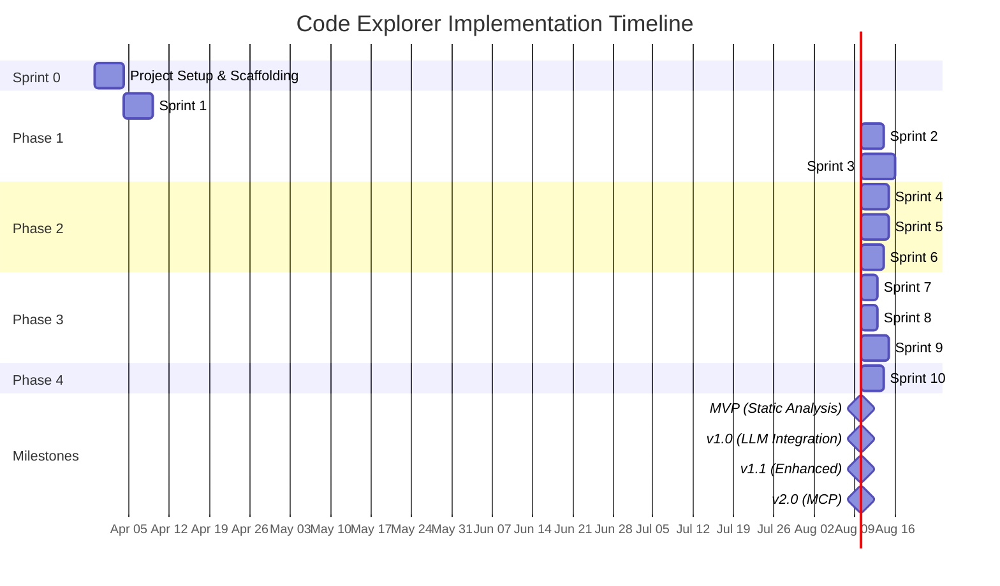

# Code Explorer — Implementation Plan

> **Version:** 1.0
> **Date:** 2026-03-28
> **Status:** Draft

---

## Table of Contents

1. [Project Setup & Scaffolding](#1-project-setup--scaffolding)
2. [Phase 1: Core Foundation](#2-phase-1-core-foundation)
3. [Phase 2: LLM Integration](#3-phase-2-llm-integration)
4. [Phase 3: Advanced Features](#4-phase-3-advanced-features)
5. [Phase 4: MCP Integration](#5-phase-4-mcp-integration)
6. [Gantt Chart](#6-gantt-chart)
7. [Key Decisions & Trade-offs](#7-key-decisions--trade-offs)
8. [Risk Management](#8-risk-management)
9. [Development Workflow](#9-development-workflow)
10. [Definition of Done](#10-definition-of-done)

---

## 1. Project Setup & Scaffolding (Sprint 0 — Week 1)

### Tasks

| # | Task | Est. Hours | Dependencies |
|---|------|-----------|--------------|
| 0.1 | Scaffold VS Code extension with `yo code` | 1h | None |
| 0.2 | Configure TypeScript (`tsconfig.json` for extension + webview) | 1h | 0.1 |
| 0.3 | Set up esbuild for extension bundling | 2h | 0.2 |
| 0.4 | Set up esbuild for webview bundling | 2h | 0.2 |
| 0.5 | Configure ESLint + Prettier | 1h | 0.1 |
| 0.6 | Set up Mocha + VS Code Extension Test Runner | 2h | 0.1 |
| 0.7 | Create directory structure (src/, webview/, test/, docs/, media/) | 0.5h | 0.1 |
| 0.8 | Configure `package.json` contributions (views, commands, config) | 2h | 0.1 |
| 0.9 | Create `.vscode/launch.json` debug configurations | 1h | 0.3 |
| 0.10 | Create `.vscode/tasks.json` (build, watch, test, package) | 1h | 0.3, 0.4 |
| 0.11 | Create data model interfaces (`src/models/types.ts`) | 2h | 0.7 |
| 0.12 | Create error types (`src/models/errors.ts`) | 1h | 0.7 |
| 0.13 | Set up CI pipeline (lint, build, test) | 2h | 0.5, 0.6 |
| 0.14 | Create `.vscodeignore` for VSIX packaging | 0.5h | 0.1 |

**Sprint 0 Total: ~17h (≈2 days)**

### Acceptance Criteria
- [ ] `npm run build` compiles extension + webview without errors
- [ ] `npm run watch` enables hot-reload development
- [ ] F5 in VS Code launches Extension Development Host
- [ ] `npm test` runs and passes (with placeholder test)
- [ ] `npm run package` produces a `.vsix` file
- [ ] All type interfaces defined and importable

---

## 2. Phase 1: Core Foundation (Weeks 2-4)

### Sprint 1: Extension Skeleton + Basic UI (Week 2)

| # | Task | Est. Hours | Dependencies |
|---|------|-----------|--------------|
| 1.1 | Implement `activate()` / `deactivate()` in `extension.ts` | 2h | 0.8 |
| 1.2 | Implement `CodeExplorerViewProvider` (WebviewViewProvider) | 4h | 1.1 |
| 1.3 | Create webview HTML template with CSP | 2h | 1.2 |
| 1.4 | Implement webview `TabBar` component | 4h | 1.3 |
| 1.5 | Implement webview `DetailPanel` with collapsible sections | 4h | 1.3 |
| 1.6 | Implement `EmptyState` and `LoadingState` components | 2h | 1.3 |
| 1.7 | Implement message passing (extension ↔ webview) | 3h | 1.2, 1.3 |
| 1.8 | Implement `SymbolResolver` (cursor position → SymbolInfo) | 4h | 0.11 |
| 1.9 | Register basic hover provider (shows symbol name + "Explore" link) | 3h | 1.8 |
| 1.10 | Register `exploreSymbol` command | 1h | 1.2, 1.8 |
| 1.11 | CSS styling with VS Code theme variables | 3h | 1.4, 1.5 |
| 1.12 | Unit tests for SymbolResolver | 2h | 1.8 |
| 1.13 | Manual E2E test: click symbol → tab opens in sidebar | 1h | All above |

**Sprint 1 Total: ~35h (≈4-5 days)**

### Sprint 2: Static Analysis Engine (Week 3)

| # | Task | Est. Hours | Dependencies |
|---|------|-----------|--------------|
| 2.1 | Implement `StaticAnalyzer.findReferences()` | 3h | 1.8 |
| 2.2 | Implement `StaticAnalyzer.buildCallHierarchy()` | 4h | 1.8 |
| 2.3 | Implement `StaticAnalyzer.getTypeHierarchy()` | 3h | 1.8 |
| 2.4 | Implement context line extraction (read line from file) | 2h | 2.1 |
| 2.5 | Wire static analysis to sidebar rendering | 3h | 2.1, 2.2, 2.3, 1.5 |
| 2.6 | Implement `CallStackSection` rendering (tree view) | 4h | 2.2, 1.5 |
| 2.7 | Implement `UsageSection` rendering (file-grouped list) | 3h | 2.1, 1.5 |
| 2.8 | Implement `RelationshipSection` rendering | 2h | 2.3, 1.5 |
| 2.9 | Implement "navigate to source" (click usage → go to file:line) | 2h | 2.7, 1.7 |
| 2.10 | Unit tests for StaticAnalyzer | 4h | 2.1, 2.2, 2.3 |
| 2.11 | Integration test: click symbol → see references in sidebar | 1h | All above |

**Sprint 2 Total: ~31h (≈4 days)**

### Sprint 3: Cache System (Week 4)

| # | Task | Est. Hours | Dependencies |
|---|------|-----------|--------------|
| 3.1 | Implement `HashService` (SHA-256 file hashing) | 2h | None |
| 3.2 | Implement `CacheKeyResolver` (symbol → file path mapping) | 3h | 0.11 |
| 3.3 | Implement `MarkdownSerializer` (serialize/deserialize) | 6h | 0.11 |
| 3.4 | Implement `IndexManager` (load, save, add, remove, search) | 5h | 0.11 |
| 3.5 | Implement `CacheManager` (get, set, invalidate, remove) | 5h | 3.1, 3.2, 3.3, 3.4 |
| 3.6 | Implement `_manifest.json` writer | 2h | 3.5 |
| 3.7 | Implement file watcher → cache invalidation | 3h | 3.5 |
| 3.8 | Implement staleness detection + UI warning banner | 2h | 3.5, 1.7 |
| 3.9 | Wire cache into AnalysisOrchestrator (check cache first) | 3h | 3.5, 2.5 |
| 3.10 | Unit tests for HashService, CacheKeyResolver | 2h | 3.1, 3.2 |
| 3.11 | Unit tests for MarkdownSerializer (roundtrip) | 3h | 3.3 |
| 3.12 | Unit tests for IndexManager | 3h | 3.4 |
| 3.13 | Unit tests for CacheManager | 3h | 3.5 |
| 3.14 | Integration test: analyze → cache → re-open (cache hit) | 2h | All above |

**Sprint 3 Total: ~44h (≈5-6 days)**

---

## 3. Phase 2: LLM Integration (Weeks 5-7)

### Sprint 4: LLM Provider Framework (Week 5)

| # | Task | Est. Hours | Dependencies |
|---|------|-----------|--------------|
| 4.1 | Define `LLMProvider` interface | 1h | 0.11 |
| 4.2 | Implement `MaiClaudeProvider` (shell out to `claude` CLI) | 4h | 4.1 |
| 4.3 | Implement `CopilotCLIProvider` (shell out to copilot CLI) | 3h | 4.1 |
| 4.4 | Implement `NullProvider` (no-op for when LLM is disabled) | 1h | 4.1 |
| 4.5 | Implement `LLMProviderFactory` (config-based selection) | 2h | 4.2, 4.3, 4.4 |
| 4.6 | Implement `PromptBuilder` — class overview prompt | 3h | 4.1 |
| 4.7 | Implement `PromptBuilder` — function call stack prompt | 3h | 4.1 |
| 4.8 | Implement `PromptBuilder` — variable lifecycle prompt | 3h | 4.1 |
| 4.9 | Implement `ResponseParser` (LLM text → structured data) | 4h | 0.11 |
| 4.10 | Implement context gathering (read related files, imports) | 3h | 4.6 |
| 4.11 | Unit tests for PromptBuilder | 2h | 4.6, 4.7, 4.8 |
| 4.12 | Unit tests for ResponseParser | 3h | 4.9 |
| 4.13 | Unit tests for providers (with mocked CLI) | 2h | 4.2, 4.3 |

**Sprint 4 Total: ~34h (≈4-5 days)**

### Sprint 5: Analysis Pipeline (Week 6)

| # | Task | Est. Hours | Dependencies |
|---|------|-----------|--------------|
| 5.1 | Implement `AnalysisQueue` with priority + rate limiting | 5h | 0.11 |
| 5.2 | Implement `AnalysisOrchestrator` (coordinate static + LLM) | 5h | Sprint 2, Sprint 4 |
| 5.3 | Implement `LLMAnalyzer` (context gathering + prompt + parse) | 4h | 4.6-4.10 |
| 5.4 | Implement result merging (static + LLM → AnalysisResult) | 3h | 5.2 |
| 5.5 | Implement on-demand analysis trigger (cache miss → LLM) | 3h | 5.2, Sprint 3 |
| 5.6 | Implement `BackgroundScheduler` (periodic re-analysis) | 4h | 5.2, 3.4 |
| 5.7 | Implement progress indicator in webview | 2h | 5.2, 1.7 |
| 5.8 | Implement error handling + retry logic | 3h | 5.1, 5.2 |
| 5.9 | Implement "Analysis unavailable" fallback (static-only) | 2h | 5.2 |
| 5.10 | Unit tests for AnalysisQueue | 3h | 5.1 |
| 5.11 | Unit tests for AnalysisOrchestrator (with mocks) | 4h | 5.2 |
| 5.12 | Integration test: full pipeline (click → LLM → cache → render) | 2h | All above |

**Sprint 5 Total: ~40h (≈5 days)**

### Sprint 6: Integration & Polish (Week 7)

| # | Task | Est. Hours | Dependencies |
|---|------|-----------|--------------|
| 6.1 | Connect full pipeline: UI → Orchestrator → Cache → LLM → UI | 4h | Sprint 5 |
| 6.2 | Implement `OverviewSection` with AI-generated content | 2h | 6.1 |
| 6.3 | Implement `DataFlowSection` visualization | 4h | 6.1 |
| 6.4 | Implement expandable/collapsible sections with animation | 2h | 6.2, 6.3 |
| 6.5 | Implement error state rendering in webview | 2h | 5.8 |
| 6.6 | Implement "Refresh" button (re-trigger analysis) | 2h | 6.1 |
| 6.7 | Implement hover card with cached summary | 3h | Sprint 3, 1.9 |
| 6.8 | Polish tab management (close others, close all, right-click) | 3h | 1.4 |
| 6.9 | Add activity bar icon | 1h | None |
| 6.10 | Full manual testing + bug fixes | 6h | All above |
| 6.11 | Write user-facing README.md | 2h | All above |

**Sprint 6 Total: ~31h (≈4 days)**

---

## 4. Phase 3: Advanced Features (Weeks 8-10)

### Sprint 7: Enhanced UI (Week 8)

| # | Task | Est. Hours | Dependencies |
|---|------|-----------|--------------|
| 7.1 | Implement search/filter within analysis results | 4h | Phase 2 |
| 7.2 | Implement `CodeExplorerDecorationProvider` (gutter icons) | 3h | Sprint 3 |
| 7.3 | Implement `CodeExplorerCodeLensProvider` (optional) | 3h | Sprint 2 |
| 7.4 | Add context menu item "Explore in Code Explorer" | 2h | 1.10 |
| 7.5 | Add keyboard shortcuts (Ctrl+Shift+E for explore) | 1h | 1.10 |
| 7.6 | High contrast theme support | 2h | 1.11 |
| 7.7 | Accessibility: ARIA labels, keyboard navigation | 4h | Phase 1 |
| 7.8 | Tab overflow: horizontal scroll with arrows | 3h | 1.4 |

**Sprint 7 Total: ~22h (≈3 days)**

### Sprint 8: Performance & Scalability (Week 9)

| # | Task | Est. Hours | Dependencies |
|---|------|-----------|--------------|
| 8.1 | Implement incremental analysis (changed files only) | 4h | Sprint 3 |
| 8.2 | Lazy loading of analysis content (load on section expand) | 3h | 1.5, Sprint 3 |
| 8.3 | Memory management (dispose unused tab data) | 2h | 1.2 |
| 8.4 | Index pagination for large workspaces | 3h | 3.4 |
| 8.5 | Debounced file watcher (batch invalidations) | 2h | 3.7 |
| 8.6 | Performance benchmarks (time hover, tab open, analysis) | 4h | All |
| 8.7 | Optimize cache I/O (batch writes, buffered reads) | 3h | Sprint 3 |

**Sprint 8 Total: ~21h (≈3 days)**

### Sprint 9: Testing & Quality (Week 10)

| # | Task | Est. Hours | Dependencies |
|---|------|-----------|--------------|
| 9.1 | Write remaining unit tests (target: 80% coverage) | 8h | All |
| 9.2 | Write integration tests for full workflows | 6h | All |
| 9.3 | E2E test: install VSIX → open project → use features | 4h | All |
| 9.4 | Edge case testing (large files, empty files, binary files) | 4h | All |
| 9.5 | Error scenario testing (no LLM, disk full, corrupt cache) | 4h | All |
| 9.6 | Fix all discovered bugs | 8h | 9.1-9.5 |
| 9.7 | Update documentation | 2h | 9.6 |

**Sprint 9 Total: ~36h (≈4-5 days)**

---

## 5. Phase 4: MCP Integration (Weeks 11-12, Future)

### Sprint 10: MCP Server

| # | Task | Est. Hours | Dependencies |
|---|------|-----------|--------------|
| 10.1 | Set up `@modelcontextprotocol/sdk` dependency | 1h | None |
| 10.2 | Implement MCP server with stdio transport | 4h | 10.1 |
| 10.3 | Implement `explore_symbol` tool | 3h | 10.2, Sprint 3 |
| 10.4 | Implement `get_call_stacks` tool | 2h | 10.2, Sprint 3 |
| 10.5 | Implement `get_usages` tool | 2h | 10.2, Sprint 3 |
| 10.6 | Implement `search_symbols` tool | 2h | 10.2, 3.4 |
| 10.7 | Implement `get_analysis_status` tool | 1h | 10.2, Sprint 3 |
| 10.8 | Implement `trigger_analysis` tool | 2h | 10.2, Sprint 5 |
| 10.9 | Implement MCP resources (index, symbol, status) | 4h | 10.2 |
| 10.10 | Test with Claude Code as MCP client | 4h | 10.3-10.9 |
| 10.11 | MCP documentation and examples | 2h | 10.10 |

**Sprint 10 Total: ~27h (≈3-4 days)**

---

## 6. Gantt Chart



### Summary Timeline

| Milestone | Sprint | Week | Deliverable |
|-----------|--------|------|-------------|
| **MVP** | End of Sprint 3 | Week 4 | Static analysis + cache + basic UI |
| **v1.0** | End of Sprint 6 | Week 7 | Full LLM integration + polished UI |
| **v1.1** | End of Sprint 9 | Week 10 | Enhanced UI + performance + quality |
| **v2.0** | End of Sprint 10 | Week 12 | MCP server for AI agent consumption |

---

## 7. Key Decisions & Trade-offs

| # | Decision | Options Considered | Choice | Rationale |
|---|----------|-------------------|--------|-----------|
| 1 | **Webview framework** | React, Preact, Svelte, Vanilla TS | **Vanilla TS** | Smallest bundle (~20KB), fastest load, no dependencies |
| 2 | **Cache format** | JSON, Markdown, SQLite | **Markdown + JSON index** | Human + AI readable, fast lookups via JSON index |
| 3 | **Bundler** | webpack, esbuild, rollup | **esbuild** | 10-100x faster builds, sufficient features |
| 4 | **LLM provider** | Direct API, CLI tools | **CLI tools** | No API key management, uses existing auth |
| 5 | **Analysis trigger** | Eager (on file open), Lazy (on click) | **Lazy (on click)** | No wasted compute; user-driven |
| 6 | **Cache storage** | In-memory, File system, IndexedDB | **File system** | Persistent, inspectable, AI-agent accessible |
| 7 | **Static analysis** | Custom AST parser, TS Language Service, VS Code API | **VS Code API** | Leverages existing TypeScript extension |
| 8 | **Background analysis** | Always on, Configurable, Off | **Configurable (off by default)** | User controls resource usage |
| 9 | **MCP transport** | stdio, HTTP, WebSocket | **stdio** | Standard for CLI-based MCP clients |
| 10 | **Test framework** | Jest, Mocha, Vitest | **Mocha** | VS Code extension test standard |

---

## 8. Risk Management

| # | Risk | Probability | Impact | Mitigation |
|---|------|------------|--------|-----------|
| R1 | LLM CLI tools not available in all environments | High | Medium | Graceful fallback to static-only analysis |
| R2 | LLM analysis too slow (>30s) | Medium | High | Show static results immediately, LLM results async |
| R3 | Cache grows too large for monorepos | Medium | Medium | Configurable cache size limit, LRU eviction |
| R4 | VS Code API changes break extension | Low | High | Pin VS Code engine version, integration tests |
| R5 | TypeScript-only: users want Python/Java/etc | High | Medium | Architecture supports adding language providers later |
| R6 | LLM response format inconsistent | High | Medium | Robust parser with fallbacks, multiple prompt templates |
| R7 | Performance issues with large files | Medium | Medium | Symbol-scoped analysis, context windowing |
| R8 | Webview security vulnerabilities | Low | High | Strict CSP, no external resources, input sanitization |
| R9 | Cache corruption on crash | Low | Medium | Atomic writes (write temp → rename), index rebuild |
| R10 | Rate limiting from LLM providers | Medium | Medium | Queue with backoff, configurable rate limits |

---

## 9. Development Workflow

### 9.1 Git Branching Strategy

```
main (stable, released)
├── develop (integration)
│   ├── feature/sprint-1-sidebar-ui
│   ├── feature/sprint-2-static-analysis
│   ├── feature/sprint-3-cache-system
│   ├── feature/sprint-4-llm-providers
│   └── fix/hover-provider-crash
```

- **Feature branches** from `develop`
- **PR required** for merge to `develop`
- **develop → main** for releases (with version tag)

### 9.2 PR Requirements

- [ ] All existing tests pass
- [ ] New code has unit tests
- [ ] No lint errors
- [ ] Build succeeds
- [ ] Manual testing of affected feature
- [ ] Updated documentation (if applicable)

### 9.3 Release Process

1. Bump version in `package.json`
2. Update `CHANGELOG.md`
3. `npm run package` → produces `.vsix`
4. Test VSIX install locally
5. Merge `develop` → `main`
6. Tag release: `git tag v1.0.0`
7. Publish: `vsce publish` (if publishing to marketplace)

---

## 10. Definition of Done

### Per-Feature DoD

- [ ] Feature implemented per spec
- [ ] Unit tests written and passing (≥80% coverage for new code)
- [ ] No TypeScript errors
- [ ] No ESLint warnings
- [ ] Works in Extension Development Host
- [ ] Error cases handled
- [ ] Loading/empty/error states implemented (for UI features)

### Per-Sprint DoD

- [ ] All sprint tasks completed
- [ ] All tests passing
- [ ] No regression in existing features
- [ ] Demo-ready in Extension Development Host
- [ ] Sprint review notes documented

### Release DoD

- [ ] All planned features implemented
- [ ] Test coverage ≥80%
- [ ] Performance targets met
- [ ] No critical/high-severity bugs
- [ ] README.md updated
- [ ] CHANGELOG.md updated
- [ ] VSIX packages and installs successfully
- [ ] Tested on Windows, macOS, Linux (VS Code)

---

*End of Implementation Plan*
