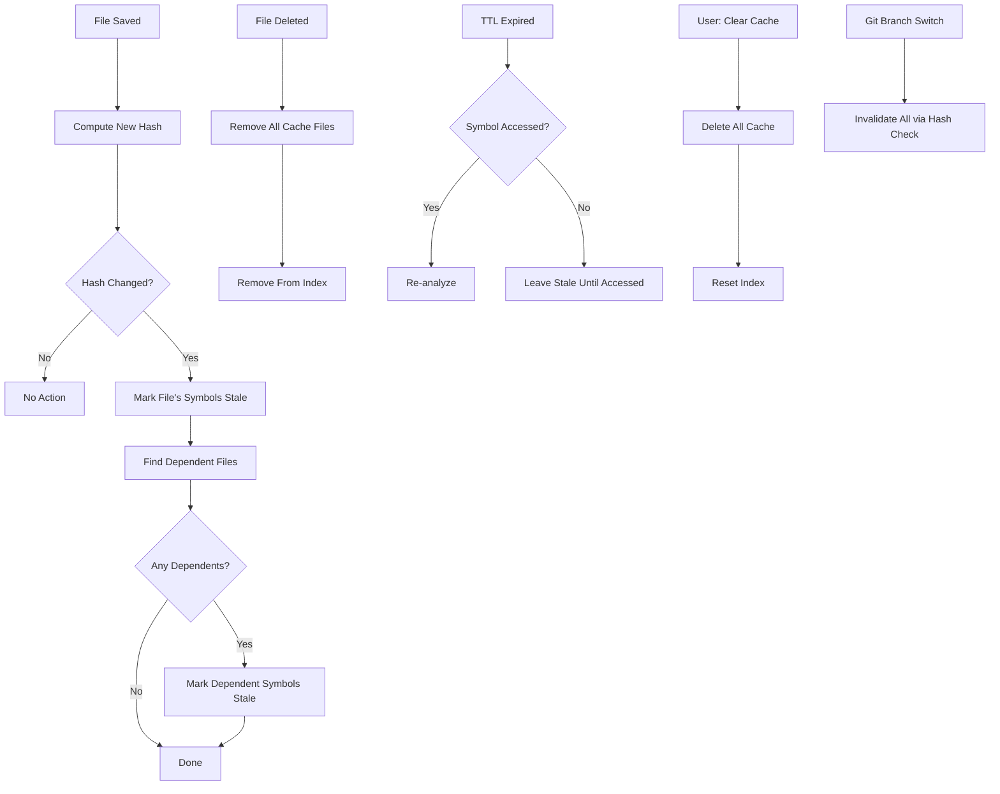

# Code Explorer — Data Model & Cache Strategy

> **Version:** 1.0
> **Date:** 2026-03-28
> **Status:** Draft

---

## Table of Contents

1. [Complete Data Model](#1-complete-data-model)
2. [Cache Directory Structure](#2-cache-directory-structure)
3. [File Format Specifications](#3-file-format-specifications)
4. [Cache Key Resolution Algorithm](#4-cache-key-resolution-algorithm)
5. [Cache Invalidation Strategy](#5-cache-invalidation-strategy)
6. [Cache Lifecycle](#6-cache-lifecycle)
7. [Index Maintenance](#7-index-maintenance)
8. [Performance Considerations](#8-performance-considerations)
9. [Agent-Friendly Design](#9-agent-friendly-design)
10. [.gitignore Considerations](#10-gitignore-considerations)

---

## 1. Complete Data Model

### 1.1 Symbol Types

```typescript
/**
 * All analyzable symbol kinds.
 * Maps to VS Code's SymbolKind but with string identifiers for readability.
 */
export type SymbolKindType =
  | 'class'       // class declaration
  | 'function'    // standalone function declaration
  | 'method'      // class method
  | 'variable'    // const, let, var declaration
  | 'interface'   // interface declaration
  | 'type'        // type alias
  | 'enum'        // enum declaration
  | 'property'    // class property
  | 'parameter'   // function parameter (rarely analyzed individually)
  | 'unknown';    // fallback

/**
 * Prefix used in cache file names for each symbol kind.
 */
export const SYMBOL_KIND_PREFIX: Record<SymbolKindType, string> = {
  class: 'class',
  function: 'fn',
  method: 'method',
  variable: 'var',
  interface: 'interface',
  type: 'type',
  enum: 'enum',
  property: 'prop',
  parameter: 'param',
  unknown: 'sym'
};
```

### 1.2 Core Interfaces

```typescript
/** Position in a source file (0-based) */
export interface Position {
  line: number;
  character: number;
}

/** Range in a source file */
export interface Range {
  start: Position;
  end: Position;
}

/**
 * Represents a code symbol that can be analyzed.
 * This is the primary input to the analysis pipeline.
 */
export interface SymbolInfo {
  /** Symbol name, e.g. "UserController" */
  name: string;
  /** Symbol kind */
  kind: SymbolKindType;
  /**
   * Relative path from workspace root to the source file.
   * Example: "src/controllers/UserController.ts"
   */
  filePath: string;
  /** Position of the symbol's name/identifier */
  position: Position;
  /** Full range of the symbol's declaration (optional) */
  range?: Range;
  /**
   * Parent container name for nested symbols.
   * Example: "UserController" for method "getUser" inside that class.
   */
  containerName?: string;
}

/**
 * Complete analysis result for a symbol.
 * This is what gets serialized to the cache markdown file.
 */
export interface AnalysisResult {
  /** The symbol that was analyzed */
  symbol: SymbolInfo;
  /** AI-generated overview/summary of the symbol */
  overview: string;
  /** Incoming call stacks (who calls this?) */
  callStacks: CallStackEntry[];
  /** All references/usages across the workspace */
  usages: UsageEntry[];
  /** Data flow tracking (for variables) */
  dataFlow: DataFlowEntry[];
  /** Type/dependency relationships */
  relationships: RelationshipEntry[];
  /** Key methods (for classes) */
  keyMethods?: string[];
  /** Dependencies (for classes) */
  dependencies?: string[];
  /** AI-suggested usage pattern */
  usagePattern?: string;
  /** AI-detected potential issues */
  potentialIssues?: string[];
  /** Variable lifecycle (for variables) */
  variableLifecycle?: VariableLifecycle;
  /** Metadata for cache management */
  metadata: AnalysisMetadata;
}

/**
 * A single call stack entry showing who calls the analyzed symbol.
 */
export interface CallStackEntry {
  /** The calling function/method */
  caller: {
    name: string;
    filePath: string;
    line: number;
    kind: SymbolKindType;
  };
  /** Exact positions where the call happens */
  callSites: Position[];
  /** Depth in the call tree (0 = direct caller) */
  depth?: number;
  /**
   * Human-readable call chain.
   * Example: "app.ts:42 → router.get() → UserController.getUser()"
   */
  chain?: string;
}

/**
 * A reference/usage of the analyzed symbol.
 */
export interface UsageEntry {
  /** File where the reference occurs */
  filePath: string;
  /** Line number (1-based for display) */
  line: number;
  /** Column number */
  character: number;
  /** The line of source code containing the reference */
  contextLine: string;
  /** Whether this is the symbol's definition (vs. a usage) */
  isDefinition: boolean;
}

/**
 * A step in a variable's data flow lifecycle.
 */
export interface DataFlowEntry {
  /** What happens to the data at this point */
  type: 'created' | 'assigned' | 'read' | 'modified' | 'consumed' | 'returned' | 'passed';
  /** File where this occurs */
  filePath: string;
  /** Line number */
  line: number;
  /** Human-readable description of this data flow step */
  description: string;
}

/**
 * A relationship between the analyzed symbol and another symbol.
 */
export interface RelationshipEntry {
  /** Kind of relationship */
  type: 'extends' | 'implements' | 'uses' | 'used-by'
      | 'extended-by' | 'implemented-by' | 'imports' | 'imported-by';
  /** The related symbol's name */
  targetName: string;
  /** The related symbol's file */
  targetFilePath: string;
  /** The related symbol's line */
  targetLine: number;
}

/**
 * Variable lifecycle analysis (AI-generated).
 */
export interface VariableLifecycle {
  /** How and where the variable is declared */
  declaration: string;
  /** How the variable gets its initial value */
  initialization: string;
  /** List of mutation points */
  mutations: string[];
  /** List of consumption points */
  consumption: string[];
  /** Scope and garbage collection eligibility */
  scopeAndLifetime: string;
}
```

### 1.3 Metadata & Cache Interfaces

```typescript
/**
 * Metadata attached to every analysis result.
 * Stored in YAML frontmatter of the cache markdown file.
 */
export interface AnalysisMetadata {
  /** ISO 8601 timestamp of when analysis was run */
  analyzedAt: string;
  /**
   * SHA-256 hash of the source file at analysis time.
   * Format: "sha256:<hex>"
   */
  sourceHash: string;
  /**
   * SHA-256 hashes of files that the analysis depends on.
   * If any of these change, the analysis may be stale.
   * Keys are relative file paths, values are "sha256:<hex>".
   */
  dependentFileHashes: Record<string, string>;
  /** Which LLM provider generated the analysis (undefined for static-only) */
  llmProvider?: string;
  /** Cache format version (for future migration support) */
  analysisVersion: string;
  /** Whether the source file has changed since this analysis was run */
  stale: boolean;
}

/**
 * Master index file: O(1) lookups for any symbol.
 * Stored at: .vscode/code-explorer/_index.json
 */
export interface MasterIndex {
  /** Index format version */
  version: string;
  /** ISO 8601 timestamp of last index update */
  lastUpdated: string;
  /** Total number of indexed symbols */
  symbolCount: number;
  /**
   * Symbol entries keyed by cache key.
   * Key format: "relativePath::kind.Name"
   * Example: "src/controllers/UserController.ts::class.UserController"
   */
  entries: Record<string, IndexEntry>;
  /**
   * File-level index for fast invalidation.
   * Key: relative file path
   */
  fileIndex: Record<string, FileIndexEntry>;
}

/**
 * A single entry in the master index.
 */
export interface IndexEntry {
  /** Symbol name */
  name: string;
  /** Symbol kind */
  kind: SymbolKindType;
  /** Source file (relative path) */
  file: string;
  /**
   * Path to the cache markdown file (relative to cache root).
   * Example: "src/controllers/UserController.ts/class.UserController.md"
   */
  cachePath: string;
  /** When this symbol was last analyzed */
  analyzedAt: string;
  /** Hash of the source file at analysis time */
  sourceHash: string;
  /** Whether the analysis is stale */
  stale: boolean;
}

/**
 * File-level entry in the master index.
 * Enables fast "invalidate all symbols in this file" operations.
 */
export interface FileIndexEntry {
  /** SHA-256 hash of the source file */
  hash: string;
  /**
   * Symbol names in this file.
   * Format: "kind.Name" (e.g., "class.UserController", "fn.getUser")
   */
  symbols: string[];
  /** When this file was last analyzed */
  lastAnalyzed: string;
}

/**
 * Per-file manifest stored alongside cache files.
 * Stored at: .vscode/code-explorer/<source-path>/_manifest.json
 */
export interface FileManifest {
  /** Source file relative path */
  file: string;
  /** Source file hash at last analysis */
  hash: string;
  /** Analyzed symbols in this file */
  symbols: {
    /** Symbol name (without kind prefix) */
    name: string;
    /** Symbol kind */
    kind: SymbolKindType;
    /** Line number in source file */
    line?: number;
    /** Cache file name (e.g., "class.UserController.md") */
    cacheFile: string;
    /** When this symbol was analyzed */
    analyzedAt: string;
    /** Whether analysis is stale */
    stale: boolean;
  }[];
}

/**
 * Cache statistics for UI display and diagnostics.
 */
export interface CacheStats {
  totalSymbols: number;
  freshCount: number;
  staleCount: number;
  totalSizeBytes: number;
  oldestAnalysis: string;
  newestAnalysis: string;
}
```

---

## 2. Cache Directory Structure

### 2.1 Full Example

```
<workspace-root>/
└── .vscode/
    └── code-explorer/
        ├── _index.json                              # Master symbol index
        ├── _config.json                             # Cache configuration
        ├── _stats.json                              # Usage statistics
        ├── README.md                                # Agent-friendly documentation
        │
        ├── src/
        │   ├── controllers/
        │   │   └── UserController.ts/               # One directory per source file
        │   │       ├── _manifest.json               # File-level manifest
        │   │       ├── class.UserController.md      # Class analysis
        │   │       ├── fn.getUser.md                # Function analysis
        │   │       ├── fn.createUser.md
        │   │       ├── fn.updateUser.md
        │   │       ├── fn.deleteUser.md
        │   │       └── var.userCache.md             # Variable analysis
        │   │
        │   ├── models/
        │   │   └── User.ts/
        │   │       ├── _manifest.json
        │   │       ├── class.User.md
        │   │       ├── interface.IUser.md
        │   │       └── type.UserRole.md
        │   │
        │   ├── services/
        │   │   └── UserService.ts/
        │   │       ├── _manifest.json
        │   │       ├── class.UserService.md
        │   │       ├── fn.validateUser.md
        │   │       └── fn.hashPassword.md
        │   │
        │   └── utils/
        │       └── Logger.ts/
        │           ├── _manifest.json
        │           └── class.Logger.md
        │
        └── test/
            └── controllers/
                └── UserController.test.ts/
                    ├── _manifest.json
                    └── fn.describe.UserController.md
```

### 2.2 Directory Naming Convention

The cache directory structure **mirrors** the source tree:

- Source file `src/controllers/UserController.ts` →
  Cache directory `.vscode/code-explorer/src/controllers/UserController.ts/`

This makes it trivial to find the cache for any source file:
1. Take the source file's relative path
2. Append it to `.vscode/code-explorer/`
3. Look inside that directory for the symbol's markdown file

### 2.3 File Naming Convention

| Symbol Kind | Prefix | File Name Example |
|-------------|--------|-------------------|
| Class | `class.` | `class.UserController.md` |
| Function (standalone) | `fn.` | `fn.getUser.md` |
| Method (in class) | `method.` | `method.UserController.getUser.md` |
| Variable | `var.` | `var.userCache.md` |
| Interface | `interface.` | `interface.IUser.md` |
| Type alias | `type.` | `type.UserRole.md` |
| Enum | `enum.` | `enum.HttpStatus.md` |
| Property | `prop.` | `prop.UserController.logger.md` |
| Unknown | `sym.` | `sym.unknown.md` |

**Nested symbols** use dot notation for the container:
- Method `getUser` in class `UserController` → `method.UserController.getUser.md`
- Property `logger` in class `UserController` → `prop.UserController.logger.md`

---

## 3. File Format Specifications

### 3.1 Master Index (`_index.json`)

```json
{
  "version": "1.0.0",
  "lastUpdated": "2026-03-28T10:30:00Z",
  "symbolCount": 14,
  "entries": {
    "src/controllers/UserController.ts::class.UserController": {
      "name": "UserController",
      "kind": "class",
      "file": "src/controllers/UserController.ts",
      "cachePath": "src/controllers/UserController.ts/class.UserController.md",
      "analyzedAt": "2026-03-28T10:30:00Z",
      "sourceHash": "sha256:a1b2c3d4e5f67890abcdef1234567890abcdef1234567890abcdef1234567890",
      "stale": false
    },
    "src/controllers/UserController.ts::fn.getUser": {
      "name": "getUser",
      "kind": "function",
      "file": "src/controllers/UserController.ts",
      "cachePath": "src/controllers/UserController.ts/fn.getUser.md",
      "analyzedAt": "2026-03-28T10:30:05Z",
      "sourceHash": "sha256:a1b2c3d4e5f67890abcdef1234567890abcdef1234567890abcdef1234567890",
      "stale": false
    },
    "src/models/User.ts::class.User": {
      "name": "User",
      "kind": "class",
      "file": "src/models/User.ts",
      "cachePath": "src/models/User.ts/class.User.md",
      "analyzedAt": "2026-03-28T10:31:00Z",
      "sourceHash": "sha256:f6e5d4c3b2a1098765432109876543210987654321098765432109876543210",
      "stale": false
    }
  },
  "fileIndex": {
    "src/controllers/UserController.ts": {
      "hash": "sha256:a1b2c3d4e5f67890abcdef1234567890abcdef1234567890abcdef1234567890",
      "symbols": [
        "class.UserController",
        "fn.getUser",
        "fn.createUser",
        "fn.updateUser",
        "fn.deleteUser",
        "var.userCache"
      ],
      "lastAnalyzed": "2026-03-28T10:30:05Z"
    },
    "src/models/User.ts": {
      "hash": "sha256:f6e5d4c3b2a1098765432109876543210987654321098765432109876543210",
      "symbols": [
        "class.User",
        "interface.IUser",
        "type.UserRole"
      ],
      "lastAnalyzed": "2026-03-28T10:31:00Z"
    }
  }
}
```

### 3.2 File Manifest (`_manifest.json`)

```json
{
  "file": "src/controllers/UserController.ts",
  "hash": "sha256:a1b2c3d4e5f67890abcdef...",
  "symbols": [
    {
      "name": "UserController",
      "kind": "class",
      "line": 15,
      "cacheFile": "class.UserController.md",
      "analyzedAt": "2026-03-28T10:30:00Z",
      "stale": false
    },
    {
      "name": "getUser",
      "kind": "function",
      "line": 42,
      "cacheFile": "fn.getUser.md",
      "analyzedAt": "2026-03-28T10:30:05Z",
      "stale": false
    },
    {
      "name": "userCache",
      "kind": "variable",
      "line": 18,
      "cacheFile": "var.userCache.md",
      "analyzedAt": "2026-03-28T10:30:10Z",
      "stale": false
    }
  ]
}
```

### 3.3 Cache Configuration (`_config.json`)

```json
{
  "version": "1.0.0",
  "createdAt": "2026-03-28T10:00:00Z",
  "settings": {
    "ttlHours": 168,
    "maxCacheSizeMB": 500,
    "analysisVersion": "1.0.0"
  }
}
```

### 3.4 Analysis Markdown — Complete Specification

Every analysis markdown file follows this structure:

```
---
<YAML frontmatter: metadata>
---

# <kind> <Name>

## Overview
<AI-generated summary>

## Call Stacks
<numbered list of call chains>

## Usage (<N> references)
<table of references>

## Data Flow
<lifecycle steps>

## Relationships
<dependency graph>

## Key Methods (classes only)
<method list>

## Dependencies (classes only)
<dependency list>

## Potential Issues
<AI-detected concerns>
```

**YAML Frontmatter Fields:**

| Field | Type | Required | Description |
|-------|------|----------|-------------|
| `symbol` | string | Yes | Symbol name |
| `kind` | string | Yes | Symbol kind (`class`, `fn`, etc.) |
| `file` | string | Yes | Relative path to source file |
| `line` | number | Yes | Line number of declaration |
| `analyzed_at` | string | Yes | ISO 8601 timestamp |
| `analysis_version` | string | Yes | Cache format version |
| `llm_provider` | string | No | Provider used (omitted for static-only) |
| `source_hash` | string | Yes | SHA-256 of source file |
| `dependent_files` | map | No | Related file hashes |
| `stale` | boolean | Yes | Whether source has changed |

---

## 4. Cache Key Resolution Algorithm

### 4.1 Key Format

```
<relative-file-path>::<kind-prefix>.<symbol-name>
```

**Examples:**

| Symbol | Key |
|--------|-----|
| Class `UserController` in `src/controllers/UserController.ts` | `src/controllers/UserController.ts::class.UserController` |
| Function `getUser` (standalone) in same file | `src/controllers/UserController.ts::fn.getUser` |
| Method `getUser` inside class `UserController` | `src/controllers/UserController.ts::method.UserController.getUser` |
| Variable `cache` in `src/utils/cache.ts` | `src/utils/cache.ts::var.cache` |

### 4.2 Key → Cache File Path

```
src/controllers/UserController.ts::class.UserController
  → src/controllers/UserController.ts/class.UserController.md
```

Algorithm:
1. Split key on `::` → `[filePath, symbolPart]`
2. Join with `/` and append `.md`
3. Result is relative to `.vscode/code-explorer/`

### 4.3 Edge Cases

| Scenario | Resolution |
|----------|-----------|
| **Nested classes** | `method.OuterClass.InnerClass.method.md` |
| **Anonymous functions** | `fn._anonymous_L42.md` (line number suffix) |
| **Overloaded functions** | Same key — latest analysis wins (overloads share behavior) |
| **Name collisions** | Prefix with container: `fn.moduleA.setup.md` vs `fn.moduleB.setup.md` are in different directories |
| **Special characters in names** | Replace `<>` with `_angle_`, `/` with `_slash_` |
| **Very long names** | Truncate to 200 chars + hash suffix |

---

## 5. Cache Invalidation Strategy

### 5.1 Invalidation Triggers



### 5.2 Hash-Based Invalidation (Primary)

1. **File Watcher** detects `onDidChange` event
2. **HashService** computes SHA-256 of the changed file
3. **IndexManager** compares with stored hash
4. If different → mark all symbols in that file as `stale: true`
5. Additionally, check `dependentFileHashes` across all cached results

**Dependent File Invalidation:**
When file `A.ts` changes, any analysis that lists `A.ts` in its `dependent_files` frontmatter is also marked stale.

### 5.3 TTL-Based Invalidation (Secondary)

- Configurable via `codeExplorer.cacheTTLHours` (default: 168 = 7 days)
- Checked lazily when cache is accessed, not proactively
- Ensures stale analysis is refreshed even if file hashes haven't changed (e.g., related API changes, library updates)

### 5.4 Manual Invalidation

- Command: `Code Explorer: Clear Cache` — deletes all cache files + resets index
- Command: `Code Explorer: Refresh Analysis` — re-analyzes the currently viewed symbol
- UI: "Refresh" button on staleness warning banner

---

## 6. Cache Lifecycle

```mermaid
statediagram-v2
    [*] --> NonExistent: Symbol never analyzed

    NonExistent --> Analyzing: User clicks symbol (or background scheduler)
    Analyzing --> Fresh: Analysis complete, cached
    Analyzing --> Failed: Analysis error

    Fresh --> Stale: Source file changed (hash mismatch)
    Fresh --> Expired: TTL exceeded
    Fresh --> [*]: File deleted

    Stale --> Analyzing: User clicks Refresh / Background re-analysis
    Expired --> Analyzing: Symbol accessed again

    Failed --> Analyzing: User retries

    state Fresh {
        [*] --> Cached
        Cached --> Read: Tab opened / Hover triggered
        Read --> Cached: Data returned to UI
    }
```

### Lifecycle Events

| Event | Action | Index Update | File Action |
|-------|--------|-------------|-------------|
| **First analysis** | Create cache dir + markdown + manifest | Add entry + file entry | Write `.md` + `_manifest.json` |
| **Tab opened** | Read markdown, check staleness | None (or mark stale) | Read `.md` |
| **Source changed** | Mark stale | `stale: true` | None |
| **Re-analysis** | Overwrite markdown, update manifest | Update entry | Overwrite `.md` + `_manifest.json` |
| **File deleted** | Remove cache dir | Remove entries | Delete directory |
| **Clear cache** | Remove all | Reset index | Delete `.vscode/code-explorer/` |

---

## 7. Index Maintenance

### 7.1 Normal Operations (Incremental)

- **Add:** When a symbol is analyzed, add/update its entry in `_index.json`
- **Remove:** When a source file is deleted, remove all its entries
- **Stale:** When a source file changes, mark entries as stale (don't remove)
- **Save:** Debounced writes (max once per 500ms)

### 7.2 Full Rebuild

Triggered when:
- `_index.json` is missing or corrupt
- User runs a "rebuild index" command
- Version mismatch (index version != expected version)

**Rebuild Algorithm:**
1. Walk `.vscode/code-explorer/` recursively
2. Find all `_manifest.json` files
3. Parse each manifest and reconstruct index entries
4. If no manifests exist, walk for `.md` files and parse frontmatter
5. Write new `_index.json`

### 7.3 Index Corruption Recovery

```typescript
async function recoverIndex(cacheRoot: string): Promise<MasterIndex> {
  const index: MasterIndex = { version: '1.0.0', lastUpdated: '', symbolCount: 0, entries: {}, fileIndex: {} };

  // Walk cache directory for manifests
  const manifests = await glob('**/\\_manifest.json', { cwd: cacheRoot });

  for (const manifestPath of manifests) {
    const content = await fs.readFile(path.join(cacheRoot, manifestPath), 'utf-8');
    const manifest: FileManifest = JSON.parse(content);

    // Reconstruct file index entry
    index.fileIndex[manifest.file] = {
      hash: manifest.hash,
      symbols: manifest.symbols.map(s => `${SYMBOL_KIND_PREFIX[s.kind]}.${s.name}`),
      lastAnalyzed: manifest.symbols.reduce((max, s) =>
        s.analyzedAt > max ? s.analyzedAt : max, '')
    };

    // Reconstruct symbol entries
    for (const sym of manifest.symbols) {
      const key = `${manifest.file}::${SYMBOL_KIND_PREFIX[sym.kind]}.${sym.name}`;
      index.entries[key] = {
        name: sym.name,
        kind: sym.kind,
        file: manifest.file,
        cachePath: `${manifest.file}/${sym.cacheFile}`,
        analyzedAt: sym.analyzedAt,
        sourceHash: manifest.hash,
        stale: sym.stale
      };
    }
  }

  index.lastUpdated = new Date().toISOString();
  index.symbolCount = Object.keys(index.entries).length;

  return index;
}
```

### 7.4 Index Migration

When the index version changes (e.g., 1.0.0 → 2.0.0):

1. Detect version mismatch on load
2. Run migration function: `migrate_1_to_2(oldIndex) → newIndex`
3. Save new index
4. Log migration event

---

## 8. Performance Considerations

### 8.1 Scaling by Workspace Size

| Workspace | Files | Symbols | Index Size | Strategy |
|-----------|-------|---------|------------|----------|
| Tiny | <50 | <200 | <50KB | Full index in memory, eager analysis OK |
| Small | 50-500 | 200-2K | 50-200KB | Index in memory, lazy analysis |
| Medium | 500-5K | 2K-20K | 200KB-2MB | Index in memory, lazy analysis, batch invalidation |
| Large | 5K-50K | 20K-200K | 2-20MB | Lazy index loading, paginated search, exclude patterns |
| Monorepo | 50K+ | 200K+ | 20MB+ | Scope to active folder, aggressive exclusion |

### 8.2 I/O Optimization

| Operation | Strategy |
|-----------|----------|
| **Index read** | Single JSON.parse on activation (~100ms for 20K entries) |
| **Index write** | Debounced (500ms), atomic (write tmp → rename) |
| **Cache read** | Single file read per tab open (~5ms) |
| **Cache write** | Immediate (write after each analysis) |
| **Hash compute** | Parallel for batch invalidation (`Promise.all`) |
| **Directory walk** | Only for index rebuild; normally use index |

### 8.3 Memory Budget

| Component | Memory | Notes |
|-----------|--------|-------|
| Master index | ~100 bytes/entry | 20K entries = 2MB |
| Active tab data | ~50KB/tab | Max 10 tabs = 500KB |
| LLM response buffer | ~100KB | Freed after parsing |
| **Total peak** | **~5MB** | Well within VS Code extension limits |

---

## 9. Agent-Friendly Design

### 9.1 Design Principles for AI Agents

The cache is designed so AI agents (Copilot, Claude Code, etc.) can:

1. **Discover** — Find what's analyzed via `_index.json`
2. **Navigate** — Directory structure mirrors source tree
3. **Read** — Markdown is natural language, readable by LLMs
4. **Query** — JSON index for programmatic access
5. **Understand freshness** — Metadata includes staleness info

### 9.2 Cache Root README

A `README.md` at the cache root helps agents understand the structure:

```markdown
# Code Explorer Cache

This directory contains AI-generated code analysis cached by the Code Explorer VS Code extension.

## Quick Access

- **Find a symbol:** Look up in `_index.json` → `entries` → find by name
- **Browse a file's symbols:** Navigate to `<source-path>/_manifest.json`
- **Read analysis:** Open the `.md` file for any symbol

## Structure

- `_index.json` — Master lookup index (JSON)
- `<source-path>/` — One directory per analyzed source file
  - `_manifest.json` — List of analyzed symbols in this file
  - `<kind>.<Name>.md` — Analysis for a specific symbol

## Freshness

Each `.md` file has YAML frontmatter with:
- `analyzed_at` — When the analysis was run
- `source_hash` — Hash of the source file at analysis time
- `stale` — Whether the source has changed since analysis
```

### 9.3 MCP Access Pattern

AI agents using the MCP server follow this pattern:

1. `search_symbols({query: "UserController"})` → Find matching symbols
2. `explore_symbol({name: "UserController", kind: "class"})` → Get full analysis
3. `get_call_stacks({functionName: "getUser"})` → Get specific call stacks
4. `get_analysis_status()` → Check cache health

---

## 10. .gitignore Considerations

### 10.1 Recommendation: Gitignore the Cache

```gitignore
# Code Explorer analysis cache (machine-specific)
.vscode/code-explorer/
```

### 10.2 Rationale

| Factor | Gitignore? | Reason |
|--------|-----------|--------|
| **File paths** | Yes | Absolute paths vary per developer machine |
| **File hashes** | Yes | Hashes tied to local file state; diverge on branches |
| **Analysis content** | Yes | May contain sensitive code summaries |
| **LLM provider** | Yes | Varies per developer's setup |
| **Cache size** | Yes | Can be 10-100MB for large projects |
| **Freshness** | Yes | Stale the moment another developer pulls |

### 10.3 What Could Be Shared (Future)

If teams want shared analysis:
- **Export format:** A separate "team analysis" file with anonymized, path-relative data
- **Central cache:** MCP server with shared cache (architecture concern, not file-based)
- **CI-generated:** Analysis run in CI, results published as artifact

---

*End of Data Model & Cache Strategy Document*
