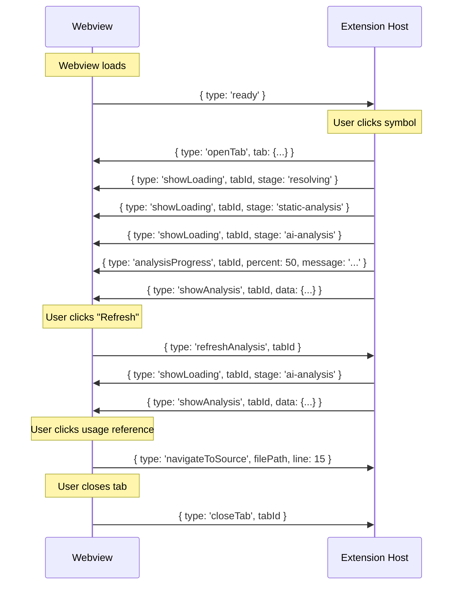

# Code Explorer — MCP & API Design

> **Version:** 1.0
> **Date:** 2026-03-28
> **Status:** Draft

---

## Table of Contents

1. [MCP Server Design](#1-mcp-server-design)
2. [MCP Tools](#2-mcp-tools)
3. [MCP Resources](#3-mcp-resources)
4. [Internal Extension API](#4-internal-extension-api)
5. [Webview Message Protocol](#5-webview-message-protocol)
6. [LLM Provider API](#6-llm-provider-api)
7. [Prompt Templates](#7-prompt-templates)
8. [Error Handling API](#8-error-handling-api)
9. [Rate Limiting & Quotas](#9-rate-limiting--quotas)
10. [Versioning Strategy](#10-versioning-strategy)

---

## 1. MCP Server Design

### 1.1 Overview

The Code Explorer MCP server exposes cached code analysis to AI agents, enabling them to understand codebases when fixing bugs or implementing features.

### 1.2 Server Configuration

**For Claude Code (`.claude/mcp_servers.json`):**
```json
{
  "code-explorer": {
    "command": "node",
    "args": ["./node_modules/code-explorer/dist/mcp-server.js"],
    "env": {
      "CODE_EXPLORER_WORKSPACE": "/path/to/workspace"
    }
  }
}
```

**For VS Code MCP (`.vscode/mcp.json`):**
```json
{
  "mcpServers": {
    "code-explorer": {
      "command": "node",
      "args": ["${workspaceFolder}/node_modules/code-explorer/dist/mcp-server.js"],
      "env": {
        "CODE_EXPLORER_WORKSPACE": "${workspaceFolder}"
      }
    }
  }
}
```

### 1.3 Server Implementation

```typescript
// src/mcp/MCPServer.ts
import { Server } from '@modelcontextprotocol/sdk/server/index.js';
import { StdioServerTransport } from '@modelcontextprotocol/sdk/server/stdio.js';
import {
  CallToolRequestSchema,
  ListToolsRequestSchema,
  ListResourcesRequestSchema,
  ReadResourceRequestSchema
} from '@modelcontextprotocol/sdk/types.js';
import { CacheManager } from '../cache/CacheManager';
import { IndexManager } from '../cache/IndexManager';

export class MCPServer {
  private _server: Server;
  private _cacheManager: CacheManager;
  private _indexManager: IndexManager;

  constructor(workspaceRoot: string) {
    this._server = new Server(
      { name: 'code-explorer', version: '1.0.0' },
      { capabilities: { tools: {}, resources: {} } }
    );

    // Initialize cache layer
    const hashService = new HashService();
    const keyResolver = new CacheKeyResolver();
    const serializer = new MarkdownSerializer();
    this._indexManager = new IndexManager(workspaceRoot);
    this._cacheManager = new CacheManager(
      workspaceRoot, this._indexManager, hashService, serializer, keyResolver
    );

    this._registerTools();
    this._registerResources();
  }

  async start(): Promise<void> {
    await this._indexManager.load();
    const transport = new StdioServerTransport();
    await this._server.connect(transport);
  }
}
```

### 1.4 Transport Options

| Transport | Use Case | Configuration |
|-----------|----------|--------------|
| **stdio** | CLI-based clients (Claude Code, other agents) | Default. Reads stdin, writes stdout. |
| **In-process** | VS Code extension consuming its own MCP | Direct function calls, no serialization overhead. |

---

## 2. MCP Tools

### 2.1 `explore_symbol`

Get full analysis for a symbol.

**Input Schema:**
```json
{
  "type": "object",
  "properties": {
    "symbolName": {
      "type": "string",
      "description": "Name of the symbol to explore (e.g., 'UserController', 'getUser')"
    },
    "filePath": {
      "type": "string",
      "description": "Optional: relative path to the source file to disambiguate"
    },
    "symbolKind": {
      "type": "string",
      "enum": ["class", "function", "method", "variable", "interface", "type", "enum"],
      "description": "Optional: kind of symbol to filter results"
    }
  },
  "required": ["symbolName"]
}
```

**Output:** Full `AnalysisResult` as JSON.

**Example Request:**
```json
{
  "name": "explore_symbol",
  "arguments": {
    "symbolName": "UserController",
    "symbolKind": "class"
  }
}
```

**Example Response:**
```json
{
  "content": [{
    "type": "text",
    "text": "# class UserController\n\n## Overview\nHandles user-related HTTP endpoints...\n\n## Call Stacks\n1. app.ts:42 → routes/user.ts:15 → UserController.getUser()\n...\n\n## Usage (12 references)\n- routes/user.ts:8 — new UserController(svc)\n...\n\n## Metadata\n- Analyzed: 2h ago\n- Status: Fresh\n- Provider: mai-claude"
  }]
}
```

### 2.2 `get_call_stacks`

Get call hierarchy for a function/method.

**Input Schema:**
```json
{
  "type": "object",
  "properties": {
    "functionName": {
      "type": "string",
      "description": "Name of the function/method"
    },
    "filePath": {
      "type": "string",
      "description": "Optional: source file path"
    },
    "maxDepth": {
      "type": "number",
      "description": "Maximum call stack depth (default: 5)",
      "default": 5
    }
  },
  "required": ["functionName"]
}
```

**Output:** List of call chains as formatted text.

### 2.3 `get_usages`

Find all usages of a symbol across the workspace.

**Input Schema:**
```json
{
  "type": "object",
  "properties": {
    "symbolName": {
      "type": "string",
      "description": "Name of the symbol"
    },
    "filePath": {
      "type": "string",
      "description": "Optional: source file path"
    },
    "symbolKind": {
      "type": "string",
      "enum": ["class", "function", "method", "variable", "interface", "type", "enum"],
      "description": "Optional: kind filter"
    }
  },
  "required": ["symbolName"]
}
```

**Output:** Table of file:line references with context.

### 2.4 `get_data_flow`

Trace a variable's lifecycle.

**Input Schema:**
```json
{
  "type": "object",
  "properties": {
    "variableName": {
      "type": "string",
      "description": "Name of the variable to trace"
    },
    "filePath": {
      "type": "string",
      "description": "Source file containing the variable"
    }
  },
  "required": ["variableName", "filePath"]
}
```

**Output:** Ordered lifecycle steps (created → assigned → read → modified → consumed).

### 2.5 `get_class_overview`

Get class details including methods, properties, and inheritance.

**Input Schema:**
```json
{
  "type": "object",
  "properties": {
    "className": {
      "type": "string",
      "description": "Name of the class"
    },
    "filePath": {
      "type": "string",
      "description": "Optional: source file path"
    }
  },
  "required": ["className"]
}
```

**Output:** Class overview with methods, properties, inheritance chain, and dependencies.

### 2.6 `search_symbols`

Search for symbols by name pattern.

**Input Schema:**
```json
{
  "type": "object",
  "properties": {
    "query": {
      "type": "string",
      "description": "Search query (substring match on symbol names)"
    },
    "kind": {
      "type": "string",
      "enum": ["class", "function", "method", "variable", "interface", "type", "enum"],
      "description": "Optional: filter by symbol kind"
    },
    "limit": {
      "type": "number",
      "description": "Maximum results to return (default: 20)",
      "default": 20
    }
  },
  "required": ["query"]
}
```

**Output:** List of matching symbols with file paths and kinds.

### 2.7 `get_file_analysis`

Get all analyzed symbols in a file.

**Input Schema:**
```json
{
  "type": "object",
  "properties": {
    "filePath": {
      "type": "string",
      "description": "Relative path to the source file"
    }
  },
  "required": ["filePath"]
}
```

**Output:** List of all analyzed symbols in the file with their summaries.

### 2.8 `get_relationships`

Get dependency graph for a symbol.

**Input Schema:**
```json
{
  "type": "object",
  "properties": {
    "symbolName": {
      "type": "string",
      "description": "Name of the symbol"
    },
    "filePath": {
      "type": "string",
      "description": "Optional: source file path"
    },
    "depth": {
      "type": "number",
      "description": "Relationship traversal depth (default: 1)",
      "default": 1
    }
  },
  "required": ["symbolName"]
}
```

**Output:** Relationship graph showing extends, implements, uses, used-by connections.

### 2.9 `trigger_analysis`

Request analysis of a specific symbol (triggers AI analysis if not cached).

**Input Schema:**
```json
{
  "type": "object",
  "properties": {
    "symbolName": {
      "type": "string",
      "description": "Name of the symbol to analyze"
    },
    "filePath": {
      "type": "string",
      "description": "Source file path"
    },
    "force": {
      "type": "boolean",
      "description": "Force re-analysis even if cached (default: false)",
      "default": false
    }
  },
  "required": ["symbolName", "filePath"]
}
```

**Output:** Status message with estimated completion time.

### 2.10 `get_analysis_status`

Check cache health and freshness.

**Input Schema:**
```json
{
  "type": "object",
  "properties": {
    "filePath": {
      "type": "string",
      "description": "Optional: check status for a specific file. If omitted, returns overall status."
    }
  },
  "required": []
}
```

**Output:**
```json
{
  "totalSymbols": 142,
  "freshCount": 128,
  "staleCount": 14,
  "lastAnalyzed": "2026-03-28T10:30:00Z",
  "cacheSize": "12.5 MB",
  "llmProvider": "mai-claude"
}
```

### Tool Summary

| Tool | Purpose | Input Required | Use When |
|------|---------|----------------|----------|
| `explore_symbol` | Full analysis | `symbolName` | Understanding a class/function/variable |
| `get_call_stacks` | Call hierarchy | `functionName` | Debugging execution flow |
| `get_usages` | Reference finding | `symbolName` | Understanding impact of changes |
| `get_data_flow` | Variable lifecycle | `variableName` + `filePath` | Tracking data transformations |
| `get_class_overview` | Class structure | `className` | Understanding class design |
| `search_symbols` | Symbol discovery | `query` | Finding relevant code |
| `get_file_analysis` | File-level overview | `filePath` | Understanding a file's contents |
| `get_relationships` | Dependency graph | `symbolName` | Understanding dependencies |
| `trigger_analysis` | Request fresh analysis | `symbolName` + `filePath` | Ensuring up-to-date data |
| `get_analysis_status` | Cache health | (optional `filePath`) | Checking data freshness |

---

## 3. MCP Resources

### 3.1 Resource URIs

| URI Pattern | Description | MIME Type |
|-------------|-------------|-----------|
| `code-explorer://index` | Master symbol index | `application/json` |
| `code-explorer://status` | Overall cache health | `application/json` |
| `code-explorer://file/{filePath}` | All analysis for a file | `text/markdown` |
| `code-explorer://symbol/{symbolKey}` | Single symbol analysis | `text/markdown` |

### 3.2 Resource Implementation

```typescript
// Resource: code-explorer://index
{
  uri: 'code-explorer://index',
  name: 'Code Explorer Index',
  description: 'Master index of all analyzed symbols in the workspace',
  mimeType: 'application/json'
}

// Resource: code-explorer://symbol/src/controllers/UserController.ts::class.UserController
{
  uri: 'code-explorer://symbol/src/controllers/UserController.ts::class.UserController',
  name: 'UserController Analysis',
  description: 'Analysis of class UserController',
  mimeType: 'text/markdown'
}
```

---

## 4. Internal Extension API

### 4.1 Public API Surface

Other VS Code extensions can consume Code Explorer via the extension API:

```typescript
// Exported from extension.ts via return value of activate()
export interface CodeExplorerAPI {
  /** Get the API version */
  readonly version: string;

  /**
   * Analyze a symbol and return the result.
   * Uses cache if available, triggers LLM if not.
   */
  analyzeSymbol(symbol: SymbolInfo, options?: { force?: boolean }): Promise<AnalysisResult>;

  /**
   * Get cached analysis for a symbol (no LLM trigger).
   * Returns null if not cached.
   */
  getCachedAnalysis(symbolKey: string): Promise<AnalysisResult | null>;

  /**
   * Search for analyzed symbols by name.
   */
  searchSymbols(query: string, kind?: SymbolKindType, limit?: number): IndexEntry[];

  /**
   * Invalidate cache for a file (marks symbols stale).
   */
  invalidateCache(filePath: string): Promise<void>;

  /**
   * Get cache statistics.
   */
  getCacheStats(): CacheStats;

  /**
   * Event fired when analysis completes for any symbol.
   */
  onAnalysisComplete: vscode.Event<AnalysisResult>;

  /**
   * Event fired when cache entries are invalidated.
   */
  onCacheInvalidated: vscode.Event<{ filePath: string; symbolKeys: string[] }>;
}
```

**Usage by other extensions:**
```typescript
const codeExplorer = vscode.extensions.getExtension<CodeExplorerAPI>('code-explorer.code-explorer');
if (codeExplorer) {
  const api = codeExplorer.exports;
  const analysis = await api.analyzeSymbol({
    name: 'UserController',
    kind: 'class',
    filePath: 'src/controllers/UserController.ts',
    position: { line: 15, character: 0 }
  });
  console.log(analysis.overview);
}
```

---

## 5. Webview Message Protocol

### 5.1 Extension → Webview Messages

```typescript
/**
 * All messages sent from the extension host to the webview.
 */
type ExtensionToWebviewMessage =
  // Tab management
  | { type: 'openTab'; tab: TabState }
  | { type: 'focusTab'; tabId: string }
  | { type: 'closeTab'; tabId: string }

  // Analysis results
  | { type: 'showAnalysis'; tabId: string; data: AnalysisResult }
  | { type: 'showLoading'; tabId: string; stage: LoadingStage }
  | { type: 'showError'; tabId: string; error: ErrorInfo }
  | { type: 'analysisProgress'; tabId: string; percent: number; message: string }

  // Cache events
  | { type: 'stalenessWarning'; tabId: string; changedFiles: string[] }
  | { type: 'cacheCleared' }

  // Configuration
  | { type: 'updateConfig'; config: Partial<ExtensionConfig> };

type LoadingStage = 'resolving' | 'static-analysis' | 'ai-analysis' | 'caching';

interface ErrorInfo {
  code: string;
  message: string;
  recoverable: boolean;
  actions: ErrorAction[];
}

interface ErrorAction {
  label: string;
  command: string; // e.g., 'retry', 'configure', 'dismiss'
}
```

### 5.2 Webview → Extension Messages

```typescript
/**
 * All messages sent from the webview to the extension host.
 */
type WebviewToExtensionMessage =
  // Tab management
  | { type: 'closeTab'; tabId: string }
  | { type: 'closeOtherTabs'; tabId: string }
  | { type: 'closeAllTabs' }
  | { type: 'switchTab'; tabId: string }

  // Navigation
  | { type: 'navigateToSource'; filePath: string; line: number; character?: number }
  | { type: 'exploreSymbol'; symbolName: string; filePath: string; kind: SymbolKindType }

  // Analysis
  | { type: 'refreshAnalysis'; tabId: string }
  | { type: 'retryAnalysis'; tabId: string }

  // UI
  | { type: 'ready' }              // Webview has loaded
  | { type: 'openSettings' }
  | { type: 'copyText'; text: string }
  | { type: 'sectionToggle'; tabId: string; section: string; expanded: boolean }

  // Telemetry
  | { type: 'trackEvent'; event: string; properties?: Record<string, string> };
```

### 5.3 Message Flow Example



---

## 6. LLM Provider API

### 6.1 Provider Interface

```typescript
/**
 * Abstract interface for LLM providers.
 * Implementations shell out to CLI tools.
 */
export interface LLMProvider {
  /** Provider identifier */
  readonly name: string;

  /**
   * Check if the provider's CLI tool is installed and accessible.
   * Should be fast (<1s).
   */
  isAvailable(): Promise<boolean>;

  /**
   * Execute an analysis prompt and return the raw text response.
   * @throws CodeExplorerError on timeout, auth error, rate limit, etc.
   */
  analyze(request: LLMAnalysisRequest): Promise<string>;

  /**
   * Get provider capabilities for prompt sizing and cost estimation.
   */
  getCapabilities(): ProviderCapabilities;
}

export interface LLMAnalysisRequest {
  /** The main analysis prompt */
  prompt: string;
  /** Optional system prompt for role/format instructions */
  systemPrompt?: string;
  /** Maximum response tokens (default: 4096) */
  maxTokens?: number;
  /** Sampling temperature (default: 0.3 for deterministic analysis) */
  temperature?: number;
  /** Timeout in milliseconds (default: 120000) */
  timeoutMs?: number;
}

export interface ProviderCapabilities {
  /** Maximum input context window in tokens */
  maxContextTokens: number;
  /** Whether the provider supports streaming responses */
  supportsStreaming: boolean;
  /** Approximate cost per million input tokens (USD) */
  costPerMTokenInput: number;
  /** Approximate cost per million output tokens (USD) */
  costPerMTokenOutput: number;
}
```

### 6.2 Provider Factory

```typescript
/**
 * Factory to create the appropriate LLM provider based on configuration.
 */
export class LLMProviderFactory {
  static create(providerName: string): LLMProvider {
    switch (providerName) {
      case 'mai-claude':
        return new MaiClaudeProvider();
      case 'copilot-cli':
        return new CopilotCLIProvider();
      case 'none':
        return new NullProvider();
      default:
        console.warn(`Unknown LLM provider '${providerName}', falling back to 'none'`);
        return new NullProvider();
    }
  }
}
```

### 6.3 Provider Implementations

**Mai-Claude Provider:**
```typescript
export class MaiClaudeProvider implements LLMProvider {
  readonly name = 'mai-claude';

  async isAvailable(): Promise<boolean> {
    try {
      const { stdout } = await execFileAsync('claude', ['--version'], { timeout: 5000 });
      return stdout.length > 0;
    } catch {
      return false;
    }
  }

  async analyze(request: LLMAnalysisRequest): Promise<string> {
    const args: string[] = ['--print'];

    if (request.maxTokens) {
      args.push('--max-tokens', String(request.maxTokens));
    }
    if (request.systemPrompt) {
      args.push('--system-prompt', request.systemPrompt);
    }

    args.push(request.prompt);

    try {
      const { stdout } = await execFileAsync('claude', args, {
        timeout: request.timeoutMs || 120_000,
        maxBuffer: 1024 * 1024 * 5
      });
      return stdout;
    } catch (error: any) {
      if (error.killed) {
        throw new CodeExplorerError('LLM analysis timed out', ErrorCode.LLM_TIMEOUT);
      }
      if (error.code === 'ENOENT') {
        throw new CodeExplorerError('claude CLI not found', ErrorCode.LLM_UNAVAILABLE);
      }
      throw new CodeExplorerError(`LLM analysis failed: ${error.message}`, ErrorCode.UNKNOWN);
    }
  }

  getCapabilities(): ProviderCapabilities {
    return {
      maxContextTokens: 200_000,
      supportsStreaming: false,
      costPerMTokenInput: 3.0,
      costPerMTokenOutput: 15.0
    };
  }
}
```

**Copilot CLI Provider:**
```typescript
export class CopilotCLIProvider implements LLMProvider {
  readonly name = 'copilot-cli';

  async isAvailable(): Promise<boolean> {
    try {
      await execFileAsync('github-copilot-cli', ['--version'], { timeout: 5000 });
      return true;
    } catch {
      return false;
    }
  }

  async analyze(request: LLMAnalysisRequest): Promise<string> {
    const { stdout } = await execFileAsync(
      'github-copilot-cli', ['explain', request.prompt],
      { timeout: request.timeoutMs || 120_000, maxBuffer: 1024 * 1024 * 5 }
    );
    return stdout;
  }

  getCapabilities(): ProviderCapabilities {
    return {
      maxContextTokens: 128_000,
      supportsStreaming: false,
      costPerMTokenInput: 0, // included in Copilot subscription
      costPerMTokenOutput: 0
    };
  }
}
```

**Null Provider:**
```typescript
export class NullProvider implements LLMProvider {
  readonly name = 'none';

  async isAvailable(): Promise<boolean> { return true; }

  async analyze(_request: LLMAnalysisRequest): Promise<string> {
    throw new CodeExplorerError(
      'No LLM provider configured',
      ErrorCode.LLM_UNAVAILABLE,
      true,
      'AI analysis is disabled. Configure an LLM provider in settings.'
    );
  }

  getCapabilities(): ProviderCapabilities {
    return { maxContextTokens: 0, supportsStreaming: false, costPerMTokenInput: 0, costPerMTokenOutput: 0 };
  }
}
```

---

## 7. Prompt Templates

### 7.1 System Prompt (Shared)

```
You are a code analysis assistant. Your job is to analyze source code and provide
structured, accurate, and concise analysis. Always use the exact section headers
specified. Be factual — do not hallucinate code that doesn't exist. If you're
unsure about something, say so.
```

### 7.2 Class Overview Prompt

```typescript
static classOverview(className: string, sourceCode: string, relatedFiles: FileContent[]): string {
  const related = relatedFiles
    .map(f => `\n--- ${f.path} ---\n${f.content}`)
    .join('\n');

  return `Analyze the following class and provide a structured analysis.

## Source Code
\`\`\`typescript
${sourceCode}
\`\`\`

## Related Files
${related}

## Required Output Format (use these exact headers)

### Overview
2-3 sentence description of what this class does, its purpose, and role in the codebase.

### Key Methods
For each public/important method, one line:
- \`methodName(params): returnType\` — description

### Dependencies
List classes/modules this class depends on (imports, injected services), one per line:
- ClassName — brief reason for dependency

### Usage Pattern
How this class is typically instantiated and used (1-2 sentences).

### Potential Issues
Up to 3 code quality concerns, potential bugs, or improvement suggestions.
Only mention real issues visible in the code, not generic advice.`;
}
```

### 7.3 Function Call Stack Prompt

```typescript
static functionCallStack(
  funcName: string,
  sourceCode: string,
  callSites: { file: string; line: number; context: string }[]
): string {
  const sites = callSites
    .map((s, i) => `${i + 1}. ${s.file}:${s.line} — ${s.context}`)
    .join('\n');

  return `Analyze the call patterns for function "${funcName}".

## Function Source
\`\`\`typescript
${sourceCode}
\`\`\`

## Known Call Sites
${sites}

## Required Output Format

### Purpose
One-sentence description of what this function does.

### Call Chain Analysis
For each call site, describe the execution path that leads to this function.
Use this format:
\`\`\`
caller1() → caller2() → ${funcName}()
\`\`\`

### Side Effects
List any side effects:
- I/O operations (file, network, database)
- State mutations (global state, class properties)
- Exceptions that may be thrown

### Data Flow
Describe what data flows in (parameters, closures) and out (return value, mutations).`;
}
```

### 7.4 Variable Lifecycle Prompt

```typescript
static variableLifecycle(
  varName: string,
  sourceCode: string,
  references: { file: string; line: number; context: string }[]
): string {
  const refs = references
    .map((r, i) => `${i + 1}. ${r.file}:${r.line} — ${r.context}`)
    .join('\n');

  return `Analyze the lifecycle of variable "${varName}".

## Source Context
\`\`\`typescript
${sourceCode}
\`\`\`

## All References
${refs}

## Required Output Format

### Declaration
Where and how the variable is declared (const/let/var, type annotation, scope).

### Initialization
How the variable gets its initial value. Is it eagerly or lazily initialized?

### Mutations
List each point where the variable is modified (if mutable), with brief context.
If const/immutable, state "Immutable — no mutations."

### Consumption
Where the variable's value is read/used, grouped by purpose:
- Direct reads
- Passed as argument
- Returned from function
- Used in conditions

### Scope & Lifetime
Describe the variable's lexical scope and when it becomes eligible for GC.`;
}
```

### 7.5 Expected LLM Response Format

The ResponseParser expects LLM output to follow the exact headers specified in prompts:

```markdown
### Overview
Handles user-related HTTP endpoints for the REST API...

### Key Methods
- `getUser(req, res): Promise<void>` — Fetches user by ID
- `createUser(req, res): Promise<void>` — Creates new user

### Dependencies
- UserService — business logic delegation
- Logger — request/response logging

### Usage Pattern
Instantiated in route configuration with dependency injection...

### Potential Issues
- No input validation on createUser endpoint
- Missing error handling for database connection failures
```

---

## 8. Error Handling API

### 8.1 Error Codes

```typescript
export enum ErrorCode {
  // LLM Errors (prefix: LLM_)
  LLM_UNAVAILABLE = 'LLM_UNAVAILABLE',     // CLI tool not installed
  LLM_TIMEOUT = 'LLM_TIMEOUT',             // Analysis took too long
  LLM_RATE_LIMITED = 'LLM_RATE_LIMITED',    // Too many requests
  LLM_PARSE_ERROR = 'LLM_PARSE_ERROR',     // Response couldn't be parsed
  LLM_AUTH_ERROR = 'LLM_AUTH_ERROR',        // Authentication failed

  // Cache Errors (prefix: CACHE_)
  CACHE_READ_ERROR = 'CACHE_READ_ERROR',
  CACHE_WRITE_ERROR = 'CACHE_WRITE_ERROR',
  CACHE_CORRUPT = 'CACHE_CORRUPT',
  INDEX_CORRUPT = 'INDEX_CORRUPT',

  // Analysis Errors (prefix: ANALYSIS_)
  SYMBOL_NOT_FOUND = 'SYMBOL_NOT_FOUND',
  ANALYSIS_TIMEOUT = 'ANALYSIS_TIMEOUT',
  FILE_NOT_FOUND = 'FILE_NOT_FOUND',
  LANGUAGE_NOT_SUPPORTED = 'LANGUAGE_NOT_SUPPORTED',

  // System Errors
  WORKSPACE_NOT_OPEN = 'WORKSPACE_NOT_OPEN',
  DISK_FULL = 'DISK_FULL',
  PERMISSION_DENIED = 'PERMISSION_DENIED',
  UNKNOWN = 'UNKNOWN'
}
```

### 8.2 MCP Error Responses

MCP tools return errors in a structured format:

```json
{
  "content": [{
    "type": "text",
    "text": "Error: Symbol 'FooBar' not found in the analysis cache.\n\nSuggestions:\n- Check the symbol name spelling\n- Run trigger_analysis to analyze it first\n- Use search_symbols to find similar names"
  }],
  "isError": true
}
```

---

## 9. Rate Limiting & Quotas

### 9.1 Rate Limit Configuration

```typescript
export interface RateLimitConfig {
  /** Maximum concurrent LLM requests */
  maxConcurrent: number;       // default: 3
  /** Minimum delay between requests (ms) */
  minRequestIntervalMs: number; // default: 2000
  /** Maximum requests per hour */
  maxRequestsPerHour: number;   // default: 60
  /** Maximum retries per request */
  maxRetries: number;           // default: 2
  /** Base backoff delay for retries (ms) */
  retryBackoffMs: number;       // default: 5000
}
```

### 9.2 Priority Levels

| Priority | Value | Source | Behavior |
|----------|-------|--------|----------|
| Critical | 100 | Direct user action (click) | Processes immediately, preempts lower priority |
| High | 50 | User-triggered refresh | Processes after current batch |
| Normal | 10 | Background scheduler | Processes when queue is clear |
| Low | 1 | Periodic re-analysis | Processes only when idle |

### 9.3 Queue Behavior

- User-triggered analyses always bypass the queue if below `maxConcurrent`
- Background analyses are paused when user-triggered work is queued
- If queue exceeds 100 items, oldest low-priority items are dropped
- Rate limit violations cause exponential backoff (2s → 4s → 8s → 16s)

---

## 10. Versioning Strategy

### 10.1 Version Matrix

| Component | Current | Versioning Scheme |
|-----------|---------|-------------------|
| Cache format | `1.0.0` | SemVer in `analysis_version` frontmatter field |
| Master index | `1.0.0` | SemVer in `version` field of `_index.json` |
| MCP tools | `1.0.0` | Server version in MCP handshake |
| Extension API | `1.0.0` | In exported API's `version` field |
| Message protocol | `1` | Major version only (breaking changes only) |

### 10.2 Migration Strategy

When a version changes:

```typescript
async function migrateIndex(index: any): Promise<MasterIndex> {
  const version = index.version || '0.0.0';

  if (semver.lt(version, '1.0.0')) {
    // Pre-1.0: rebuild from scratch
    return await rebuildIndex();
  }

  if (semver.lt(version, '2.0.0')) {
    // 1.x → 2.x migration
    return migrate1to2(index);
  }

  return index;
}
```

### 10.3 Backward Compatibility

- **Cache files:** Old format files are readable; analysis is re-triggered if format is too old
- **Index:** Auto-rebuild if version is incompatible
- **MCP tools:** New optional parameters don't break old clients
- **Extension API:** New methods added, existing signatures unchanged

---

*End of MCP & API Design Document*
