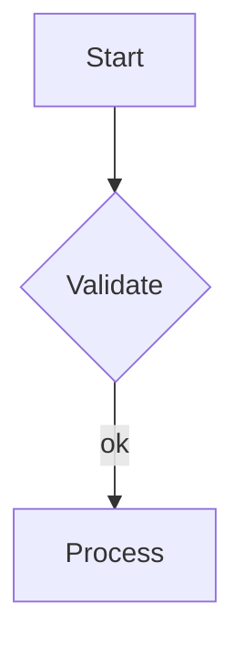

# src/cache/

Markdown-based cache layer — reads and writes analysis results as markdown files with YAML frontmatter.

## Modules

| File | Role |
|------|------|
| `CacheStore.ts` | Primary cache implementation: read, write, clear, findByCursor (fuzzy lookup), serialize, deserialize. Used by `AnalysisOrchestrator`. |
| `CacheWriter.ts` | Earlier/alternative writer with simpler serialization. Not used by the main pipeline (superseded by `CacheStore`). |

## Cache File Format

Each analyzed symbol gets a markdown file at:
```
.vscode/code-explorer/<source-path>/<scope-chain>.<kind>.<Name>.md
```

Example: `.vscode/code-explorer/src/main.cpp/fn.printBanner.md`

### Structure

```markdown
---
symbol: printBanner
kind: function
file: src/main.cpp
line: 10
scope_chain: "main"
analyzed_at: "2026-03-28T..."
analysis_version: "1.0.0"
llm_provider: copilot-cli
stale: false
---

# function printBanner

## Overview
...

## Key Points
- ...

## Data Kind (for variables)
**Cache / Lookup Table**
...

## Callers
1. **main** -- `src/main.cpp:42` -- main() -> printBanner()

```json:callers
[{"name": "main", "filePath": "src/main.cpp", "line": 42, ...}]
```

## Diagrams

### Execution Flow



```json:diagrams
[{"title": "Execution Flow", "type": "flowchart", "mermaidSource": "..."}]
```

## Q&A

### Q: How does error handling work?
*3/29/2026, 8:00:00 AM*

The function uses try/catch blocks to...

```json:qa_history
[{"question": "...", "answer": "...", "timestamp": "..."}]
```

...more sections...
```

## Serialized Sections

The `_serialize()` method writes sections in this order:

1. YAML frontmatter (symbol, kind, file, line, scope_chain, analyzed_at, etc.)
2. Overview
3. Key Points
4. Callers (human-readable + `json:callers`)
5. Usages
6. Relationships
7. Data Flow (human-readable + `json:data_flow`)
8. Variable Lifecycle (`json:variable_lifecycle`)
9. Data Kind (`json:data_kind`)
10. Class Members (human-readable + `json:class_members`)
11. Member Access Patterns (`json:member_access`)
12. Diagrams (mermaid fences + `json:diagrams`)
13. Function Steps (human-readable + `json:steps`)
14. Sub-Functions (human-readable + `json:subfunctions`)
15. Function Input (`json:function_inputs`)
16. Function Output (`json:function_output`)
17. Dependencies
18. Usage Pattern
19. Potential Issues
20. Q&A History (human-readable + `json:qa_history`)

## Read Methods

### `read(symbol)` — Exact-Path Lookup

Computes the exact cache file path from the symbol's kind, name, and scope chain via `_buildCacheKey()`. Returns `AnalysisResult | null`. Used by the legacy `analyzeSymbol` flow and for pre-cache dedup checks.

### `findByCursor(word, filePath, cursorLine)` — Fuzzy Cursor Lookup

Used by the primary `analyzeFromCursor` flow where the symbol kind is not yet known. Scans the cache directory for the source file and inspects each `.md` file's YAML frontmatter:

1. Lists all `.md` files in `.vscode/code-explorer/<filePath>/`
2. For each file, quick-parses frontmatter: `symbol`, `kind`, `line`
3. Matches if symbol name equals `word` AND line is within **±3 lines** of cursor
4. Returns `{ symbol: SymbolInfo, result: AnalysisResult } | null`

### `listCachedSymbols(filePath)` — Lightweight Metadata Scan

Lists all cached symbols for a given source file by reading YAML frontmatter + a short overview snippet (~150 chars) from each `.md` cache file. Returns `CachedSymbolSummary[]`. Used by the LLM-assisted cache fallback.

### `findByCursorWithLLMFallback(cursor, workspaceRoot)` — Smart Cache Lookup

Two-tier cache lookup:
1. **Tier 1**: `findByCursor()` — fast, exact name + ±3 lines.
2. **Tier 2** (on miss): Lightweight Copilot CLI call with cached symbol descriptions. LLM outputs `json:cache_match` to pick the best match.

## Cache Key Resolution

`_buildCacheKey(symbol)` builds a unique key from:
1. **Scope chain** (if present): `scopeA.scopeB.kind.Name`
2. **Container name** (fallback): `Container.kind.Name`
3. **Name only**: `kind.Name`

## Deserialization

The `_deserialize()` method parses:
- YAML frontmatter → metadata fields
- Section headings → key-value map
- Tagged JSON blocks → typed arrays/objects: callers, steps, subfunctions, function_inputs, function_output, data_flow, variable_lifecycle, data_kind, class_members, member_access, diagrams, qa_history

## Not Yet Implemented

From `docs/05-implementation_plan.md`:
- **CacheManager**: High-level cache operations (TTL, size limits, batch invalidation)
- **IndexManager**: Master index at `.vscode/code-explorer/_index.json` for O(1) lookups
- **HashService**: SHA-256 hashing for staleness detection
- **CacheKeyResolver**: Advanced key resolution with disambiguation
- **File watcher pipeline**: Detect file changes -> invalidate affected cache entries
